# Intel® HD Graphics FAQs  
  
**Intel® HD Graphics** are video cards built into Intel processors. Not all processors are equipped with integrated graphics. To find out if yours is, use this [table](https://en.wikipedia.org/wiki/List_of_Intel_graphics_processing_units) or see the specifications of your processor on Intel’s [website](https://ark.intel.com/content/www/us/en/ark/search.html). For example, the table shows Intel® HD 4600 integrated graphics for [i7-4770k](https://ark.intel.com/products/75123/Intel-Core-i7-4770K-Processor-8M-Cache-up-to-3_90-GHz), whereas the [i7-4930k](https://ark.intel.com/products/77780/Intel-Core-i7-4930K-Processor-12M-Cache-up-to-3_90-GHz) has none.  
  
macOS has quite acceptable support for Intel® HD Graphics (Arrandale) and newer. For older generation graphics see the appropriate threads / instructions  ([GMA950](https://www.applelife.ru/threads/intel-gma950-32bit-only.22726/), [GMA X3100](https://www.applelife.ru/threads/intel-gma-x3100-zavod.36617/)). Attention, not all Intel graphics cards can be successfully enabled in macOS (more below).  
 
If you use a discrete graphics card (AMD or NVIDIA), having integrated Intel graphics enabled is still useful, as it can be used in offline mode (also known as ["empty framebuffer", 0 connectors, connector-less framebuffer, IQSV only](https://www.applelife.ru/threads/zavod-intel-quick-sync-video.817923/)) for hardware encoding and decoding of media files and so forth.  
  
The general concept of enabling Intel graphics cards:  

1. Correct the names of all related devices (`IGPU` for the video card itself, `IMEI` for the Intel Management Engine).  
2. If necessary, fake the `device-id`'s of the video card and Intel Management Engine to compatible ones.  
3. Specify the correct framebuffer (`AAPL,ig-platform-id` or `AAPL,snb-platform-id`) describing available outputs and other properties of the video card.  
4. Add some other additional properties to devices related to Intel® HD Graphics аnd for digital audio.  
  
At this point, paragraphs 1 and 4 are automated by [WhateverGreen](https://github.com/acidanthera/WhateverGreen) and [AppleALC](https://github.com/acidanthera/AppleALC). It works in OS X 10.8 and later, and greatly simplifies graphics enabling in macOS.  
  
## General recommendations  

1. Select the required amount in BIOS for Graphics Memory Allocation (DVMT Pre-Allocated): 32MB, 64MB, 96MB, etc. depending on the framebuffer (Look value TOTAL STOLEN in framebuffer list).  
For the total amount of memory DVMT (DVMT Total) select: MAX.  
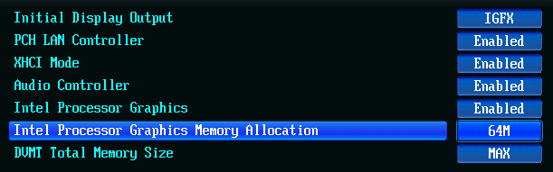  
Some faulty BIOSes show a higher value, but actually allocate less. In such cases select a value a step higher. This is common with Dell laptops, their BIOS reports 64MB, but actually allocates 32MB and there is no way to change it. Such case will be shown in this manual.
2. Add [Lilu.kext](https://github.com/vit9696/Lilu/releases) and [WhateverGreen.kext](https://github.com/acidanthera/WhateverGreen/releases)(hereinafter referred to as the **WEG**) to bootloader Clover or OpenCore.
3. Remove (if used previously) these kexts:  
— IntelGraphicsFixup.kext  
— NvidiaGraphicsFixup.kext  
— CoreDisplayFixup.kext  
— Shiki.kext  
— IntelGraphicsDVMTFixup.kext  
— AzulPatcher4600.kext  
— AppleBacklightFixup.kext,  
— FakePCIID_Intel_HD_Graphics.kext  
— FakePCIID_Intel_HDMI_Audio.kext  
— and FakePCIID.kext (if there are no other FakePCIID plugins)  
4. Turn off all Clover's graphic injects (and I mean turn off and not comment out).
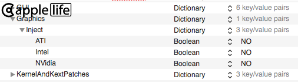
5. Turn off Clover's DSDT fixes:  
— `AddHDMI`  
— `FixDisplay`  
— `FixIntelGfx`  
— `AddIMEI`  
— `FixHDA`  
— `AddPNLF`

6. Turn off Clover's: `UseIntelHDMI`, `SetIntelBacklight` and `SetIntelMaxBacklight`.  
7. Disable Clover's `Devices` - `Inject` (usually this parameter is absent and that is good, but if it is there, turn off or delete).  
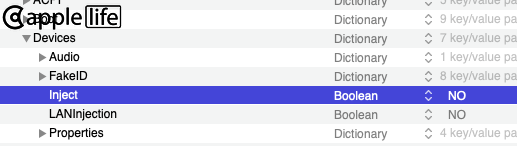  
  
8. Delete `-disablegfxfirmware` and `-igfxnohdmi` boot arguments.  
9. Delete Clover's `FakeID` for `IntelGFX` and `IMEI`.  
10. Delete Clover's `ig-platform-id`.  
11. Completely remove Clover's `Arbitrary`, `AddProperties`, as well as IGPU, IMEI, HDEF and HDMI audio definitions from `SSDT` and `DSDT` (if you added them).  
12. Delete or disable binary patches DSDT: `GFX0 to IGPU`, `PEGP to GFX0`, `HECI to IMEI`, `MEI to IMEI`, `HDAS to HDEF`, `B0D3 to HDAU`.  

**Injecting Properties:**  
To inject properties, use `Devices`-`Properties` section for Clover or `DeviceProperties` section for OpenCore in config.plist.  
Only these properties may be added:  
— `AAPL,ig-platform-id` or `AAPL,snb-platform-id` framebuffer  
— `device-id` for `IGPU` (if faking is necessary)  
— `device-id` for `IMEI` (if faking is necessary)  
— properties for patches (if necessary)  
And `layout-id` for `HDEF` (More detail in [AppleALC Wiki](https://github.com/acidanthera/AppleALC/wiki/Installation-and-usage), `HDEF` device locations `PciRoot`, [gfxutil](https://github.com/acidanthera/gfxutil) may be used: `gfxutil -f HDEF`).  
  
Adding these is not mandatory. An example: the default framebuffer is good enough or it is set with a boot argument (boot-arg), and faking the `device-id` is not required.  
The bytes in `Properties` must be put in reversed order. For example: framebuffer `0x0166000B` would be put in as `0B006601`, DevID `0x1E3A` would be put in as `3A1E0000`.  
  
Common `Properties` templates for `IGPU` and `IMEI` sections are described below for each processor family separately.  
>**Attention!**<br>
Do not leave empty property values. For example, if a certain property is not required, delete the entire line! Remove `PciRoot` dictionary entirely if it has no properties.

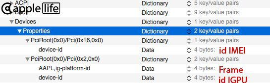
  
**Choosing a framebuffer:**  
First try the recommended one. If it is not successful, then try the others one by one, excluding the "empty framebuffers" (0 connectors), which are described in a separate [topic](https://www.applelife.ru/threads/zavod-intel-quick-sync-video.817923/).  
When looking for a suitable framebuffer you can set it with a boot argument (boot-arg), in which case the framebuffer set in the `Properties` section is ignored.
For example: `igfxframe=0x0166000B`  
>**Attention!**<br>
Unlike in `Properties` the normal byte order and the `0x` prefix are to be used.  

- If a framebuffer is not specified explicitly in any way, the default framebuffer will be injected.  
- If a framebuffer is not set and the system has a discrete graphics card, an "empty framebuffer" will be injected.  

## Intel HD Graphics (first generation / Ironlake) ([Arrandale](https://en.wikipedia.org/wiki/Arrandale) processors)  

> Supported from Mac OS X 10.6.4 to macOS 10.13.6. The instructions are for OS X 10.6.4 - macOS 10.13.6 and are unsupported on newer operating systems. Metal support is absent.  
> Laptops with LVDS displays are the only supported combination. All other display types are unsupported.    

> For more information, reference [this](https://github.com/Goldfish64/ArrandaleGraphicsHackintosh) and [this](https://www.insanelymac.com/forum/topic/286092-guide-1st-generation-intel-hd-graphics-qeci/).

Most typical configuration will require `framebuffer-patch-enable` and `framebuffer-singlelink`. `AAPL,ig-platform-id` is not required.

If there are display or wake issues, `framebuffer-fbccontrol-*` and `framebuffer-featurecontrol-*` properties may be helpful. These mirror the settings present in the `Info.plist` of the AppleIntelHDGraphicsFB.kext and are simple 0 or 1 settings.

**Semantic:**  
*framebuffer-patch-enable (enable patching)  
framebuffer-linkwidth (specify link width, default is 1)  
framebuffer-singlelink (enable single link mode)*  

**FBCControl:**  
*framebuffer-fbccontrol-allzero (sets all properties to zero, ones below will override)  
framebuffer-fbccontrol-compression*  

**FeatureControl:**  
*framebuffer-featurecontrol-allzero (sets all properties to zero, ones below will override)  
framebuffer-featurecontrol-fbc  
framebuffer-featurecontrol-gpuinterrupthandling  
framebuffer-featurecontrol-gamma  
framebuffer-featurecontrol-maximumselfrefreshlevel  
framebuffer-featurecontrol-powerstates  
framebuffer-featurecontrol-rstimertest  
framebuffer-featurecontrol-renderstandby  
framebuffer-featurecontrol-watermarks*  

***Native supported DevID's:*** 

- `0x0042`
- `0x0046`
  
## Intel HD Graphics 2000/3000 ([Sandy Bridge](https://en.wikipedia.org/wiki/Sandy_Bridge) processors)  

> Supported from Mac OS X 10.7.x to macOS 10.13.6. The instructions are for OS X 10.8.x - macOS 10.13.6. On older operating systems follow the "ancient ways". On newer operating systems these are not supported. [But if you really want to - read this.](https://applelife.ru/posts/744431) Metal support is absent.  
  
***SNB Framebuffer List:***

| Framebuffer | Type    | Connectors | TOTAL STOLEN Memory |
| ----------- | ------- | ---------- | ------------------- |
| 0x00010000  | mobile  | 4          | 32 MB?              |
| 0x00020000  | mobile  | 1          | 32 MB?              |
| 0x00030010  | desktop | 3          | 32 MB?              |
| 0x00030020  | desktop | 3          | 32 MB?              |
| 0x00030030  | desktop | 0          | 32 MB?              |
| 0x00040000  | mobile  | 3          | 32 MB?              |
| 0x00050000  | desktop | 0          | 32 MB?              |

<details>
<summary>Spoiler: SNB connectors</summary>

`AppleIntelSNBGraphicsFB.kext`
  
ID: SNB0 0x10000, STOLEN: 0 bytes, FBMEM: 0 bytes, VRAM: 0 bytes, Flags: 0x00000000  
TOTAL STOLEN: 0 bytes, TOTAL CURSOR: 1 MB, MAX STOLEN: 0 bytes, MAX OVERALL: 1 MB (1064960 bytes)  
Camellia: CamelliaUnsupported (255), Freq: 1808 Hz, FreqMax: 1808 Hz  
Mobile: 1, PipeCount: 2, PortCount: 4, FBMemoryCount: 0  
[5] busId: 0x03, pipe: 0, type: 0x00000002, flags: 0x00000030 - ConnectorLVDS  
[2] busId: 0x05, pipe: 0, type: 0x00000400, flags: 0x00000007 - ConnectorDP  
[3] busId: 0x04, pipe: 0, type: 0x00000400, flags: 0x00000009 - ConnectorDP  
[4] busId: 0x06, pipe: 0, type: 0x00000400, flags: 0x00000009 - ConnectorDP  
05030000 02000000 30000000  
02050000 00040000 07000000  
03040000 00040000 09000000  
04060000 00040000 09000000  
  
ID: SNB1 0x20000, STOLEN: 0 bytes, FBMEM: 0 bytes, VRAM: 0 bytes, Flags: 0x00000000  
TOTAL STOLEN: 0 bytes, TOTAL CURSOR: 1 MB, MAX STOLEN: 0 bytes, MAX OVERALL: 1 MB (1052672 bytes)  
Camellia: CamelliaUnsupported (255), Freq: 1808 Hz, FreqMax: 1808 Hz  
Mobile: 1, PipeCount: 2, PortCount: 1, FBMemoryCount: 0  
[5] busId: 0x03, pipe: 0, type: 0x00000002, flags: 0x00000030 - ConnectorLVDS  
05030000 02000000 30000000  

ID: SNB2 0x30010 or 0x30020, STOLEN: 0 bytes, FBMEM: 0 bytes, VRAM: 0 bytes, Flags: 0x00000000  
TOTAL STOLEN: 0 bytes, TOTAL CURSOR: 1 MB, MAX STOLEN: 0 bytes, MAX OVERALL: 1 MB (1060864 bytes)  
Camellia: CamelliaUnsupported (255), Freq: 0 Hz, FreqMax: -1 Hz  
Mobile: 0, PipeCount: 2, PortCount: 3, FBMemoryCount: 0  
[2] busId: 0x05, pipe: 0, type: 0x00000400, flags: 0x00000007 - ConnectorDP  
[3] busId: 0x04, pipe: 0, type: 0x00000400, flags: 0x00000009 - ConnectorDP  
[4] busId: 0x06, pipe: 0, type: 0x00000800, flags: 0x00000006 - ConnectorHDMI  
02050000 00040000 07000000  
03040000 00040000 09000000  
04060000 00080000 06000000  
  
ID: SNB3 0x30030, STOLEN: 0 bytes, FBMEM: 0 bytes, VRAM: 0 bytes, Flags: 0x00000000  
TOTAL STOLEN: 0 bytes, TOTAL CURSOR: 0 bytes, MAX STOLEN: 0 bytes, MAX OVERALL: 0 bytes  
Camellia: CamelliaUnsupported (255), Freq: 0 Hz, FreqMax: 0 Hz  
Mobile: 0, PipeCount: 0, PortCount: 0, FBMemoryCount: 0  
  
ID: SNB4 0x40000, STOLEN: 0 bytes, FBMEM: 0 bytes, VRAM: 0 bytes, Flags: 0x00000000  
TOTAL STOLEN: 0 bytes, TOTAL CURSOR: 1 MB, MAX STOLEN: 0 bytes, MAX OVERALL: 1 MB (1060864 bytes)  
Camellia: CamelliaUnsupported (255), Freq: 1808 Hz, FreqMax: 1808 Hz  
Mobile: 1, PipeCount: 2, PortCount: 3, FBMemoryCount: 0  
[1] busId: 0x00, pipe: 0, type: 0x00000002, flags: 0x00000030 - ConnectorLVDS  
[2] busId: 0x05, pipe: 0, type: 0x00000400, flags: 0x00000007 - ConnectorDP  
[3] busId: 0x04, pipe: 0, type: 0x00000400, flags: 0x00000009 - ConnectorDP  
01000000 02000000 30000000  
02050000 00040000 07000000  
03040000 00040000 09000000  
  
ID: SNB5 0x50000, STOLEN: 0 bytes, FBMEM: 0 bytes, VRAM: 0 bytes, Flags: 0x00000000  
TOTAL STOLEN: 0 bytes, TOTAL CURSOR: 0 bytes, MAX STOLEN: 0 bytes, MAX OVERALL: 0 bytes  
Camellia: CamelliaUnsupported (255), Freq: 0 Hz, FreqMax: 0 Hz  
Mobile: 0, PipeCount: 0, PortCount: 0, FBMemoryCount: 0  
  
ID: SNB6 Not addressible, STOLEN: 0 bytes, FBMEM: 0 bytes, VRAM: 0 bytes, Flags: 0x00000000  
TOTAL STOLEN: 0 bytes, TOTAL CURSOR: 512 KB, MAX STOLEN: 0 bytes, MAX OVERALL: 512 KB  
Camellia: CamelliaUnsupported (255), Freq: 0 Hz, FreqMax: 0 Hz  
Mobile: 0, PipeCount: 1, PortCount: 0, FBMemoryCount: 0  
  
ID: SNB7 Not addressible, STOLEN: 0 bytes, FBMEM: 0 bytes, VRAM: 0 bytes, Flags: 0x00000000  
TOTAL STOLEN: 0 bytes, TOTAL CURSOR: 1 MB (1572864 bytes), MAX STOLEN: 0 bytes, MAX OVERALL: 1 MB (1589248 bytes)  
Camellia: CamelliaUnsupported (255), Freq: 1808 Hz, FreqMax: 1808 Hz  
Mobile: 1, PipeCount: 3, PortCount: 4, FBMemoryCount: 0  
[1] busId: 0x00, pipe: 0, type: 0x00000400, flags: 0x00000030 - ConnectorDP  
[2] busId: 0x05, pipe: 0, type: 0x00000400, flags: 0x00000007 - ConnectorDP  
[3] busId: 0x04, pipe: 0, type: 0x00000400, flags: 0x00000009 - ConnectorDP  
[4] busId: 0x06, pipe: 0, type: 0x00000800, flags: 0x00000006 - ConnectorHDMI  
01000000 00040000 30000000  
02050000 00040000 07000000  
03040000 00040000 09000000  
04060000 00080000 06000000  
  
Default SNB, DVMT: 0 bytes, FBMEM: 0 bytes, VRAM: 0 bytes, Flags: 0x00000000  
Camellia: CamelliaUnsupported (255), Freq: 1808 Hz, FreqMax: 1808 Hz  
Mobile: 1, PipeCount: 3, PortCount: 4, FBMemoryCount: 0  
[1] busId: 0x00, pipe: 0, type: 0x00000400, flags: 0x00000030 - ConnectorDP  
[2] busId: 0x05, pipe: 0, type: 0x00000400, flags: 0x00000007 - ConnectorDP  
[3] busId: 0x04, pipe: 0, type: 0x00000400, flags: 0x00000009 - ConnectorDP  
[4] busId: 0x06, pipe: 0, type: 0x00000800, flags: 0x00000006 - ConnectorHDMI  
01000000 00040000 30000000  
02050000 00040000 07000000  
03040000 00040000 09000000  
04060000 00080000 06000000  
  
Note, that without AAPL,snb-platform-id the following models will use predefined IDs:  
Mac-94245B3640C91C81 -> SNB0 (MacBookPro8,1)  
Mac-94245AF5819B141B -> SNB0  
Mac-94245A3940C91C80 -> SNB0 (MacBookPro8,2)  
Mac-942459F5819B171B -> SNB0 (MacBookPro8,3)  
Mac-8ED6AF5B48C039E1 -> SNB2 (Macmini5,1)  
Mac-7BA5B2794B2CDB12 -> SNB2 (Macmini5,3)  
Mac-4BC72D62AD45599E -> SNB3 (Macmini5,2) -> no ports  
Mac-742912EFDBEE19B3 -> SNB4 (MacBookAir4,2)  
Mac-C08A6BB70A942AC2 -> SNB4 (MacBookAir4,1)  
Mac-942B5BF58194151B -> SNB5 (iMac12,1) -> no ports  
Mac-942B5B3A40C91381 -> SNB5 -> no ports  
Mac-942B59F58194171B -> SNB5 (iMac12,2) -> no ports
</details>
<br>

***Native supported DevID's:*** 

- `0x0106`
- `0x1106`
- `0x1601`
- `0x0116`
- `0x0126`
- `0x0102`

***Recommended framebuffers:***

- Desktop:
  - `0x00030010` (default)
- Laptop:
  - `0x00010000` (default)
- Empty Framebuffer:
  - `0x00050000` (default)

HD2000 doesn't work as a full-featured graphics card in macOS, but you can (and should) use it with an "empty framebuffer" (0 connectors) for [IQSV](https://www.applelife.ru/threads/zavod-intel-quick-sync-video.817923/). Only the HD3000 can work with a display.  

Sandy Bridge doesn't usually require framebuffer specifying, the default framebuffer for your board-id will automatically be used. Specifying the framebuffer is required if you are using a non Sandy Brige Mac model.  
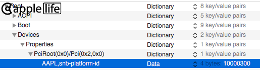  
Keep in mind that the framebuffer property name for `Sandy Bridge` — `AAPL,snb-platform-id` — differs from others IGPUs.  
  
Desktops require a fake `device-id` `26010000` for `IGPU`:  
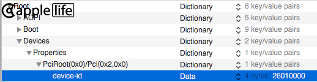

For an "empty framebuffer" a different device-id is required, more in this [thread](https://www.applelife.ru/threads/zavod-intel-quick-sync-video.817923/)
  
>**Attention!** If you are using a motherboard with a [7 series](https://ark.intel.com/products/series/98460/Intel-7-Series-Chipsets) chipset, it is necessary to fake the `device-id` `3A1C0000` for `IMEI` and add ACPI table [SSDT-IMEI](https://github.com/acidanthera/OpenCorePkg/blob/master/Docs/AcpiSamples/Source/SSDT-IMEI.dsl)  
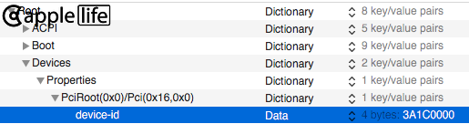  

## Intel HD Graphics 2500/4000 ([Ivy Bridge](https://en.wikipedia.org/wiki/Ivy_Bridge_(microarchitecture)) processors)  

> Supported from OS X 10.8.x to macOS 11.x. On newer operating systems these are not supported. [But if you really want to - read this.](https://github.com/dortania/OpenCore-Legacy-Patcher)  
  
***Capri framebuffer list:***
| Framebuffer | Type    | Connectors | TOTAL STOLEN Memory |
| ----------- | ------- | ---------- | ------------------- |
| 0x01660000  | desktop | 4          | 24 MB               |
| 0x01620006  | desktop | 0          | 0 bytes             |
| 0x01620007  | desktop | 0          | 0 bytes             |
| 0x01620005  | desktop | 3          | 16 MB               |
| 0x01660001  | mobile  | 4          | 24 MB               |
| 0x01660002  | mobile  | 1          | 24 MB               |
| 0x01660008  | mobile  | 3          | 16 MB               |
| 0x01660009  | mobile  | 3          | 16 MB               |
| 0x01660003  | mobile  | 4          | 16 MB               |
| 0x01660004  | mobile  | 1          | 16 MB               |
| 0x0166000A  | desktop | 3          | 16 MB               |
| 0x0166000B  | desktop | 3          | 16 MB               |

<details>
<summary>Spoiler: Capri connectors</summary>
  
`AppleIntelFramebufferCapri.kext`  
  
ID: 01660000, STOLEN: 96 MB, FBMEM: 24 MB, VRAM: 1024 MB, Flags: 0x00000000  
TOTAL STOLEN: 24 MB, TOTAL CURSOR: 1 MB (1572864 bytes), MAX STOLEN: 72 MB, MAX OVERALL: 73 MB (77086720 bytes)  
Camellia: CamelliaUnsupported (255), Freq: 1808 Hz, FreqMax: 1808 Hz  
Mobile: 0, PipeCount: 3, PortCount: 4, FBMemoryCount: 3  
[1] busId: 0x00, pipe: 0, type: 0x00000002, flags: 0x00000030 - ConnectorLVDS  
[2] busId: 0x05, pipe: 0, type: 0x00000400, flags: 0x00000007 - ConnectorDP  
[3] busId: 0x04, pipe: 0, type: 0x00000400, flags: 0x00000007 - ConnectorDP  
[4] busId: 0x06, pipe: 0, type: 0x00000400, flags: 0x00000007 - ConnectorDP  
01000000 02000000 30000000  
02050000 00040000 07000000  
03040000 00040000 07000000  
04060000 00040000 07000000  
  
ID: 01620006, STOLEN: 0 bytes, FBMEM: 0 bytes, VRAM: 256 MB, Flags: 0x00000000  
TOTAL STOLEN: 0 bytes, TOTAL CURSOR: 0 bytes, MAX STOLEN: 0 bytes, MAX OVERALL: 0 bytes  
Camellia: CamelliaUnsupported (255), Freq: 1808 Hz, FreqMax: 1808 Hz  
Mobile: 0, PipeCount: 0, PortCount: 0, FBMemoryCount: 0  
  
ID: 01620007, STOLEN: 0 bytes, FBMEM: 0 bytes, VRAM: 256 MB, Flags: 0x00000000  
TOTAL STOLEN: 0 bytes, TOTAL CURSOR: 0 bytes, MAX STOLEN: 0 bytes, MAX OVERALL: 0 bytes  
Camellia: CamelliaUnsupported (255), Freq: 1808 Hz, FreqMax: 1808 Hz  
Mobile: 0, PipeCount: 0, PortCount: 0, FBMemoryCount: 0  
  
ID: 01620005, STOLEN: 32 MB, FBMEM: 16 MB, VRAM: 1536 MB, Flags: 0x00000000  
TOTAL STOLEN: 16 MB, TOTAL CURSOR: 1 MB, MAX STOLEN: 32 MB, MAX OVERALL: 33 MB (34615296 bytes)  
Camellia: CamelliaUnsupported (255), Freq: 1808 Hz, FreqMax: 1808 Hz  
Mobile: 0, PipeCount: 2, PortCount: 3, FBMemoryCount: 2  
[2] busId: 0x05, pipe: 0, type: 0x00000400, flags: 0x00000011 - ConnectorDP  
[3] busId: 0x04, pipe: 0, type: 0x00000400, flags: 0x00000107 - ConnectorDP  
[4] busId: 0x06, pipe: 0, type: 0x00000400, flags: 0x00000107 - ConnectorDP  
02050000 00040000 11000000  
03040000 00040000 07010000  
04060000 00040000 07010000  
  
ID: 01660001, STOLEN: 96 MB, FBMEM: 24 MB, VRAM: 1536 MB, Flags: 0x00000000  
TOTAL STOLEN: 24 MB, TOTAL CURSOR: 1 MB (1572864 bytes), MAX STOLEN: 72 MB, MAX OVERALL: 73 MB (77086720 bytes)  
Camellia: CamelliaUnsupported (255), Freq: 1808 Hz, FreqMax: 1808 Hz  
Mobile: 1, PipeCount: 3, PortCount: 4, FBMemoryCount: 3  
[1] busId: 0x00, pipe: 0, type: 0x00000002, flags: 0x00000030 - ConnectorLVDS  
[2] busId: 0x05, pipe: 0, type: 0x00000800, flags: 0x00000006 - ConnectorHDMI  
[3] busId: 0x04, pipe: 0, type: 0x00000400, flags: 0x00000107 - ConnectorDP  
[4] busId: 0x06, pipe: 0, type: 0x00000400, flags: 0x00000107 - ConnectorDP  
01000000 02000000 30000000  
02050000 00080000 06000000  
03040000 00040000 07010000  
04060000 00040000 07010000  
  
ID: 01660002, STOLEN: 64 MB, FBMEM: 24 MB, VRAM: 1536 MB, Flags: 0x00000000  
TOTAL STOLEN: 24 MB, TOTAL CURSOR: 1 MB (1572864 bytes), MAX STOLEN: 24 MB, MAX OVERALL: 25 MB (26742784 bytes)  
Camellia: CamelliaUnsupported (255), Freq: 1808 Hz, FreqMax: 1808 Hz  
Mobile: 1, PipeCount: 3, PortCount: 1, FBMemoryCount: 1  
[1] busId: 0x00, pipe: 0, type: 0x00000002, flags: 0x00000030 - ConnectorLVDS  
01000000 02000000 30000000  
  
ID: 01660008, STOLEN: 64 MB, FBMEM: 16 MB, VRAM: 1536 MB, Flags: 0x00000000  
TOTAL STOLEN: 16 MB, TOTAL CURSOR: 1 MB (1572864 bytes), MAX STOLEN: 48 MB, MAX OVERALL: 49 MB (51916800 bytes)  
Camellia: CamelliaUnsupported (255), Freq: 1808 Hz, FreqMax: 1808 Hz  
Mobile: 1, PipeCount: 3, PortCount: 3, FBMemoryCount: 3  
[1] busId: 0x00, pipe: 0, type: 0x00000002, flags: 0x00000030 - ConnectorLVDS  
[2] busId: 0x05, pipe: 0, type: 0x00000400, flags: 0x00000107 - ConnectorDP  
[3] busId: 0x04, pipe: 0, type: 0x00000400, flags: 0x00000107 - ConnectorDP  
01000000 02000000 30000000  
02050000 00040000 07010000  
03040000 00040000 07010000  
  
ID: 01660009, STOLEN: 64 MB, FBMEM: 16 MB, VRAM: 1536 MB, Flags: 0x00000000  
TOTAL STOLEN: 16 MB, TOTAL CURSOR: 1 MB (1572864 bytes), MAX STOLEN: 48 MB, MAX OVERALL: 49 MB (51916800 bytes)  
Camellia: CamelliaUnsupported (255), Freq: 1808 Hz, FreqMax: 1808 Hz  
Mobile: 1, PipeCount: 3, PortCount: 3, FBMemoryCount: 3  
[1] busId: 0x00, pipe: 0, type: 0x00000002, flags: 0x00000030 - ConnectorLVDS  
[2] busId: 0x05, pipe: 0, type: 0x00000400, flags: 0x00000107 - ConnectorDP  
[3] busId: 0x04, pipe: 0, type: 0x00000400, flags: 0x00000107 - ConnectorDP  
01000000 02000000 30000000  
02050000 00040000 07010000  
03040000 00040000 07010000  
  
ID: 01660003, STOLEN: 64 MB, FBMEM: 16 MB, VRAM: 1536 MB, Flags: 0x00000000  
TOTAL STOLEN: 16 MB, TOTAL CURSOR: 1 MB, MAX STOLEN: 32 MB, MAX OVERALL: 33 MB (34619392 bytes)  
Camellia: CamelliaUnsupported (255), Freq: 1808 Hz, FreqMax: 1808 Hz  
Mobile: 1, PipeCount: 2, PortCount: 4, FBMemoryCount: 2  
[5] busId: 0x03, pipe: 0, type: 0x00000002, flags: 0x00000030 - ConnectorLVDS  
[2] busId: 0x05, pipe: 0, type: 0x00000400, flags: 0x00000407 - ConnectorDP  
[3] busId: 0x04, pipe: 0, type: 0x00000400, flags: 0x00000081 - ConnectorDP  
[4] busId: 0x06, pipe: 0, type: 0x00000400, flags: 0x00000081 - ConnectorDP  
05030000 02000000 30000000  
02050000 00040000 07040000  
03040000 00040000 81000000  
04060000 00040000 81000000  
  
ID: 01660004, STOLEN: 32 MB, FBMEM: 16 MB, VRAM: 1536 MB, Flags: 0x00000000  
TOTAL STOLEN: 16 MB, TOTAL CURSOR: 1 MB (1572864 bytes), MAX STOLEN: 16 MB, MAX OVERALL: 17 MB (18354176 bytes)  
Camellia: CamelliaUnsupported (255), Freq: 1808 Hz, FreqMax: 1808 Hz  
Mobile: 1, PipeCount: 3, PortCount: 1, FBMemoryCount: 1  
[5] busId: 0x03, pipe: 0, type: 0x00000002, flags: 0x00000230 - ConnectorLVDS  
05030000 02000000 30020000  
  
ID: 0166000A, STOLEN: 32 MB, FBMEM: 16 MB, VRAM: 1536 MB, Flags: 0x00000000  
TOTAL STOLEN: 16 MB, TOTAL CURSOR: 1 MB, MAX STOLEN: 32 MB, MAX OVERALL: 33 MB (34615296 bytes)  
Camellia: CamelliaUnsupported (255), Freq: 1808 Hz, FreqMax: 1808 Hz  
Mobile: 0, PipeCount: 2, PortCount: 3, FBMemoryCount: 2  
[2] busId: 0x05, pipe: 0, type: 0x00000400, flags: 0x00000107 - ConnectorDP  
[3] busId: 0x04, pipe: 0, type: 0x00000400, flags: 0x00000107 - ConnectorDP  
[4] busId: 0x06, pipe: 0, type: 0x00000800, flags: 0x00000006 - ConnectorHDMI  
02050000 00040000 07010000  
03040000 00040000 07010000  
04060000 00080000 06000000  
  
ID: 0166000B, STOLEN: 32 MB, FBMEM: 16 MB, VRAM: 1536 MB, Flags: 0x00000000  
TOTAL STOLEN: 16 MB, TOTAL CURSOR: 1 MB, MAX STOLEN: 32 MB, MAX OVERALL: 33 MB (34615296 bytes)  
Camellia: CamelliaUnsupported (255), Freq: 1808 Hz, FreqMax: 1808 Hz  
Mobile: 0, PipeCount: 2, PortCount: 3, FBMemoryCount: 2  
[2] busId: 0x05, pipe: 0, type: 0x00000400, flags: 0x00000107 - ConnectorDP  
[3] busId: 0x04, pipe: 0, type: 0x00000400, flags: 0x00000107 - ConnectorDP  
[4] busId: 0x06, pipe: 0, type: 0x00000800, flags: 0x00000006 - ConnectorHDMI  
02050000 00040000 07010000  
03040000 00040000 07010000  
04060000 00080000 06000000  
</details>
<br>

***Native supported DevIDs :***

- `0x0152`
- `0x0156`
- `0x0162`
- `0x0166`

***Recommended framebuffers :*** 

- Desktop:
  - `0x0166000A` (default)
  - `0x01620005`
- Laptop:
  - `0x01660003` (default)
  - `0x01660009`
  - `0x01660004`
- Empty Framebuffer:
  - `0x01620007` (default)

HD2500 doesn't work as a full-featured graphics card in macOS, but you can (and should) use it with an "empty framebuffer" (0 connectors) for [IQSV](https://www.applelife.ru/threads/zavod-intel-quick-sync-video.817923/). Only the HD4000 can work with a display.  

>***Attention!*** If you are using a motherboard with a  [6-series](https://ark.intel.com/products/series/98461/Intel-6-Series-Chipsets) chipset, it is necessary to fake the `device-id` `3A1E0000` for `IMEI` and add ACPI table [SSDT-IMEI](https://github.com/acidanthera/OpenCorePkg/blob/master/Docs/AcpiSamples/Source/SSDT-IMEI.dsl)  
  

## Intel HD Graphics 4200-5200 ([Haswell](https://en.wikipedia.org/wiki/Haswell_(microarchitecture)) processors)  

> Supported since OS X 10.9.x  
  
***Azul framebuffer list:***
| Framebuffer | Type    | Connectors | TOTAL STOLEN Memory |
| ----------- | ------- | ---------- | ------------------- |
| 0x0C060000  | desktop | 3          | 209 MB              |
| 0x0C160000  | desktop | 3          | 209 MB              |
| 0x0C260000  | desktop | 3          | 209 MB              |
| 0x04060000  | desktop | 3          | 209 MB              |
| 0x04160000  | desktop | 3          | 209 MB              |
| 0x04260000  | desktop | 3          | 209 MB              |
| 0x0D260000  | desktop | 3          | 209 MB              |
| 0x0A160000  | desktop | 3          | 209 MB              |
| 0x0A260000  | desktop | 3          | 209 MB              |
| 0x0A260005  | mobile  | 3          | 52 MB               |
| 0x0A260006  | mobile  | 3          | 52 MB               |
| 0x0A2E0008  | mobile  | 3          | 99 MB               |
| 0x0A16000C  | mobile  | 3          | 99 MB               |
| 0x0D260007  | mobile  | 4          | 99 MB               |
| 0x0D220003  | desktop | 3          | 52 MB               |
| 0x0A2E000A  | desktop | 3          | 52 MB               |
| 0x0A26000A  | desktop | 3          | 52 MB               |
| 0x0A2E000D  | desktop | 2          | 131 MB              |
| 0x0A26000D  | desktop | 2          | 131 MB              |
| 0x04120004  | desktop | 0          | 1 MB                |
| 0x0412000B  | desktop | 0          | 1 MB                |
| 0x0D260009  | mobile  | 1          | 99 MB               |
| 0x0D26000E  | mobile  | 4          | 131 MB              |
| 0x0D26000F  | mobile  | 1          | 131 MB              |
  
<details>
<summary>Spoiler: Azul connectors</summary>
  
`AppleIntelFramebufferAzul.kext`  
  
ID: 0C060000, STOLEN: 64 MB, FBMEM: 16 MB, VRAM: 1024 MB, Flags: 0x00000004  
TOTAL STOLEN: 209 MB, TOTAL CURSOR: 1 MB (1572864 bytes), MAX STOLEN: 209 MB, MAX OVERALL: 210 MB (220737536 bytes)  
Camellia: CamelliaDisabled (0), Freq: 5273 Hz, FreqMax: 5273 Hz  
Mobile: 0, PipeCount: 3, PortCount: 3, FBMemoryCount: 3  
[0] busId: 0x00, pipe: 8, type: 0x00000002, flags: 0x00000030 - ConnectorLVDS  
[1] busId: 0x05, pipe: 9, type: 0x00000004, flags: 0x00000004 - ConnectorDigitalDVI  
[2] busId: 0x04, pipe: 9, type: 0x00000800, flags: 0x00000082 - ConnectorHDMI  
00000800 02000000 30000000  
01050900 04000000 04000000  
02040900 00080000 82000000  
  
ID: 0C160000, STOLEN: 64 MB, FBMEM: 16 MB, VRAM: 1024 MB, Flags: 0x00000004  
TOTAL STOLEN: 209 MB, TOTAL CURSOR: 1 MB (1572864 bytes), MAX STOLEN: 209 MB, MAX OVERALL: 210 MB (220737536 bytes)  
Camellia: CamelliaDisabled (0), Freq: 5273 Hz, FreqMax: 5273 Hz  
Mobile: 0, PipeCount: 3, PortCount: 3, FBMemoryCount: 3  
[0] busId: 0x00, pipe: 8, type: 0x00000002, flags: 0x00000030 - ConnectorLVDS  
[1] busId: 0x05, pipe: 9, type: 0x00000004, flags: 0x00000004 - ConnectorDigitalDVI  
[2] busId: 0x04, pipe: 9, type: 0x00000800, flags: 0x00000082 - ConnectorHDMI  
00000800 02000000 30000000  
01050900 04000000 04000000  
02040900 00080000 82000000  
  
ID: 0C260000, STOLEN: 64 MB, FBMEM: 16 MB, VRAM: 1024 MB, Flags: 0x00000004  
TOTAL STOLEN: 209 MB, TOTAL CURSOR: 1 MB (1572864 bytes), MAX STOLEN: 209 MB, MAX OVERALL: 210 MB (220737536 bytes)  
Camellia: CamelliaDisabled (0), Freq: 5273 Hz, FreqMax: 5273 Hz  
Mobile: 0, PipeCount: 3, PortCount: 3, FBMemoryCount: 3  
[0] busId: 0x00, pipe: 8, type: 0x00000002, flags: 0x00000030 - ConnectorLVDS  
[1] busId: 0x05, pipe: 9, type: 0x00000004, flags: 0x00000004 - ConnectorDigitalDVI  
[2] busId: 0x04, pipe: 9, type: 0x00000800, flags: 0x00000082 - ConnectorHDMI  
00000800 02000000 30000000  
01050900 04000000 04000000  
02040900 00080000 82000000  
  
ID: 04060000, STOLEN: 64 MB, FBMEM: 16 MB, VRAM: 1024 MB, Flags: 0x00000004  
TOTAL STOLEN: 209 MB, TOTAL CURSOR: 1 MB (1572864 bytes), MAX STOLEN: 209 MB, MAX OVERALL: 210 MB (220737536 bytes)  
Camellia: CamelliaDisabled (0), Freq: 5273 Hz, FreqMax: 5273 Hz  
Mobile: 0, PipeCount: 3, PortCount: 3, FBMemoryCount: 3  
[0] busId: 0x00, pipe: 8, type: 0x00000002, flags: 0x00000030 - ConnectorLVDS  
[1] busId: 0x05, pipe: 9, type: 0x00000004, flags: 0x00000004 - ConnectorDigitalDVI  
[2] busId: 0x04, pipe: 9, type: 0x00000800, flags: 0x00000082 - ConnectorHDMI  
00000800 02000000 30000000  
01050900 04000000 04000000  
02040900 00080000 82000000  
  
ID: 04160000, STOLEN: 64 MB, FBMEM: 16 MB, VRAM: 1024 MB, Flags: 0x00000004  
TOTAL STOLEN: 209 MB, TOTAL CURSOR: 1 MB (1572864 bytes), MAX STOLEN: 209 MB, MAX OVERALL: 210 MB (220737536 bytes)  
Camellia: CamelliaDisabled (0), Freq: 5273 Hz, FreqMax: 5273 Hz  
Mobile: 0, PipeCount: 3, PortCount: 3, FBMemoryCount: 3  
[0] busId: 0x00, pipe: 8, type: 0x00000002, flags: 0x00000030 - ConnectorLVDS  
[1] busId: 0x05, pipe: 9, type: 0x00000004, flags: 0x00000004 - ConnectorDigitalDVI  
[2] busId: 0x04, pipe: 9, type: 0x00000800, flags: 0x00000082 - ConnectorHDMI  
00000800 02000000 30000000  
01050900 04000000 04000000  
02040900 00080000 82000000  
  
ID: 04260000, STOLEN: 64 MB, FBMEM: 16 MB, VRAM: 1024 MB, Flags: 0x00000004  
TOTAL STOLEN: 209 MB, TOTAL CURSOR: 1 MB (1572864 bytes), MAX STOLEN: 209 MB, MAX OVERALL: 210 MB (220737536 bytes)  
Camellia: CamelliaDisabled (0), Freq: 5273 Hz, FreqMax: 5273 Hz  
Mobile: 0, PipeCount: 3, PortCount: 3, FBMemoryCount: 3  
[0] busId: 0x00, pipe: 8, type: 0x00000002, flags: 0x00000030 - ConnectorLVDS  
[1] busId: 0x05, pipe: 9, type: 0x00000004, flags: 0x00000004 - ConnectorDigitalDVI  
[2] busId: 0x04, pipe: 9, type: 0x00000800, flags: 0x00000082 - ConnectorHDMI  
00000800 02000000 30000000  
01050900 04000000 04000000  
02040900 00080000 82000000  
  
ID: 0D260000, STOLEN: 64 MB, FBMEM: 16 MB, VRAM: 1024 MB, Flags: 0x00000004  
TOTAL STOLEN: 209 MB, TOTAL CURSOR: 1 MB (1572864 bytes), MAX STOLEN: 209 MB, MAX OVERALL: 210 MB (220737536 bytes)  
Camellia: CamelliaDisabled (0), Freq: 5273 Hz, FreqMax: 5273 Hz  
Mobile: 0, PipeCount: 3, PortCount: 3, FBMemoryCount: 3  
[0] busId: 0x00, pipe: 8, type: 0x00000002, flags: 0x00000030 - ConnectorLVDS  
[1] busId: 0x05, pipe: 9, type: 0x00000004, flags: 0x00000004 - ConnectorDigitalDVI  
[2] busId: 0x04, pipe: 9, type: 0x00000800, flags: 0x00000082 - ConnectorHDMI  
00000800 02000000 30000000  
01050900 04000000 04000000  
02040900 00080000 82000000  
  
ID: 0A160000, STOLEN: 64 MB, FBMEM: 16 MB, VRAM: 1024 MB, Flags: 0x00000004  
TOTAL STOLEN: 209 MB, TOTAL CURSOR: 1 MB (1572864 bytes), MAX STOLEN: 209 MB, MAX OVERALL: 210 MB (220737536 bytes)  
Camellia: CamelliaDisabled (0), Freq: 2777 Hz, FreqMax: 2777 Hz  
Mobile: 0, PipeCount: 3, PortCount: 3, FBMemoryCount: 3  
[0] busId: 0x00, pipe: 8, type: 0x00000002, flags: 0x00000030 - ConnectorLVDS  
[1] busId: 0x05, pipe: 9, type: 0x00000004, flags: 0x00000004 - ConnectorDigitalDVI  
[2] busId: 0x04, pipe: 9, type: 0x00000800, flags: 0x00000082 - ConnectorHDMI  
00000800 02000000 30000000  
01050900 04000000 04000000  
02040900 00080000 82000000  
  
ID: 0A260000, STOLEN: 64 MB, FBMEM: 16 MB, VRAM: 1024 MB, Flags: 0x00000004  
TOTAL STOLEN: 209 MB, TOTAL CURSOR: 1 MB (1572864 bytes), MAX STOLEN: 209 MB, MAX OVERALL: 210 MB (220737536 bytes)  
Camellia: CamelliaDisabled (0), Freq: 2777 Hz, FreqMax: 2777 Hz  
Mobile: 0, PipeCount: 3, PortCount: 3, FBMemoryCount: 3  
[0] busId: 0x00, pipe: 8, type: 0x00000002, flags: 0x00000030 - ConnectorLVDS  
[1] busId: 0x05, pipe: 9, type: 0x00000004, flags: 0x00000004 - ConnectorDigitalDVI  
[2] busId: 0x04, pipe: 9, type: 0x00000800, flags: 0x00000082 - ConnectorHDMI  
00000800 02000000 30000000  
01050900 04000000 04000000  
02040900 00080000 82000000  
  
ID: 0A260005, STOLEN: 32 MB, FBMEM: 19 MB, VRAM: 1536 MB, Flags: 0x0000000F  
TOTAL STOLEN: 52 MB, TOTAL CURSOR: 1 MB (1572864 bytes), MAX STOLEN: 116 MB, MAX OVERALL: 117 MB (123219968 bytes)  
Camellia: CamelliaDisabled (0), Freq: 2777 Hz, FreqMax: 2777 Hz  
Mobile: 1, PipeCount: 3, PortCount: 3, FBMemoryCount: 3  
[0] busId: 0x00, pipe: 8, type: 0x00000002, flags: 0x00000030 - ConnectorLVDS  
[1] busId: 0x05, pipe: 9, type: 0x00000400, flags: 0x00000087 - ConnectorDP  
[2] busId: 0x04, pipe: 9, type: 0x00000400, flags: 0x00000087 - ConnectorDP  
00000800 02000000 30000000  
01050900 00040000 87000000  
02040900 00040000 87000000  
  
ID: 0A260006, STOLEN: 32 MB, FBMEM: 19 MB, VRAM: 1536 MB, Flags: 0x0000000F  
TOTAL STOLEN: 52 MB, TOTAL CURSOR: 1 MB (1572864 bytes), MAX STOLEN: 116 MB, MAX OVERALL: 117 MB (123219968 bytes)  
Camellia: CamelliaDisabled (0), Freq: 2777 Hz, FreqMax: 2777 Hz  
Mobile: 1, PipeCount: 3, PortCount: 3, FBMemoryCount: 3  
[0] busId: 0x00, pipe: 8, type: 0x00000002, flags: 0x00000030 - ConnectorLVDS  
[1] busId: 0x05, pipe: 9, type: 0x00000400, flags: 0x00000087 - ConnectorDP  
[2] busId: 0x04, pipe: 9, type: 0x00000400, flags: 0x00000087 - ConnectorDP  
00000800 02000000 30000000  
01050900 00040000 87000000  
02040900 00040000 87000000  
  
ID: 0A2E0008, STOLEN: 64 MB, FBMEM: 34 MB, VRAM: 1536 MB, Flags: 0x0000021E  
TOTAL STOLEN: 99 MB, TOTAL CURSOR: 1 MB (1572864 bytes), MAX STOLEN: 227 MB, MAX OVERALL: 228 MB (239611904 bytes)  
Camellia: CamelliaV1 (1), Freq: 1388 Hz, FreqMax: 1388 Hz  
Mobile: 1, PipeCount: 3, PortCount: 3, FBMemoryCount: 3  
[0] busId: 0x00, pipe: 8, type: 0x00000002, flags: 0x00000030 - ConnectorLVDS  
[1] busId: 0x05, pipe: 9, type: 0x00000400, flags: 0x00000107 - ConnectorDP  
[2] busId: 0x04, pipe: 10, type: 0x00000400, flags: 0x00000107 - ConnectorDP  
00000800 02000000 30000000  
01050900 00040000 07010000  
02040A00 00040000 07010000  
  
ID: 0A16000C, STOLEN: 64 MB, FBMEM: 34 MB, VRAM: 1536 MB, Flags: 0x0000001E  
TOTAL STOLEN: 99 MB, TOTAL CURSOR: 1 MB (1572864 bytes), MAX STOLEN: 227 MB, MAX OVERALL: 228 MB (239611904 bytes)  
Camellia: CamelliaDisabled (0), Freq: 1388 Hz, FreqMax: 1388 Hz  
Mobile: 1, PipeCount: 3, PortCount: 3, FBMemoryCount: 3  
[0] busId: 0x00, pipe: 8, type: 0x00000002, flags: 0x00000030 - ConnectorLVDS  
[1] busId: 0x05, pipe: 9, type: 0x00000400, flags: 0x00000107 - ConnectorDP  
[2] busId: 0x04, pipe: 10, type: 0x00000400, flags: 0x00000107 - ConnectorDP  
00000800 02000000 30000000  
01050900 00040000 07010000  
02040A00 00040000 07010000  
  
ID: 0D260007, STOLEN: 64 MB, FBMEM: 34 MB, VRAM: 1536 MB, Flags: 0x0000031E  
TOTAL STOLEN: 99 MB, TOTAL CURSOR: 1 MB (1572864 bytes), MAX STOLEN: 227 MB, MAX OVERALL: 228 MB (239616000 bytes)  
Camellia: CamelliaDisabled (0), Freq: 1953 Hz, FreqMax: 1953 Hz  
Mobile: 1, PipeCount: 3, PortCount: 4, FBMemoryCount: 3  
[0] busId: 0x00, pipe: 8, type: 0x00000002, flags: 0x00000030 - ConnectorLVDS  
[1] busId: 0x05, pipe: 11, type: 0x00000400, flags: 0x00000107 - ConnectorDP  
[2] busId: 0x04, pipe: 11, type: 0x00000400, flags: 0x00000107 - ConnectorDP  
[3] busId: 0x06, pipe: 3, type: 0x00000800, flags: 0x00000006 - ConnectorHDMI  
00000800 02000000 30000000  
01050B00 00040000 07010000  
02040B00 00040000 07010000  
03060300 00080000 06000000  
  
ID: 0D220003, STOLEN: 32 MB, FBMEM: 19 MB, VRAM: 1536 MB, Flags: 0x00000402  
TOTAL STOLEN: 52 MB, TOTAL CURSOR: 1 MB (1572864 bytes), MAX STOLEN: 116 MB, MAX OVERALL: 117 MB (123219968 bytes)  
Camellia: CamelliaDisabled (0), Freq: 5273 Hz, FreqMax: 5273 Hz  
Mobile: 0, PipeCount: 3, PortCount: 3, FBMemoryCount: 3  
[1] busId: 0x05, pipe: 9, type: 0x00000400, flags: 0x00000087 - ConnectorDP  
[2] busId: 0x04, pipe: 10, type: 0x00000400, flags: 0x00000087 - ConnectorDP  
[3] busId: 0x06, pipe: 8, type: 0x00000400, flags: 0x00000011 - ConnectorDP  
01050900 00040000 87000000  
02040A00 00040000 87000000  
03060800 00040000 11000000  
  
ID: 0A2E000A, STOLEN: 32 MB, FBMEM: 19 MB, VRAM: 1536 MB, Flags: 0x000000D6  
TOTAL STOLEN: 52 MB, TOTAL CURSOR: 1 MB (1572864 bytes), MAX STOLEN: 116 MB, MAX OVERALL: 117 MB (123219968 bytes)  
Camellia: CamelliaDisabled (0), Freq: 5273 Hz, FreqMax: 5273 Hz  
Mobile: 0, PipeCount: 3, PortCount: 3, FBMemoryCount: 3  
[0] busId: 0x00, pipe: 8, type: 0x00000002, flags: 0x00000011 - ConnectorLVDS  
[1] busId: 0x05, pipe: 9, type: 0x00000400, flags: 0x00000087 - ConnectorDP  
[2] busId: 0x04, pipe: 10, type: 0x00000400, flags: 0x00000087 - ConnectorDP  
00000800 02000000 11000000  
01050900 00040000 87000000  
02040A00 00040000 87000000  
  
ID: 0A26000A, STOLEN: 32 MB, FBMEM: 19 MB, VRAM: 1536 MB, Flags: 0x000000D6  
TOTAL STOLEN: 52 MB, TOTAL CURSOR: 1 MB (1572864 bytes), MAX STOLEN: 116 MB, MAX OVERALL: 117 MB (123219968 bytes)  
Camellia: CamelliaDisabled (0), Freq: 5273 Hz, FreqMax: 5273 Hz  
Mobile: 0, PipeCount: 3, PortCount: 3, FBMemoryCount: 3  
[0] busId: 0x00, pipe: 8, type: 0x00000002, flags: 0x00000011 - ConnectorLVDS  
[1] busId: 0x05, pipe: 9, type: 0x00000400, flags: 0x00000087 - ConnectorDP  
[2] busId: 0x04, pipe: 10, type: 0x00000400, flags: 0x00000087 - ConnectorDP  
00000800 02000000 11000000  
01050900 00040000 87000000  
02040A00 00040000 87000000  
  
ID: 0A2E000D, STOLEN: 96 MB, FBMEM: 34 MB, VRAM: 1536 MB, Flags: 0x0000040E  
TOTAL STOLEN: 131 MB, TOTAL CURSOR: 1 MB (1572864 bytes), MAX STOLEN: 227 MB, MAX OVERALL: 228 MB (239607808 bytes)  
Camellia: CamelliaDisabled (0), Freq: 5273 Hz, FreqMax: 5273 Hz  
Mobile: 0, PipeCount: 3, PortCount: 2, FBMemoryCount: 2  
[1] busId: 0x05, pipe: 9, type: 0x00000400, flags: 0x00000107 - ConnectorDP  
[2] busId: 0x04, pipe: 10, type: 0x00000400, flags: 0x00000107 - ConnectorDP  
01050900 00040000 07010000  
02040A00 00040000 07010000  
  
ID: 0A26000D, STOLEN: 96 MB, FBMEM: 34 MB, VRAM: 1536 MB, Flags: 0x0000040E  
TOTAL STOLEN: 131 MB, TOTAL CURSOR: 1 MB (1572864 bytes), MAX STOLEN: 227 MB, MAX OVERALL: 228 MB (239607808 bytes)  
Camellia: CamelliaDisabled (0), Freq: 5273 Hz, FreqMax: 5273 Hz  
Mobile: 0, PipeCount: 3, PortCount: 2, FBMemoryCount: 2  
[1] busId: 0x05, pipe: 9, type: 0x00000400, flags: 0x00000107 - ConnectorDP  
[2] busId: 0x04, pipe: 10, type: 0x00000400, flags: 0x00000107 - ConnectorDP  
01050900 00040000 07010000  
02040A00 00040000 07010000  
  
ID: 04120004, STOLEN: 32 MB, FBMEM: 0 bytes, VRAM: 1536 MB, Flags: 0x00000000  
TOTAL STOLEN: 1 MB, TOTAL CURSOR: 0 bytes, MAX STOLEN: 1 MB, MAX OVERALL: 1 MB  
Camellia: CamelliaDisabled (0), Freq: 0 Hz, FreqMax: 0 Hz  
Mobile: 0, PipeCount: 0, PortCount: 0, FBMemoryCount: 0  
  
ID: 0412000B, STOLEN: 32 MB, FBMEM: 0 bytes, VRAM: 1536 MB, Flags: 0x00000000  
TOTAL STOLEN: 1 MB, TOTAL CURSOR: 0 bytes, MAX STOLEN: 1 MB, MAX OVERALL: 1 MB  
Camellia: CamelliaDisabled (0), Freq: 0 Hz, FreqMax: 0 Hz  
Mobile: 0, PipeCount: 0, PortCount: 0, FBMemoryCount: 0  
  
ID: 0D260009, STOLEN: 64 MB, FBMEM: 34 MB, VRAM: 1536 MB, Flags: 0x0000001E
TOTAL STOLEN: 99 MB, TOTAL CURSOR: 1 MB (1572864 bytes), MAX STOLEN: 99 MB, MAX OVERALL: 100 MB (105385984 bytes)  
Camellia: CamelliaDisabled (0), Freq: 1953 Hz, FreqMax: 1953 Hz  
Mobile: 1, PipeCount: 3, PortCount: 1, FBMemoryCount: 1  
[0] busId: 0x00, pipe: 8, type: 0x00000002, flags: 0x00000030 - ConnectorLVDS  
00000800 02000000 30000000  
  
ID: 0D26000E, STOLEN: 96 MB, FBMEM: 34 MB, VRAM: 1536 MB, Flags: 0x0000031E  
TOTAL STOLEN: 131 MB, TOTAL CURSOR: 1 MB (1572864 bytes), MAX STOLEN: 323 MB, MAX OVERALL: 324 MB (340279296 bytes)  
Camellia: CamelliaV2 (2), Freq: 1953 Hz, FreqMax: 1953 Hz  
Mobile: 1, PipeCount: 3, PortCount: 4, FBMemoryCount: 3  
[0] busId: 0x00, pipe: 8, type: 0x00000002, flags: 0x00000030 - ConnectorLVDS  
[1] busId: 0x05, pipe: 11, type: 0x00000400, flags: 0x00000107 - ConnectorDP  
[2] busId: 0x04, pipe: 11, type: 0x00000400, flags: 0x00000107 - ConnectorDP  
[3] busId: 0x06, pipe: 3, type: 0x00000800, flags: 0x00000006 - ConnectorHDMI  
00000800 02000000 30000000  
01050B00 00040000 07010000  
02040B00 00040000 07010000  
03060300 00080000 06000000  
  
ID: 0D26000F, STOLEN: 96 MB, FBMEM: 34 MB, VRAM: 1536 MB, Flags: 0x0000001E  
TOTAL STOLEN: 131 MB, TOTAL CURSOR: 1 MB (1572864 bytes), MAX STOLEN: 131 MB, MAX OVERALL: 132 MB (138940416 bytes)  
Camellia: CamelliaV2 (2), Freq: 1953 Hz, FreqMax: 1953 Hz  
Mobile: 1, PipeCount: 3, PortCount: 1, FBMemoryCount: 1  
[0] busId: 0x00, pipe: 8, type: 0x00000002, flags: 0x00000030 - ConnectorLVDS  
00000800 02000000 30000000  
</details>
<br>

***Native supported DevIDs:***

- `0x0d26`
- `0x0a26`
- `0x0a2e`
- `0x0d22`
- `0x0412`

***Recommended framebuffers:***

- Desktop:
  - `0x0D220003` (default)
- Laptop:
  - `0x0A160000` (default)
  - `0x0A260005` (recommended)
  - `0x0A260006` (recommended)
- Empty Framebuffer:
  - `0x04120004` (default)
  
For desktop HD4400 and mobile HD4200/HD4400/HD4600 need fake the `device-id` `12040000` for `IGPU`.  
  


## Intel HD Graphics 5300-6300 ([Broadwell](https://en.wikipedia.org/wiki/Broadwell_(microarchitecture)) processors)  

> Supported since OS X 10.10.2  
  
***BDW framebuffer list:***

| Framebuffer | Type    | Connectors | TOTAL STOLEN Memory |
| ----------- | ------- | ---------- | ------------------- |
| 0x16060000  | desktop | 3          | 32 MB               |
| 0x160E0000  | desktop | 3          | 32 MB               |
| 0x16160000  | desktop | 3          | 32 MB               |
| 0x161E0000  | desktop | 3          | 32 MB               |
| 0x16260000  | desktop | 3          | 32 MB               |
| 0x162B0000  | desktop | 3          | 32 MB               |
| 0x16220000  | desktop | 3          | 32 MB               |
| 0x160E0001  | mobile  | 3          | 60 MB               |
| 0x161E0001  | mobile  | 3          | 60 MB               |
| 0x16060002  | mobile  | 3          | 56 MB               |
| 0x16160002  | mobile  | 3          | 56 MB               |
| 0x16260002  | mobile  | 3          | 56 MB               |
| 0x16220002  | mobile  | 3          | 56 MB               |
| 0x162B0002  | mobile  | 3          | 56 MB               |
| 0x16120003  | mobile  | 4          | 56 MB               |
| 0x162B0004  | desktop | 3          | 56 MB               |
| 0x16260004  | desktop | 3          | 56 MB               |
| 0x16220007  | desktop | 3          | 77 MB               |
| 0x16260005  | mobile  | 3          | 56 MB               |
| 0x16260006  | mobile  | 3          | 56 MB               |
| 0x162B0008  | desktop | 2          | 69 MB               |
| 0x16260008  | desktop | 2          | 69 MB               |

<details>
<summary>Spoiler: BDW connectors</summary>
  
`AppleIntelBDWGraphicsFramebuffer.kext`  
  
ID: 16060000, STOLEN: 16 MB, FBMEM: 15 MB, VRAM: 1024 MB, Flags: 0x00000B06  
TOTAL STOLEN: 32 MB, TOTAL CURSOR: 1 MB (1572864 bytes), MAX STOLEN: 64 MB, MAX OVERALL: 65 MB (68694016 bytes)  
Camellia: CamelliaDisabled (0), Freq: 5273 Hz, FreqMax: 5273 Hz  
Mobile: 0, PipeCount: 3, PortCount: 3, FBMemoryCount: 3  
[0] busId: 0x00, pipe: 8, type: 0x00000002, flags: 0x00000230 - ConnectorLVDS  
[1] busId: 0x05, pipe: 9, type: 0x00000004, flags: 0x00000004 - ConnectorDigitalDVI  
[2] busId: 0x04, pipe: 9, type: 0x00000800, flags: 0x00000082 - ConnectorHDMI  
00000800 02000000 30020000  
01050900 04000000 04000000  
02040900 00080000 82000000  
  
ID: 160E0000, STOLEN: 16 MB, FBMEM: 15 MB, VRAM: 1024 MB, Flags: 0x00000706  
TOTAL STOLEN: 32 MB, TOTAL CURSOR: 1 MB (1572864 bytes), MAX STOLEN: 64 MB, MAX OVERALL: 65 MB (68694016 bytes)  
Camellia: CamelliaDisabled (0), Freq: 5273 Hz, FreqMax: 5273 Hz  
Mobile: 0, PipeCount: 3, PortCount: 3, FBMemoryCount: 3  
[0] busId: 0x00, pipe: 8, type: 0x00000002, flags: 0x00000230 - ConnectorLVDS  
[1] busId: 0x05, pipe: 9, type: 0x00000004, flags: 0x00000004 - ConnectorDigitalDVI  
[2] busId: 0x04, pipe: 9, type: 0x00000800, flags: 0x00000082 - ConnectorHDMI  
00000800 02000000 30020000  
01050900 04000000 04000000  
02040900 00080000 82000000  
  
ID: 16160000, STOLEN: 16 MB, FBMEM: 15 MB, VRAM: 1024 MB, Flags: 0x00000B06  
TOTAL STOLEN: 32 MB, TOTAL CURSOR: 1 MB (1572864 bytes), MAX STOLEN: 64 MB, MAX OVERALL: 65 MB (68694016 bytes)  
Camellia: CamelliaDisabled (0), Freq: 5273 Hz, FreqMax: 5273 Hz  
Mobile: 0, PipeCount: 3, PortCount: 3, FBMemoryCount: 3  
[0] busId: 0x00, pipe: 8, type: 0x00000002, flags: 0x00000230 - ConnectorLVDS  
[1] busId: 0x05, pipe: 9, type: 0x00000004, flags: 0x00000004 - ConnectorDigitalDVI  
[2] busId: 0x04, pipe: 9, type: 0x00000800, flags: 0x00000082 - ConnectorHDMI  
00000800 02000000 30020000  
01050900 04000000 04000000  
02040900 00080000 82000000  
  
ID: 161E0000, STOLEN: 16 MB, FBMEM: 15 MB, VRAM: 1024 MB, Flags: 0x00000716  
TOTAL STOLEN: 32 MB, TOTAL CURSOR: 1 MB (1572864 bytes), MAX STOLEN: 64 MB, MAX OVERALL: 65 MB (68694016 bytes)  
Camellia: CamelliaDisabled (0), Freq: 5273 Hz, FreqMax: 5273 Hz  
Mobile: 0, PipeCount: 3, PortCount: 3, FBMemoryCount: 3  
[0] busId: 0x00, pipe: 8, type: 0x00000002, flags: 0x00000230 - ConnectorLVDS  
[1] busId: 0x05, pipe: 9, type: 0x00000004, flags: 0x00000004 - ConnectorDigitalDVI  
[2] busId: 0x04, pipe: 9, type: 0x00000800, flags: 0x00000082 - ConnectorHDMI  
00000800 02000000 30020000  
01050900 04000000 04000000  
02040900 00080000 82000000  
  
ID: 16260000, STOLEN: 16 MB, FBMEM: 15 MB, VRAM: 1024 MB, Flags: 0x00000B06  
TOTAL STOLEN: 32 MB, TOTAL CURSOR: 1 MB (1572864 bytes), MAX STOLEN: 64 MB, MAX OVERALL: 65 MB (68694016 bytes)  
Camellia: CamelliaDisabled (0), Freq: 5273 Hz, FreqMax: 5273 Hz  
Mobile: 0, PipeCount: 3, PortCount: 3, FBMemoryCount: 3  
[0] busId: 0x00, pipe: 8, type: 0x00000002, flags: 0x00000230 - ConnectorLVDS  
[1] busId: 0x05, pipe: 9, type: 0x00000004, flags: 0x00000004 - ConnectorDigitalDVI  
[2] busId: 0x04, pipe: 9, type: 0x00000800, flags: 0x00000082 - ConnectorHDMI  
00000800 02000000 30020000  
01050900 04000000 04000000  
02040900 00080000 82000000  
  
ID: 162B0000, STOLEN: 16 MB, FBMEM: 15 MB, VRAM: 1024 MB, Flags: 0x00000B06  
TOTAL STOLEN: 32 MB, TOTAL CURSOR: 1 MB (1572864 bytes), MAX STOLEN: 64 MB, MAX OVERALL: 65 MB (68694016 bytes)  
Camellia: CamelliaDisabled (0), Freq: 5273 Hz, FreqMax: 5273 Hz  
Mobile: 0, PipeCount: 3, PortCount: 3, FBMemoryCount: 3  
[0] busId: 0x00, pipe: 8, type: 0x00000002, flags: 0x00000230 - ConnectorLVDS  
[1] busId: 0x05, pipe: 9, type: 0x00000004, flags: 0x00000004 - ConnectorDigitalDVI  
[2] busId: 0x04, pipe: 9, type: 0x00000800, flags: 0x00000082 - ConnectorHDMI  
00000800 02000000 30020000  
01050900 04000000 04000000  
02040900 00080000 82000000  
  
ID: 16220000, STOLEN: 16 MB, FBMEM: 15 MB, VRAM: 1024 MB, Flags: 0x0000110E  
TOTAL STOLEN: 32 MB, TOTAL CURSOR: 1 MB (1572864 bytes), MAX STOLEN: 64 MB, MAX OVERALL: 65 MB (68694016 bytes)  
Camellia: CamelliaDisabled (0), Freq: 5273 Hz, FreqMax: 5273 Hz  
Mobile: 0, PipeCount: 3, PortCount: 3, FBMemoryCount: 3  
[0] busId: 0x00, pipe: 8, type: 0x00000002, flags: 0x00000230 - ConnectorLVDS  
[1] busId: 0x05, pipe: 9, type: 0x00000004, flags: 0x00000004 - ConnectorDigitalDVI  
[2] busId: 0x04, pipe: 9, type: 0x00000800, flags: 0x00000082 - ConnectorHDMI  
00000800 02000000 30020000  
01050900 04000000 04000000  
02040900 00080000 82000000  
  
ID: 160E0001, STOLEN: 38 MB, FBMEM: 21 MB, VRAM: 1536 MB, Flags: 0x00000702  
TOTAL STOLEN: 60 MB, TOTAL CURSOR: 1 MB (1572864 bytes), MAX STOLEN: 136 MB, MAX OVERALL: 137 MB (144191488 bytes)  
Camellia: CamelliaV2 (2), Freq: 1388 Hz, FreqMax: 1388 Hz  
Mobile: 1, PipeCount: 3, PortCount: 3, FBMemoryCount: 3  
[0] busId: 0x00, pipe: 8, type: 0x00000002, flags: 0x00000230 - ConnectorLVDS  
[1] busId: 0x05, pipe: 9, type: 0x00000400, flags: 0x00001001 - ConnectorDP  
[2] busId: 0x04, pipe: 10, type: 0x00000400, flags: 0x00003001 - ConnectorDP  
00000800 02000000 30020000  
01050900 00040000 01100000  
02040A00 00040000 01300000  
  
ID: 161E0001, STOLEN: 38 MB, FBMEM: 21 MB, VRAM: 1536 MB, Flags: 0x00000702  
TOTAL STOLEN: 60 MB, TOTAL CURSOR: 1 MB (1572864 bytes), MAX STOLEN: 136 MB, MAX OVERALL: 137 MB (144191488 bytes)  
Camellia: CamelliaV2 (2), Freq: 1388 Hz, FreqMax: 1388 Hz  
Mobile: 1, PipeCount: 3, PortCount: 3, FBMemoryCount: 3  
[0] busId: 0x00, pipe: 8, type: 0x00000002, flags: 0x00000230 - ConnectorLVDS  
[1] busId: 0x05, pipe: 9, type: 0x00000400, flags: 0x00001001 - ConnectorDP  
[2] busId: 0x04, pipe: 10, type: 0x00000400, flags: 0x00003001 - ConnectorDP  
00000800 02000000 30020000  
01050900 00040000 01100000  
02040A00 00040000 01300000  
  
ID: 16060002, STOLEN: 34 MB, FBMEM: 21 MB, VRAM: 1536 MB, Flags: 0x00004B02  
TOTAL STOLEN: 56 MB, TOTAL CURSOR: 1 MB (1572864 bytes), MAX STOLEN: 124 MB, MAX OVERALL: 125 MB (131608576 bytes)  
Camellia: CamelliaV2 (2), Freq: 1388 Hz, FreqMax: 1388 Hz  
Mobile: 1, PipeCount: 3, PortCount: 3, FBMemoryCount: 3  
[0] busId: 0x00, pipe: 8, type: 0x00000002, flags: 0x00000230 - ConnectorLVDS  
[1] busId: 0x05, pipe: 9, type: 0x00000400, flags: 0x00000507 - ConnectorDP  
[2] busId: 0x04, pipe: 10, type: 0x00000400, flags: 0x00000507 - ConnectorDP  
00000800 02000000 30020000  
01050900 00040000 07050000  
02040A00 00040000 07050000  
  
ID: 16160002, STOLEN: 34 MB, FBMEM: 21 MB, VRAM: 1536 MB, Flags: 0x00004B02  
TOTAL STOLEN: 56 MB, TOTAL CURSOR: 1 MB (1572864 bytes), MAX STOLEN: 124 MB, MAX OVERALL: 125 MB (131608576 bytes)  
Camellia: CamelliaV2 (2), Freq: 1388 Hz, FreqMax: 1388 Hz  
Mobile: 1, PipeCount: 3, PortCount: 3, FBMemoryCount: 3  
[0] busId: 0x00, pipe: 8, type: 0x00000002, flags: 0x00000230 - ConnectorLVDS  
[1] busId: 0x05, pipe: 9, type: 0x00000400, flags: 0x00000507 - ConnectorDP  
[2] busId: 0x04, pipe: 10, type: 0x00000400, flags: 0x00000507 - ConnectorDP  
00000800 02000000 30020000  
01050900 00040000 07050000  
02040A00 00040000 07050000  
  
ID: 16260002, STOLEN: 34 MB, FBMEM: 21 MB, VRAM: 1536 MB, Flags: 0x00004B0A  
TOTAL STOLEN: 56 MB, TOTAL CURSOR: 1 MB (1572864 bytes), MAX STOLEN: 124 MB, MAX OVERALL: 125 MB (131608576 bytes)  
Camellia: CamelliaV2 (2), Freq: 1388 Hz, FreqMax: 1388 Hz  
Mobile: 1, PipeCount: 3, PortCount: 3, FBMemoryCount: 3  
[0] busId: 0x00, pipe: 8, type: 0x00000002, flags: 0x00000230 - ConnectorLVDS  
[1] busId: 0x05, pipe: 9, type: 0x00000400, flags: 0x00000507 - ConnectorDP  
[2] busId: 0x04, pipe: 10, type: 0x00000400, flags: 0x00000507 - ConnectorDP  
00000800 02000000 30020000  
01050900 00040000 07050000  
02040A00 00040000 07050000  
  
ID: 16220002, STOLEN: 34 MB, FBMEM: 21 MB, VRAM: 1536 MB, Flags: 0x00004B0A  
TOTAL STOLEN: 56 MB, TOTAL CURSOR: 1 MB (1572864 bytes), MAX STOLEN: 124 MB, MAX OVERALL: 125 MB (131608576 bytes)  
Camellia: CamelliaV2 (2), Freq: 1388 Hz, FreqMax: 1388 Hz  
Mobile: 1, PipeCount: 3, PortCount: 3, FBMemoryCount: 3  
[0] busId: 0x00, pipe: 8, type: 0x00000002, flags: 0x00000230 - ConnectorLVDS  
[1] busId: 0x05, pipe: 9, type: 0x00000400, flags: 0x00000507 - ConnectorDP  
[2] busId: 0x04, pipe: 10, type: 0x00000400, flags: 0x00000507 - ConnectorDP  
00000800 02000000 30020000  
01050900 00040000 07050000  
02040A00 00040000 07050000  
  
ID: 162B0002, STOLEN: 34 MB, FBMEM: 21 MB, VRAM: 1536 MB, Flags: 0x00004B0A  
TOTAL STOLEN: 56 MB, TOTAL CURSOR: 1 MB (1572864 bytes), MAX STOLEN: 124 MB, MAX OVERALL: 125 MB (131608576 bytes)  
Camellia: CamelliaV2 (2), Freq: 1388 Hz, FreqMax: 1388 Hz  
Mobile: 1, PipeCount: 3, PortCount: 3, FBMemoryCount: 3  
[0] busId: 0x00, pipe: 8, type: 0x00000002, flags: 0x00000230 - ConnectorLVDS  
[1] busId: 0x05, pipe: 9, type: 0x00000400, flags: 0x00000507 - ConnectorDP  
[2] busId: 0x04, pipe: 10, type: 0x00000400, flags: 0x00000507 - ConnectorDP  
00000800 02000000 30020000  
01050900 00040000 07050000  
02040A00 00040000 07050000  
  
ID: 16120003, STOLEN: 34 MB, FBMEM: 21 MB, VRAM: 1536 MB, Flags: 0x00001306  
TOTAL STOLEN: 56 MB, TOTAL CURSOR: 1 MB (1572864 bytes), MAX STOLEN: 124 MB, MAX OVERALL: 125 MB (131612672 bytes)  
Camellia: CamelliaV1 (1), Freq: 1953 Hz, FreqMax: 1953 Hz  
Mobile: 1, PipeCount: 3, PortCount: 4, FBMemoryCount: 3  
[0] busId: 0x00, pipe: 8, type: 0x00000002, flags: 0x00000230 - ConnectorLVDS  
[1] busId: 0x05, pipe: 11, type: 0x00000400, flags: 0x00000507 - ConnectorDP  
[2] busId: 0x04, pipe: 11, type: 0x00000400, flags: 0x00000507 - ConnectorDP  
[3] busId: 0x06, pipe: 3, type: 0x00000800, flags: 0x00000006 - ConnectorHDMI  
00000800 02000000 30020000  
01050B00 00040000 07050000  
02040B00 00040000 07050000  
03060300 00080000 06000000  
  
ID: 162B0004, STOLEN: 34 MB, FBMEM: 21 MB, VRAM: 1536 MB, Flags: 0x00040B46  
TOTAL STOLEN: 56 MB, TOTAL CURSOR: 1 MB (1572864 bytes), MAX STOLEN: 124 MB, MAX OVERALL: 125 MB (131608576 bytes)  
Camellia: CamelliaDisabled (0), Freq: 5273 Hz, FreqMax: 5273 Hz  
Mobile: 0, PipeCount: 3, PortCount: 3, FBMemoryCount: 3  
[0] busId: 0x00, pipe: 8, type: 0x00000002, flags: 0x00000211 - ConnectorLVDS  
[1] busId: 0x05, pipe: 9, type: 0x00000400, flags: 0x00000507 - ConnectorDP  
[2] busId: 0x04, pipe: 10, type: 0x00000400, flags: 0x00000507 - ConnectorDP  
00000800 02000000 11020000  
01050900 00040000 07050000  
02040A00 00040000 07050000  
  
ID: 16260004, STOLEN: 34 MB, FBMEM: 21 MB, VRAM: 1536 MB, Flags: 0x00040B46  
TOTAL STOLEN: 56 MB, TOTAL CURSOR: 1 MB (1572864 bytes), MAX STOLEN: 124 MB, MAX OVERALL: 125 MB (131608576 bytes)  
Camellia: CamelliaDisabled (0), Freq: 5273 Hz, FreqMax: 5273 Hz  
Mobile: 0, PipeCount: 3, PortCount: 3, FBMemoryCount: 3  
[0] busId: 0x00, pipe: 8, type: 0x00000002, flags: 0x00000211 - ConnectorLVDS  
[1] busId: 0x05, pipe: 9, type: 0x00000400, flags: 0x00000507 - ConnectorDP  
[2] busId: 0x04, pipe: 10, type: 0x00000400, flags: 0x00000507 - ConnectorDP  
00000800 02000000 11020000  
01050900 00040000 07050000  
02040A00 00040000 07050000  
  
ID: 16220007, STOLEN: 38 MB, FBMEM: 38 MB, VRAM: 1536 MB, Flags: 0x000BB306  
TOTAL STOLEN: 77 MB, TOTAL CURSOR: 1 MB (1572864 bytes), MAX STOLEN: 153 MB, MAX OVERALL: 154 MB (162017280 bytes)  
Camellia: CamelliaDisabled (0), Freq: 5273 Hz, FreqMax: 5273 Hz  
Mobile: 0, PipeCount: 3, PortCount: 3, FBMemoryCount: 3  
[1] busId: 0x05, pipe: 9, type: 0x00000400, flags: 0x00000507 - ConnectorDP  
[2] busId: 0x04, pipe: 10, type: 0x00000400, flags: 0x00000507 - ConnectorDP  
[3] busId: 0x06, pipe: 8, type: 0x00000400, flags: 0x00000011 - ConnectorDP  
01050900 00040000 07050000  
02040A00 00040000 07050000  
03060800 00040000 11000000  
  
ID: 16260005, STOLEN: 34 MB, FBMEM: 21 MB, VRAM: 1536 MB, Flags: 0x00000B0B  
TOTAL STOLEN: 56 MB, TOTAL CURSOR: 1 MB (1572864 bytes), MAX STOLEN: 124 MB, MAX OVERALL: 125 MB (131608576 bytes)  
Camellia: CamelliaDisabled (0), Freq: 2777 Hz, FreqMax: 2777 Hz  
Mobile: 1, PipeCount: 3, PortCount: 3, FBMemoryCount: 3  
[0] busId: 0x00, pipe: 8, type: 0x00000002, flags: 0x00000230 - ConnectorLVDS  
[1] busId: 0x05, pipe: 11, type: 0x00000400, flags: 0x00000507 - ConnectorDP  
[2] busId: 0x04, pipe: 11, type: 0x00000400, flags: 0x00000507 - ConnectorDP  
00000800 02000000 30020000  
01050B00 00040000 07050000  
02040B00 00040000 07050000  
  
ID: 16260006, STOLEN: 34 MB, FBMEM: 21 MB, VRAM: 1536 MB, Flags: 0x00000B0B  
TOTAL STOLEN: 56 MB, TOTAL CURSOR: 1 MB (1572864 bytes), MAX STOLEN: 124 MB, MAX OVERALL: 125 MB (131608576 bytes)  
Camellia: CamelliaDisabled (0), Freq: 2777 Hz, FreqMax: 2777 Hz  
Mobile: 1, PipeCount: 3, PortCount: 3, FBMemoryCount: 3  
[0] busId: 0x00, pipe: 8, type: 0x00000002, flags: 0x00000230 - ConnectorLVDS  
[1] busId: 0x05, pipe: 11, type: 0x00000400, flags: 0x00000507 - ConnectorDP  
[2] busId: 0x04, pipe: 11, type: 0x00000400, flags: 0x00000507 - ConnectorDP  
00000800 02000000 30020000  
01050B00 00040000 07050000  
02040B00 00040000 07050000  
  
ID: 162B0008, STOLEN: 34 MB, FBMEM: 34 MB, VRAM: 1536 MB, Flags: 0x00002B0E  
TOTAL STOLEN: 69 MB, TOTAL CURSOR: 1 MB, MAX STOLEN: 103 MB, MAX OVERALL: 104 MB (109060096 bytes)  
Camellia: CamelliaDisabled (0), Freq: 5273 Hz, FreqMax: 5273 Hz  
Mobile: 0, PipeCount: 2, PortCount: 2, FBMemoryCount: 2  
[1] busId: 0x05, pipe: 9, type: 0x00000400, flags: 0x00000507 - ConnectorDP  
[2] busId: 0x04, pipe: 10, type: 0x00000400, flags: 0x00000507 - ConnectorDP  
01050900 00040000 07050000  
02040A00 00040000 07050000  
  
ID: 16260008, STOLEN: 34 MB, FBMEM: 34 MB, VRAM: 1536 MB, Flags: 0x00002B0E  
TOTAL STOLEN: 69 MB, TOTAL CURSOR: 1 MB, MAX STOLEN: 103 MB, MAX OVERALL: 104 MB (109060096 bytes)  
Camellia: CamelliaDisabled (0), Freq: 5273 Hz, FreqMax: 5273 Hz  
Mobile: 0, PipeCount: 2, PortCount: 2, FBMemoryCount: 2  
[1] busId: 0x05, pipe: 9, type: 0x00000400, flags: 0x00000507 - ConnectorDP  
[2] busId: 0x04, pipe: 10, type: 0x00000400, flags: 0x00000507 - ConnectorDP  
01050900 00040000 07050000  
02040A00 00040000 07050000  
</details>
<br>

***Native supported DevIDs:***

- `0x0BD1`
- `0x0BD2`
- `0x0BD3`
- `0x1606`
- `0x160e`
- `0x1616`
- `0x161e`
- `0x1626`
- `0x1622`
- `0x1612`
- `0x162b`

***Recommended framebuffers:*** 

- Desktop:
  - `0x16220007` (default)
- Laptop:
  - `0x16260006` (default)
  
## Intel HD Graphics 510-580 ([Skylake](https://en.wikipedia.org/wiki/Skylake_(microarchitecture)))  

> Supported since OS X 10.11.4  
  
***SKL framebuffer list:***

| Framebuffer | Type    | Connectors | TOTAL STOLEN Memory |
| ----------- | ------- | ---------- | ------------------- |
| 0x191E0000  | mobile  | 3          | 56 MB               |
| 0x19160000  | mobile  | 3          | 56 MB               |
| 0x19260000  | mobile  | 3          | 56 MB               |
| 0x19270000  | mobile  | 3          | 56 MB               |
| 0x191B0000  | mobile  | 3          | 56 MB               |
| 0x193B0000  | mobile  | 3          | 56 MB               |
| 0x19120000  | mobile  | 3          | 56 MB               |
| 0x19020001  | desktop | 0          | 1 MB                |
| 0x19170001  | desktop | 0          | 1 MB                |
| 0x19120001  | desktop | 0          | 1 MB                |
| 0x19320001  | desktop | 0          | 1 MB                |
| 0x19160002  | mobile  | 3          | 58 MB               |
| 0x19260002  | mobile  | 3          | 58 MB               |
| 0x191E0003  | mobile  | 3          | 41 MB               |
| 0x19260004  | mobile  | 3          | 35 MB               |
| 0x19270004  | mobile  | 3          | 58 MB               |
| 0x193B0005  | mobile  | 4          | 35 MB               |
| 0x191B0006  | mobile  | 1          | 39 MB               |
| 0x19260007  | mobile  | 3          | 35 MB               |
 
<details>
<summary>Spoiler: SKL connectors</summary>
  
`AppleIntelSKLGraphicsFramebuffer.kext`  
  
ID: 191E0000, STOLEN: 34 MB, FBMEM: 21 MB, VRAM: 1536 MB, Flags: 0x0000050F  
TOTAL STOLEN: 56 MB, TOTAL CURSOR: 1 MB (1572864 bytes), MAX STOLEN: 124 MB, MAX OVERALL: 125 MB (131608576 bytes)  
Model name: Intel HD Graphics SKL CRB  
Camellia: CamelliaDisabled (0), Freq: 1388 Hz, FreqMax: 1388 Hz  
Mobile: 1, PipeCount: 3, PortCount: 3, FBMemoryCount: 3  
[0] busId: 0x00, pipe: 8, type: 0x00000002, flags: 0x00000098 - ConnectorLVDS  
[1] busId: 0x05, pipe: 9, type: 0x00000400, flags: 0x00000187 - ConnectorDP  
[2] busId: 0x04, pipe: 10, type: 0x00000400, flags: 0x00000187 - ConnectorDP  
00000800 02000000 98000000  
01050900 00040000 87010000  
02040A00 00040000 87010000  
  
ID: 19160000, STOLEN: 34 MB, FBMEM: 21 MB, VRAM: 1536 MB, Flags: 0x0000090F  
TOTAL STOLEN: 56 MB, TOTAL CURSOR: 1 MB (1572864 bytes), MAX STOLEN: 124 MB, MAX OVERALL: 125 MB (131608576 bytes)  
Model name: Intel HD Graphics SKL CRB  
Camellia: CamelliaDisabled (0), Freq: 1388 Hz, FreqMax: 1388 Hz  
Mobile: 1, PipeCount: 3, PortCount: 3, FBMemoryCount: 3  
[0] busId: 0x00, pipe: 8, type: 0x00000002, flags: 0x00000098 - ConnectorLVDS  
[1] busId: 0x05, pipe: 9, type: 0x00000400, flags: 0x00000187 - ConnectorDP  
[2] busId: 0x04, pipe: 10, type: 0x00000400, flags: 0x00000187 - ConnectorDP  
00000800 02000000 98000000  
01050900 00040000 87010000  
02040A00 00040000 87010000  
  
ID: 19260000, STOLEN: 34 MB, FBMEM: 21 MB, VRAM: 1536 MB, Flags: 0x0000090F  
TOTAL STOLEN: 56 MB, TOTAL CURSOR: 1 MB (1572864 bytes), MAX STOLEN: 124 MB, MAX OVERALL: 125 MB (131608576 bytes)  
Model name: Intel HD Graphics SKL CRB  
Camellia: CamelliaDisabled (0), Freq: 1388 Hz, FreqMax: 1388 Hz  
Mobile: 1, PipeCount: 3, PortCount: 3, FBMemoryCount: 3  
[0] busId: 0x00, pipe: 8, type: 0x00000002, flags: 0x00000098 - ConnectorLVDS  
[1] busId: 0x05, pipe: 9, type: 0x00000400, flags: 0x00000187 - ConnectorDP  
[2] busId: 0x04, pipe: 10, type: 0x00000400, flags: 0x00000187 - ConnectorDP  
00000800 02000000 98000000  
01050900 00040000 87010000  
02040A00 00040000 87010000  
  
ID: 19270000, STOLEN: 34 MB, FBMEM: 21 MB, VRAM: 1536 MB, Flags: 0x0000090F  
TOTAL STOLEN: 56 MB, TOTAL CURSOR: 1 MB (1572864 bytes), MAX STOLEN: 124 MB, MAX OVERALL: 125 MB (131608576 bytes)  
Model name: Intel HD Graphics SKL CRB  
Camellia: CamelliaDisabled (0), Freq: 1388 Hz, FreqMax: 1388 Hz  
Mobile: 1, PipeCount: 3, PortCount: 3, FBMemoryCount: 3  
[0] busId: 0x00, pipe: 8, type: 0x00000002, flags: 0x00000098 - ConnectorLVDS  
[1] busId: 0x05, pipe: 9, type: 0x00000400, flags: 0x00000187 - ConnectorDP  
[2] busId: 0x04, pipe: 10, type: 0x00000400, flags: 0x00000187 - ConnectorDP  
00000800 02000000 98000000  
01050900 00040000 87010000  
02040A00 00040000 87010000  
  
ID: 191B0000, STOLEN: 34 MB, FBMEM: 21 MB, VRAM: 1536 MB, Flags: 0x0000110F  
TOTAL STOLEN: 56 MB, TOTAL CURSOR: 1 MB (1572864 bytes), MAX STOLEN: 124 MB, MAX OVERALL: 125 MB (131608576 bytes)  
Model name: Intel HD Graphics SKL CRB  
Camellia: CamelliaDisabled (0), Freq: 1388 Hz, FreqMax: 1388 Hz  
Mobile: 1, PipeCount: 3, PortCount: 3, FBMemoryCount: 3  
[0] busId: 0x00, pipe: 8, type: 0x00000002, flags: 0x00000098 - ConnectorLVDS  
[1] busId: 0x05, pipe: 9, type: 0x00000400, flags: 0x00000187 - ConnectorDP  
[2] busId: 0x04, pipe: 10, type: 0x00000400, flags: 0x00000187 - ConnectorDP  
00000800 02000000 98000000  
01050900 00040000 87010000  
02040A00 00040000 87010000  
  
ID: 193B0000, STOLEN: 34 MB, FBMEM: 21 MB, VRAM: 1536 MB, Flags: 0x00001187  
TOTAL STOLEN: 56 MB, TOTAL CURSOR: 1 MB (1572864 bytes), MAX STOLEN: 124 MB, MAX OVERALL: 125 MB (131608576 bytes)  
Model name: Intel HD Graphics SKL CRB  
Camellia: CamelliaDisabled (0), Freq: 1388 Hz, FreqMax: 1388 Hz  
Mobile: 1, PipeCount: 3, PortCount: 3, FBMemoryCount: 3  
[0] busId: 0x00, pipe: 8, type: 0x00000002, flags: 0x00000098 - ConnectorLVDS  
[2] busId: 0x04, pipe: 10, type: 0x00000800, flags: 0x00000187 - ConnectorHDMI  
[3] busId: 0x06, pipe: 10, type: 0x00000400, flags: 0x00000187 - ConnectorDP  
00000800 02000000 98000000  
02040A00 00080000 87010000  
03060A00 00040000 87010000  
  
ID: 19120000, STOLEN: 34 MB, FBMEM: 21 MB, VRAM: 1536 MB, Flags: 0x0000110F  
TOTAL STOLEN: 56 MB, TOTAL CURSOR: 1 MB (1572864 bytes), MAX STOLEN: 124 MB, MAX OVERALL: 125 MB (131608576 bytes)  
Model name: Intel HD Graphics SKL CRB  
Camellia: CamelliaDisabled (0), Freq: 1388 Hz, FreqMax: 1388 Hz  
Mobile: 1, PipeCount: 3, PortCount: 3, FBMemoryCount: 3  
[255] busId: 0x00, pipe: 0, type: 0x00000001, flags: 0x00000020 - ConnectorDummy  
[1] busId: 0x05, pipe: 9, type: 0x00000400, flags: 0x00000187 - ConnectorDP  
[2] busId: 0x04, pipe: 10, type: 0x00000400, flags: 0x00000187 - ConnectorDP  
FF000000 01000000 20000000  
01050900 00040000 87010000  
02040A00 00040000 87010000  
  
ID: 19020001, STOLEN: 0 bytes, FBMEM: 0 bytes, VRAM: 1536 MB, Flags: 0x00040800  
TOTAL STOLEN: 1 MB, TOTAL CURSOR: 0 bytes, MAX STOLEN: 1 MB, MAX OVERALL: 1 MB  
Model name: Intel HD Graphics SKL  
Camellia: CamelliaDisabled (0), Freq: 0 Hz, FreqMax: 0 Hz  
Mobile: 0, PipeCount: 0, PortCount: 0, FBMemoryCount: 0  
  
ID: 19170001, STOLEN: 0 bytes, FBMEM: 0 bytes, VRAM: 1536 MB, Flags: 0x00040800  
TOTAL STOLEN: 1 MB, TOTAL CURSOR: 0 bytes, MAX STOLEN: 1 MB, MAX OVERALL: 1 MB  
Model name: Intel HD Graphics SKL  
Camellia: CamelliaDisabled (0), Freq: 0 Hz, FreqMax: 0 Hz  
Mobile: 0, PipeCount: 0, PortCount: 0, FBMemoryCount: 0  
  
ID: 19120001, STOLEN: 0 bytes, FBMEM: 0 bytes, VRAM: 1536 MB, Flags: 0x00040800  
TOTAL STOLEN: 1 MB, TOTAL CURSOR: 0 bytes, MAX STOLEN: 1 MB, MAX OVERALL: 1 MB  
Model name: Intel HD Graphics SKL  
Camellia: CamelliaDisabled (0), Freq: 0 Hz, FreqMax: 0 Hz  
Mobile: 0, PipeCount: 0, PortCount: 0, FBMemoryCount: 0  
  
ID: 19320001, STOLEN: 0 bytes, FBMEM: 0 bytes, VRAM: 1536 MB, Flags: 0x00040800  
TOTAL STOLEN: 1 MB, TOTAL CURSOR: 0 bytes, MAX STOLEN: 1 MB, MAX OVERALL: 1 MB  
Model name: Intel HD Graphics SKL  
Camellia: CamelliaDisabled (0), Freq: 0 Hz, FreqMax: 0 Hz  
Mobile: 0, PipeCount: 0, PortCount: 0, FBMemoryCount: 0  
  
ID: 19160002, STOLEN: 57 MB, FBMEM: 0 bytes, VRAM: 1536 MB, Flags: 0x00830B02  
TOTAL STOLEN: 58 MB, TOTAL CURSOR: 1 MB (1572864 bytes), MAX STOLEN: 172 MB, MAX OVERALL: 173 MB (181940224 bytes)  
Model name: Intel Iris Graphics 540  
Camellia: CamelliaV3 (3), Freq: 1388 Hz, FreqMax: 1388 Hz  
Mobile: 1, PipeCount: 3, PortCount: 3, FBMemoryCount: 3  
[0] busId: 0x00, pipe: 8, type: 0x00000002, flags: 0x00000498 - ConnectorLVDS  
[1] busId: 0x05, pipe: 9, type: 0x00000400, flags: 0x000003C7 - ConnectorDP  
[2] busId: 0x04, pipe: 10, type: 0x00000400, flags: 0x000003C7 - ConnectorDP  
00000800 02000000 98040000  
01050900 00040000 C7030000  
02040A00 00040000 C7030000  
  
ID: 19260002, STOLEN: 57 MB, FBMEM: 0 bytes, VRAM: 1536 MB, Flags: 0x00E30B0A  
TOTAL STOLEN: 58 MB, TOTAL CURSOR: 1 MB (1572864 bytes), MAX STOLEN: 172 MB, MAX OVERALL: 173 MB (181940224 bytes)  
Model name: Intel Iris Graphics 540  
Camellia: CamelliaV3 (3), Freq: 1388 Hz, FreqMax: 1388 Hz  
Mobile: 1, PipeCount: 3, PortCount: 3, FBMemoryCount: 3  
[0] busId: 0x00, pipe: 8, type: 0x00000002, flags: 0x00000498 - ConnectorLVDS  
[1] busId: 0x05, pipe: 9, type: 0x00000400, flags: 0x000003C7 - ConnectorDP  
[2] busId: 0x04, pipe: 10, type: 0x00000400, flags: 0x000003C7 - ConnectorDP  
00000800 02000000 98040000  
01050900 00040000 C7030000  
02040A00 00040000 C7030000  
  
ID: 191E0003, STOLEN: 40 MB, FBMEM: 0 bytes, VRAM: 1536 MB, Flags: 0x002B0702  
TOTAL STOLEN: 41 MB, TOTAL CURSOR: 1 MB (1572864 bytes), MAX STOLEN: 121 MB, MAX OVERALL: 122 MB (128462848 bytes)  
Model name: Intel HD Graphics 515  
Camellia: CamelliaV2 (2), Freq: 1388 Hz, FreqMax: 1388 Hz  
Mobile: 1, PipeCount: 3, PortCount: 3, FBMemoryCount: 3  
[0] busId: 0x00, pipe: 8, type: 0x00000002, flags: 0x00000098 - ConnectorLVDS  
[1] busId: 0x05, pipe: 9, type: 0x00000400, flags: 0x00000181 - ConnectorDP  
[2] busId: 0x04, pipe: 10, type: 0x00000400, flags: 0x00000181 - ConnectorDP  
00000800 02000000 98000000  
01050900 00040000 81010000  
02040A00 00040000 81010000  
  
ID: 19260004, STOLEN: 34 MB, FBMEM: 0 bytes, VRAM: 1536 MB, Flags: 0x00030B0A  
TOTAL STOLEN: 35 MB, TOTAL CURSOR: 1 MB (1572864 bytes), MAX STOLEN: 103 MB, MAX OVERALL: 104 MB (109588480 bytes)  
Model name: Intel Iris Graphics 550  
Camellia: CamelliaV3 (3), Freq: 1388 Hz, FreqMax: 1388 Hz  
Mobile: 1, PipeCount: 3, PortCount: 3, FBMemoryCount: 3  
[0] busId: 0x00, pipe: 8, type: 0x00000002, flags: 0x00000498 - ConnectorLVDS  
[1] busId: 0x05, pipe: 9, type: 0x00000400, flags: 0x000001C7 - ConnectorDP  
[2] busId: 0x04, pipe: 10, type: 0x00000400, flags: 0x000001C7 - ConnectorDP  
00000800 02000000 98040000  
01050900 00040000 C7010000  
02040A00 00040000 C7010000  
  
ID: 19270004, STOLEN: 57 MB, FBMEM: 0 bytes, VRAM: 1536 MB, Flags: 0x00E30B0A  
TOTAL STOLEN: 58 MB, TOTAL CURSOR: 1 MB (1572864 bytes), MAX STOLEN: 172 MB, MAX OVERALL: 173 MB (181940224 bytes)  
Model name: Intel Iris Graphics 550  
Camellia: CamelliaV3 (3), Freq: 1388 Hz, FreqMax: 1388 Hz  
Mobile: 1, PipeCount: 3, PortCount: 3, FBMemoryCount: 3  
[0] busId: 0x00, pipe: 8, type: 0x00000002, flags: 0x00000498 - ConnectorLVDS  
[1] busId: 0x05, pipe: 9, type: 0x00000400, flags: 0x000003C7 - ConnectorDP  
[2] busId: 0x04, pipe: 10, type: 0x00000400, flags: 0x000003C7 - ConnectorDP  
00000800 02000000 98040000  
01050900 00040000 C7030000  
02040A00 00040000 C7030000  
  
ID: 193B0005, STOLEN: 34 MB, FBMEM: 0 bytes, VRAM: 1536 MB, Flags: 0x0023130A  
TOTAL STOLEN: 35 MB, TOTAL CURSOR: 1 MB (1572864 bytes), MAX STOLEN: 137 MB, MAX OVERALL: 138 MB (145244160 bytes)  
Model name: Intel Iris Pro Graphics 580  
Camellia: CamelliaDisabled (0), Freq: 1388 Hz, FreqMax: 1388 Hz  
Mobile: 1, PipeCount: 3, PortCount: 4, FBMemoryCount: 4  
[0] busId: 0x00, pipe: 8, type: 0x00000002, flags: 0x00000098 - ConnectorLVDS  
[1] busId: 0x05, pipe: 9, type: 0x00000400, flags: 0x000001C7 - ConnectorDP  
[2] busId: 0x04, pipe: 10, type: 0x00000400, flags: 0x000001C7 - ConnectorDP  
[3] busId: 0x06, pipe: 10, type: 0x00000400, flags: 0x000001C7 - ConnectorDP  
00000800 02000000 98000000  
01050900 00040000 C7010000  
02040A00 00040000 C7010000  
03060A00 00040000 C7010000  
  
ID: 191B0006, STOLEN: 38 MB, FBMEM: 0 bytes, VRAM: 1536 MB, Flags: 0x00131302  
TOTAL STOLEN: 39 MB, TOTAL CURSOR: 512 KB, MAX STOLEN: 39 MB, MAX OVERALL: 39 MB (41422848 bytes)  
Model name: Intel HD Graphics 530  
Camellia: CamelliaV3 (3), Freq: 1388 Hz, FreqMax: 1388 Hz  
Mobile: 1, PipeCount: 1, PortCount: 1, FBMemoryCount: 1  
[0] busId: 0x00, pipe: 8, type: 0x00000002, flags: 0x00000498 - ConnectorLVDS  
00000800 02000000 98040000  
  
ID: 19260007, STOLEN: 34 MB, FBMEM: 0 bytes, VRAM: 1536 MB, Flags: 0x00031302  
TOTAL STOLEN: 35 MB, TOTAL CURSOR: 1 MB (1572864 bytes), MAX STOLEN: 103 MB, MAX OVERALL: 104 MB (109588480 bytes)  
Model name: Intel Iris Pro Graphics 580  
Camellia: CamelliaDisabled (0), Freq: 1388 Hz, FreqMax: 1388 Hz  
Mobile: 1, PipeCount: 3, PortCount: 3, FBMemoryCount: 3  
[0] busId: 0x00, pipe: 8, type: 0x00000002, flags: 0x00000098 - ConnectorLVDS  
[1] busId: 0x05, pipe: 9, type: 0x00000400, flags: 0x000001C7 - ConnectorDP  
[2] busId: 0x04, pipe: 10, type: 0x00000400, flags: 0x000001C7 - ConnectorDP  
00000800 02000000 98000000  
01050900 00040000 C7010000  
02040A00 00040000 C7010000  
  
Note, that without AAPL,ig-platform-id the following ID is assumed: 19120000  
</details>
<br>

***Native supported DevIDs:*** 

- `0x1916`
- `0x191E`
- `0x1926`
- `0x1927`
- `0x1912`
- `0x1932`
- `0x1902`
- `0x1917`
- `0x193B`
- `0x191B`

***Recommended framebuffers:*** 

- Desktop:
  - `0x19120000` (default)
- Laptop:
  - `0x19160000` (default)
- Empty Framebuffer:
  - `0x19120001` (default)
  
## Intel (U)HD Graphics 610-650 ([Kaby Lake](https://en.wikipedia.org/wiki/Kaby_Lake) and [Amber Lake Y](https://en.wikipedia.org/wiki/Kaby_Lake#List_of_8th_generation_Amber_Lake_Y_processors) processors)

> Supported since macOS 10.12.6 (`UHD617 Amber Lake Y` supported since macOS 10.14.1)  

***KBL/ABL framebuffer list:***

| Framebuffer | Type    | Connectors | TOTAL STOLEN Memory |
| ----------- | ------- | ---------- | ------------------- |
| 0x591E0000  | mobile  | 3          | 35 MB               |
| 0x87C00000  | mobile  | 3          | 35 MB               |
| 0x59160000  | mobile  | 3          | 35 MB               |
| 0x59230000  | desktop | 3          | 39 MB               |
| 0x59260000  | desktop | 3          | 39 MB               |
| 0x59270000  | desktop | 3          | 39 MB               |
| 0x59270009  | mobile  | 3          | 39 MB               |
| 0x59160009  | mobile  | 3          | 39 MB               |
| 0x59120000  | desktop | 3          | 39 MB               |
| 0x591B0000  | mobile  | 3          | 39 MB               |
| 0x591E0001  | mobile  | 3          | 39 MB               |
| 0x59180002  | mobile  | 0          | 1 MB                |
| 0x59120003  | mobile  | 0          | 1 MB                |
| 0x59260007  | desktop | 3          | 79 MB               |
| 0x59270004  | mobile  | 3          | 58 MB               |
| 0x59260002  | mobile  | 3          | 58 MB               |
| 0x87C00005  | mobile  | 3          | 58 MB               |
| 0x591C0005  | mobile  | 3          | 58 MB               |
| 0x591B0006  | mobile  | 1          | 39 MB               |

<details>
<summary>Spoiler: KBL/ABL connectors</summary>
  
`AppleIntelKBLGraphicsFramebuffer.kext`  
  
ID: 591E0000, STOLEN: 34 MB, FBMEM: 0 bytes, VRAM: 1536 MB, Flags: 0x0000078B  
TOTAL STOLEN: 35 MB, TOTAL CURSOR: 1 MB (1572864 bytes), MAX STOLEN: 103 MB, MAX OVERALL: 104 MB (109588480 bytes)  
Model name: Intel HD Graphics KBL CRB  
Camellia: CamelliaDisabled (0), Freq: 1388 Hz, FreqMax: 1388 Hz  
Mobile: 1, PipeCount: 3, PortCount: 3, FBMemoryCount: 3  
[0] busId: 0x00, pipe: 8, type: 0x00000002, flags: 0x00000098 - ConnectorLVDS  
[1] busId: 0x05, pipe: 9, type: 0x00000400, flags: 0x00000187 - ConnectorDP  
[2] busId: 0x04, pipe: 10, type: 0x00000400, flags: 0x00000187 - ConnectorDP  
00000800 02000000 98000000  
01050900 00040000 87010000  
02040A00 00040000 87010000  
  
ID: 87C00000, STOLEN: 34 MB, FBMEM: 0 bytes, VRAM: 1536 MB, Flags: 0x0000078B  
TOTAL STOLEN: 35 MB, TOTAL CURSOR: 1 MB (1572864 bytes), MAX STOLEN: 103 MB, MAX OVERALL: 104 MB (109588480 bytes)  
Model name: Intel HD Graphics KBL CRB  
Camellia: CamelliaDisabled (0), Freq: 1388 Hz, FreqMax: 1388 Hz  
Mobile: 1, PipeCount: 3, PortCount: 3, FBMemoryCount: 3  
[0] busId: 0x00, pipe: 8, type: 0x00000002, flags: 0x00000098 - ConnectorLVDS  
[1] busId: 0x05, pipe: 9, type: 0x00000400, flags: 0x00000187 - ConnectorDP  
[2] busId: 0x04, pipe: 10, type: 0x00000400, flags: 0x00000187 - ConnectorDP  
00000800 02000000 98000000  
01050900 00040000 87010000  
02040A00 00040000 87010000  
  
ID: 59160000, STOLEN: 34 MB, FBMEM: 0 bytes, VRAM: 1536 MB, Flags: 0x00000B0B  
TOTAL STOLEN: 35 MB, TOTAL CURSOR: 1 MB (1572864 bytes), MAX STOLEN: 103 MB, MAX OVERALL: 104 MB (109588480 bytes)  
Model name: Intel HD Graphics KBL CRB  
Camellia: CamelliaDisabled (0), Freq: 1388 Hz, FreqMax: 1388 Hz  
Mobile: 1, PipeCount: 3, PortCount: 3, FBMemoryCount: 3  
[0] busId: 0x00, pipe: 8, type: 0x00000002, flags: 0x00000098 - ConnectorLVDS  
[1] busId: 0x05, pipe: 9, type: 0x00000400, flags: 0x00000187 - ConnectorDP  
[2] busId: 0x04, pipe: 10, type: 0x00000800, flags: 0x00000187 - ConnectorHDMI  
00000800 02000000 98000000  
01050900 00040000 87010000  
02040A00 00080000 87010000  
  
ID: 59230000, STOLEN: 38 MB, FBMEM: 0 bytes, VRAM: 1536 MB, Flags: 0x00030B8B  
TOTAL STOLEN: 39 MB, TOTAL CURSOR: 1 MB (1572864 bytes), MAX STOLEN: 115 MB, MAX OVERALL: 116 MB (122171392 bytes)  
Model name: Intel HD Graphics KBL CRB  
Camellia: CamelliaDisabled (0), Freq: 1388 Hz, FreqMax: 1388 Hz  
Mobile: 0, PipeCount: 3, PortCount: 3, FBMemoryCount: 3  
[0] busId: 0x00, pipe: 8, type: 0x00000002, flags: 0x00000098 - ConnectorLVDS  
[1] busId: 0x05, pipe: 9, type: 0x00000400, flags: 0x00000187 - ConnectorDP  
[2] busId: 0x04, pipe: 10, type: 0x00000400, flags: 0x00000187 - ConnectorDP  
00000800 02000000 98000000  
01050900 00040000 87010000  
02040A00 00040000 87010000  
  
ID: 59260000, STOLEN: 38 MB, FBMEM: 0 bytes, VRAM: 1536 MB, Flags: 0x00030B8B  
TOTAL STOLEN: 39 MB, TOTAL CURSOR: 1 MB (1572864 bytes), MAX STOLEN: 115 MB, MAX OVERALL: 116 MB (122171392 bytes)  
Model name: Intel HD Graphics KBL CRB  
Camellia: CamelliaDisabled (0), Freq: 1388 Hz, FreqMax: 1388 Hz  
Mobile: 0, PipeCount: 3, PortCount: 3, FBMemoryCount: 3  
[0] busId: 0x00, pipe: 8, type: 0x00000002, flags: 0x00000098 - ConnectorLVDS  
[1] busId: 0x05, pipe: 9, type: 0x00000400, flags: 0x00000187 - ConnectorDP  
[2] busId: 0x04, pipe: 10, type: 0x00000400, flags: 0x00000187 - ConnectorDP  
00000800 02000000 98000000  
01050900 00040000 87010000  
02040A00 00040000 87010000  
  
ID: 59270000, STOLEN: 38 MB, FBMEM: 0 bytes, VRAM: 1536 MB, Flags: 0x00030B8B  
TOTAL STOLEN: 39 MB, TOTAL CURSOR: 1 MB (1572864 bytes), MAX STOLEN: 115 MB, MAX OVERALL: 116 MB (122171392 bytes)  
Model name: Intel HD Graphics KBL CRB  
Camellia: CamelliaDisabled (0), Freq: 1388 Hz, FreqMax: 1388 Hz  
Mobile: 0, PipeCount: 3, PortCount: 3, FBMemoryCount: 3  
[0] busId: 0x00, pipe: 8, type: 0x00000002, flags: 0x00000098 - ConnectorLVDS  
[1] busId: 0x05, pipe: 9, type: 0x00000400, flags: 0x00000187 - ConnectorDP  
[2] busId: 0x04, pipe: 10, type: 0x00000400, flags: 0x00000187 - ConnectorDP  
00000800 02000000 98000000  
01050900 00040000 87010000  
02040A00 00040000 87010000  
  
ID: 59270009, STOLEN: 38 MB, FBMEM: 0 bytes, VRAM: 1536 MB, Flags: 0x00830B0A  
TOTAL STOLEN: 39 MB, TOTAL CURSOR: 1 MB (1572864 bytes), MAX STOLEN: 115 MB, MAX OVERALL: 116 MB (122171392 bytes)  
Model name: Intel HD Graphics KBL CRB  
Camellia: CamelliaV3 (3), Freq: 1388 Hz, FreqMax: 1388 Hz  
Mobile: 1, PipeCount: 3, PortCount: 3, FBMemoryCount: 3  
[0] busId: 0x00, pipe: 8, type: 0x00000002, flags: 0x00000098 - ConnectorLVDS  
[1] busId: 0x05, pipe: 9, type: 0x00000400, flags: 0x000001C7 - ConnectorDP  
[2] busId: 0x04, pipe: 10, type: 0x00000400, flags: 0x000001C7 - ConnectorDP  
00000800 02000000 98000000  
01050900 00040000 C7010000  
02040A00 00040000 C7010000  
  
ID: 59160009, STOLEN: 38 MB, FBMEM: 0 bytes, VRAM: 1536 MB, Flags: 0x00830B0A  
TOTAL STOLEN: 39 MB, TOTAL CURSOR: 1 MB (1572864 bytes), MAX STOLEN: 115 MB, MAX OVERALL: 116 MB (122171392 bytes)  
Model name: Intel HD Graphics KBL CRB  
Camellia: CamelliaV3 (3), Freq: 1388 Hz, FreqMax: 1388 Hz  
Mobile: 1, PipeCount: 3, PortCount: 3, FBMemoryCount: 3  
[0] busId: 0x00, pipe: 8, type: 0x00000002, flags: 0x00000098 - ConnectorLVDS  
[1] busId: 0x05, pipe: 9, type: 0x00000400, flags: 0x000001C7 - ConnectorDP  
[2] busId: 0x04, pipe: 10, type: 0x00000400, flags: 0x000001C7 - ConnectorDP  
00000800 02000000 98000000  
01050900 00040000 C7010000  
02040A00 00040000 C7010000  
  
ID: 59120000, STOLEN: 38 MB, FBMEM: 0 bytes, VRAM: 1536 MB, Flags: 0x0000110B  
TOTAL STOLEN: 39 MB, TOTAL CURSOR: 1 MB (1572864 bytes), MAX STOLEN: 115 MB, MAX OVERALL: 116 MB (122171392 bytes)  
Model name: Intel HD Graphics KBL CRB  
Camellia: CamelliaDisabled (0), Freq: 1388 Hz, FreqMax: 1388 Hz  
Mobile: 0, PipeCount: 3, PortCount: 3, FBMemoryCount: 3  
[1] busId: 0x05, pipe: 9, type: 0x00000400, flags: 0x00000187 - ConnectorDP  
[2] busId: 0x04, pipe: 10, type: 0x00000400, flags: 0x00000187 - ConnectorDP  
[3] busId: 0x06, pipe: 10, type: 0x00000400, flags: 0x00000187 - ConnectorDP  
01050900 00040000 87010000  
02040A00 00040000 87010000  
03060A00 00040000 87010000  
  
ID: 591B0000, STOLEN: 38 MB, FBMEM: 21 MB, VRAM: 1536 MB, Flags: 0x0000130B  
TOTAL STOLEN: 39 MB, TOTAL CURSOR: 1 MB (1572864 bytes), MAX STOLEN: 136 MB, MAX OVERALL: 137 MB (144191488 bytes)  
Model name: Intel HD Graphics KBL CRB  
Camellia: CamelliaDisabled (0), Freq: 1388 Hz, FreqMax: 1388 Hz  
Mobile: 1, PipeCount: 3, PortCount: 3, FBMemoryCount: 3  
[0] busId: 0x00, pipe: 8, type: 0x00000002, flags: 0x00000098 - ConnectorLVDS  
[2] busId: 0x04, pipe: 10, type: 0x00000800, flags: 0x00000187 - ConnectorHDMI  
[3] busId: 0x06, pipe: 10, type: 0x00000400, flags: 0x00000187 - ConnectorDP  
00000800 02000000 98000000  
02040A00 00080000 87010000  
03060A00 00040000 87010000  
  
ID: 591E0001, STOLEN: 38 MB, FBMEM: 0 bytes, VRAM: 1536 MB, Flags: 0x002B0702  
TOTAL STOLEN: 39 MB, TOTAL CURSOR: 1 MB (1572864 bytes), MAX STOLEN: 115 MB, MAX OVERALL: 116 MB (122171392 bytes)  
Model name: Intel HD Graphics 615  
Camellia: CamelliaV2 (2), Freq: 1388 Hz, FreqMax: 1388 Hz  
Mobile: 1, PipeCount: 3, PortCount: 3, FBMemoryCount: 3  
[0] busId: 0x00, pipe: 8, type: 0x00000002, flags: 0x00000098 - ConnectorLVDS  
[1] busId: 0x05, pipe: 9, type: 0x00000400, flags: 0x00000181 - ConnectorDP  
[2] busId: 0x04, pipe: 10, type: 0x00000400, flags: 0x00000181 - ConnectorDP  
00000800 02000000 98000000  
01050900 00040000 81010000  
02040A00 00040000 81010000  
  
ID: 59180002, STOLEN: 0 bytes, FBMEM: 0 bytes, VRAM: 1536 MB, Flags: 0x00001000  
TOTAL STOLEN: 1 MB, TOTAL CURSOR: 0 bytes, MAX STOLEN: 1 MB, MAX OVERALL: 1 MB  
Model name: Intel HD Graphics KBL  
Camellia: CamelliaDisabled (0), Freq: 1388 Hz, FreqMax: 1388 Hz  
Mobile: 1, PipeCount: 0, PortCount: 0, FBMemoryCount: 0  
  
ID: 59120003, STOLEN: 0 bytes, FBMEM: 0 bytes, VRAM: 1536 MB, Flags: 0x00001000  
TOTAL STOLEN: 1 MB, TOTAL CURSOR: 0 bytes, MAX STOLEN: 1 MB, MAX OVERALL: 1 MB  
Model name: Intel HD Graphics KBL  
Camellia: CamelliaDisabled (0), Freq: 1388 Hz, FreqMax: 1388 Hz  
Mobile: 1, PipeCount: 0, PortCount: 0, FBMemoryCount: 0  
  
ID: 59260007, STOLEN: 57 MB, FBMEM: 21 MB, VRAM: 1536 MB, Flags: 0x00830B0E  
TOTAL STOLEN: 79 MB, TOTAL CURSOR: 1 MB (1572864 bytes), MAX STOLEN: 193 MB, MAX OVERALL: 194 MB (203960320 bytes)  
Model name: Intel Iris Plus Graphics 640  
Camellia: CamelliaDisabled (0), Freq: 1388 Hz, FreqMax: 1388 Hz  
Mobile: 0, PipeCount: 3, PortCount: 3, FBMemoryCount: 3  
[0] busId: 0x00, pipe: 8, type: 0x00000002, flags: 0x00000098 - ConnectorLVDS  
[1] busId: 0x05, pipe: 9, type: 0x00000400, flags: 0x000003C7 - ConnectorDP  
[2] busId: 0x04, pipe: 10, type: 0x00000400, flags: 0x000003C7 - ConnectorDP  
00000800 02000000 98000000  
01050900 00040000 C7030000  
02040A00 00040000 C7030000  
  
ID: 59270004, STOLEN: 57 MB, FBMEM: 0 bytes, VRAM: 1536 MB, Flags: 0x00E30B0A  
TOTAL STOLEN: 58 MB, TOTAL CURSOR: 1 MB (1572864 bytes), MAX STOLEN: 172 MB, MAX OVERALL: 173 MB (181940224 bytes)  
Model name: Intel Iris Plus Graphics 650  
Camellia: CamelliaV3 (3), Freq: 1388 Hz, FreqMax: 1388 Hz  
Mobile: 1, PipeCount: 3, PortCount: 3, FBMemoryCount: 3  
[0] busId: 0x00, pipe: 8, type: 0x00000002, flags: 0x00000498 - ConnectorLVDS  
[1] busId: 0x05, pipe: 9, type: 0x00000400, flags: 0x000003C7 - ConnectorDP  
[2] busId: 0x04, pipe: 10, type: 0x00000400, flags: 0x000003C7 - ConnectorDP  
00000800 02000000 98040000  
01050900 00040000 C7030000  
02040A00 00040000 C7030000  
  
ID: 59260002, STOLEN: 57 MB, FBMEM: 0 bytes, VRAM: 1536 MB, Flags: 0x00E30B0A  
TOTAL STOLEN: 58 MB, TOTAL CURSOR: 1 MB (1572864 bytes), MAX STOLEN: 172 MB, MAX OVERALL: 173 MB (181940224 bytes)  
Model name: Intel Iris Plus Graphics 640  
Camellia: CamelliaV3 (3), Freq: 1388 Hz, FreqMax: 1388 Hz  
Mobile: 1, PipeCount: 3, PortCount: 3, FBMemoryCount: 3  
[0] busId: 0x00, pipe: 8, type: 0x00000002, flags: 0x00000498 - ConnectorLVDS  
[1] busId: 0x05, pipe: 9, type: 0x00000400, flags: 0x000003C7 - ConnectorDP  
[2] busId: 0x04, pipe: 10, type: 0x00000400, flags: 0x000003C7 - ConnectorDP  
00000800 02000000 98040000  
01050900 00040000 C7030000  
02040A00 00040000 C7030000  
  
ID: 87C00005, STOLEN: 57 MB, FBMEM: 0 bytes, VRAM: 1536 MB, Flags: 0x00A30702  
TOTAL STOLEN: 58 MB, TOTAL CURSOR: 1 MB (1572864 bytes), MAX STOLEN: 172 MB, MAX OVERALL: 173 MB (181940224 bytes)  
Model name: Intel UHD Graphics 617  
Camellia: CamelliaV3 (3), Freq: 1388 Hz, FreqMax: 1388 Hz  
Mobile: 1, PipeCount: 3, PortCount: 3, FBMemoryCount: 3  
[0] busId: 0x00, pipe: 8, type: 0x00000002, flags: 0x00000098 - ConnectorLVDS  
[1] busId: 0x05, pipe: 9, type: 0x00000400, flags: 0x000003C7 - ConnectorDP  
[2] busId: 0x04, pipe: 10, type: 0x00000400, flags: 0x000003C7 - ConnectorDP  
00000800 02000000 98000000  
01050900 00040000 C7030000  
02040A00 00040000 C7030000  
  
ID: 591C0005, STOLEN: 57 MB, FBMEM: 0 bytes, VRAM: 1536 MB, Flags: 0x00A30702  
TOTAL STOLEN: 58 MB, TOTAL CURSOR: 1 MB (1572864 bytes), MAX STOLEN: 172 MB, MAX OVERALL: 173 MB (181940224 bytes)  
Model name: Intel UHD Graphics 617  
Camellia: CamelliaV3 (3), Freq: 1388 Hz, FreqMax: 1388 Hz  
Mobile: 1, PipeCount: 3, PortCount: 3, FBMemoryCount: 3  
[0] busId: 0x00, pipe: 8, type: 0x00000002, flags: 0x00000098 - ConnectorLVDS  
[1] busId: 0x05, pipe: 9, type: 0x00000400, flags: 0x000003C7 - ConnectorDP  
[2] busId: 0x04, pipe: 10, type: 0x00000400, flags: 0x000003C7 - ConnectorDP  
00000800 02000000 98000000  
01050900 00040000 C7030000  
02040A00 00040000 C7030000  
  
ID: 591B0006, STOLEN: 38 MB, FBMEM: 0 bytes, VRAM: 1536 MB, Flags: 0x00031302  
TOTAL STOLEN: 39 MB, TOTAL CURSOR: 512 KB, MAX STOLEN: 39 MB, MAX OVERALL: 39 MB (41422848 bytes)  
Model name: Intel HD Graphics 630  
Camellia: CamelliaV3 (3), Freq: 1388 Hz, FreqMax: 1388 Hz  
Mobile: 1, PipeCount: 1, PortCount: 1, FBMemoryCount: 1  
[0] busId: 0x00, pipe: 8, type: 0x00000002, flags: 0x00000498 - ConnectorLVDS  
00000800 02000000 98040000  
  
Note, that without AAPL,ig-platform-id the following ID is assumed: 59160000  
</details>
<br>

***Native supported DevIDs:***

- KBL:
  - `0x5912`
  - `0x5916`
  - `0x591B`
  - `0x591C`
  - `0x591E`
  - `0x5926`
  - `0x5927`
  - `0x5923`
- ABL:
  - `0x87C0`

***Recommended framebuffers:***

- Desktop:
  - `0x59160000` (default)
  - `0x59120000` (recommended)
- Laptop:
  - `0x591B0000` (default)
- Empty Framebuffer:
  - `0x59120003` (default)
  
For UHD620 ([Kaby Lake Refresh](https://en.wikipedia.org/wiki/Kaby_Lake#List_of_8th_generation_Kaby_Lake_R_processors)) fake `device-id` `16590000` for `IGPU`.
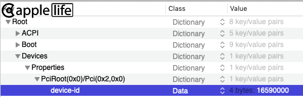  
  
## Intel UHD Graphics 610-655 ([Coffee Lake](https://en.wikipedia.org/wiki/Coffee_Lake) and [Comet Lake](https://en.wikipedia.org/wiki/Comet_Lake) processors)  

> Supported since macOS 10.14 (`UHD630 Comet Lake` supported since macOS 10.15.4, recommended 10.15.5)  
  
***CFL/CML framebuffer list:***

| Framebuffer | Type    | Connectors | TOTAL STOLEN Memory |
| ----------- | ------- | ---------- | ------------------- |
| 0x3EA50009  | mobile  | 3          | 58 MB               |
| 0x3E920009  | mobile  | 3          | 58 MB               |
| 0x3E9B0009  | mobile  | 3          | 58 MB               |
| 0x3EA50000  | mobile  | 3          | 58 MB               |
| 0x3E920000  | mobile  | 3          | 58 MB               |
| 0x3E000000  | mobile  | 3          | 58 MB               |
| 0x3E9B0000  | mobile  | 3          | 58 MB               |
| 0x3EA50004  | mobile  | 3          | 58 MB               |
| 0x3EA50005  | mobile  | 3          | 58 MB               |
| 0x3EA60005  | mobile  | 3          | 58 MB               |
| 0x3E9B0006  | mobile  | 1          | 39 MB               |
| 0x3E9B0008  | mobile  | 1          | 58 MB               |
| 0x3E9B0007  | desktop | 3          | 58 MB               |
| 0x3E920003  | desktop | 0          | 1 MB                |
| 0x3E910003  | desktop | 0          | 1 MB                |
| 0x3E980003  | desktop | 0          | 1 MB                |
| 0x9BC80003  | desktop | 0          | 1 MB                |
| 0x9BC50003  | desktop | 0          | 1 MB                |
| 0x9BC40003  | desktop | 0          | 1 MB                |

<details>
<summary>Spoiler: CFL/CML connectors</summary>
  
`AppleIntelCFLGraphicsFramebuffer.kext`  
  
ID: 3EA50009, STOLEN: 57 MB, FBMEM: 0 bytes, VRAM: 1536 MB, Flags: 0x00830B0A  
TOTAL STOLEN: 58 MB, TOTAL CURSOR: 1 MB (1572864 bytes), MAX STOLEN: 172 MB, MAX OVERALL: 173 MB (181940224 bytes)  
Model name: Intel HD Graphics CFL CRB  
Camellia: CamelliaV3 (3), Freq: 0 Hz, FreqMax: 0 Hz  
Mobile: 1, PipeCount: 3, PortCount: 3, FBMemoryCount: 3  
[0] busId: 0x00, pipe: 8, type: 0x00000002, flags: 0x00000098 - ConnectorLVDS  
[1] busId: 0x05, pipe: 9, type: 0x00000400, flags: 0x000001C7 - ConnectorDP  
[2] busId: 0x04, pipe: 10, type: 0x00000400, flags: 0x000001C7 - ConnectorDP  
00000800 02000000 98000000  
01050900 00040000 C7010000  
02040A00 00040000 C7010000  
  
ID: 3E920009, STOLEN: 57 MB, FBMEM: 0 bytes, VRAM: 1536 MB, Flags: 0x0083130A  
TOTAL STOLEN: 58 MB, TOTAL CURSOR: 1 MB (1572864 bytes), MAX STOLEN: 172 MB, MAX OVERALL: 173 MB (181940224 bytes)  
Model name: Intel HD Graphics CFL CRB  
Camellia: CamelliaV3 (3), Freq: 0 Hz, FreqMax: 0 Hz  
Mobile: 1, PipeCount: 3, PortCount: 3, FBMemoryCount: 3  
[0] busId: 0x00, pipe: 8, type: 0x00000002, flags: 0x00000098 - ConnectorLVDS  
[255] busId: 0x00, pipe: 0, type: 0x00000001, flags: 0x00000020 - ConnectorDummy  
[255] busId: 0x00, pipe: 0, type: 0x00000001, flags: 0x00000020 - ConnectorDummy  
00000800 02000000 98000000  
FF000000 01000000 20000000  
FF000000 01000000 20000000  
  
ID: 3E9B0009, STOLEN: 57 MB, FBMEM: 0 bytes, VRAM: 1536 MB, Flags: 0x0083130A  
TOTAL STOLEN: 58 MB, TOTAL CURSOR: 1 MB (1572864 bytes), MAX STOLEN: 172 MB, MAX OVERALL: 173 MB (181940224 bytes)  
Model name: Intel HD Graphics CFL CRB  
Camellia: CamelliaV3 (3), Freq: 0 Hz, FreqMax: 0 Hz  
Mobile: 1, PipeCount: 3, PortCount: 3, FBMemoryCount: 3  
[0] busId: 0x00, pipe: 8, type: 0x00000002, flags: 0x00000098 - ConnectorLVDS  
[1] busId: 0x05, pipe: 9, type: 0x00000400, flags: 0x00000187 - ConnectorDP  
[2] busId: 0x04, pipe: 10, type: 0x00000400, flags: 0x00000187 - ConnectorDP  
00000800 02000000 98000000  
01050900 00040000 87010000  
02040A00 00040000 87010000  
  
ID: 3EA50000, STOLEN: 57 MB, FBMEM: 0 bytes, VRAM: 1536 MB, Flags: 0x00030B0B  
TOTAL STOLEN: 58 MB, TOTAL CURSOR: 1 MB (1572864 bytes), MAX STOLEN: 172 MB, MAX OVERALL: 173 MB (181940224 bytes)  
Model name: Intel HD Graphics CFL CRB  
Camellia: CamelliaDisabled (0), Freq: 0 Hz, FreqMax: 0 Hz  
Mobile: 1, PipeCount: 3, PortCount: 3, FBMemoryCount: 3  
[0] busId: 0x00, pipe: 8, type: 0x00000002, flags: 0x00000098 - ConnectorLVDS  
[1] busId: 0x05, pipe: 9, type: 0x00000400, flags: 0x00000187 - ConnectorDP  
[2] busId: 0x04, pipe: 10, type: 0x00000400, flags: 0x00000187 - ConnectorDP  
00000800 02000000 98000000  
01050900 00040000 87010000  
02040A00 00040000 87010000  
  
ID: 3E920000, STOLEN: 57 MB, FBMEM: 0 bytes, VRAM: 1536 MB, Flags: 0x0000130B  
TOTAL STOLEN: 58 MB, TOTAL CURSOR: 1 MB (1572864 bytes), MAX STOLEN: 172 MB, MAX OVERALL: 173 MB (181940224 bytes)  
Model name: Intel HD Graphics CFL CRB  
Camellia: CamelliaDisabled (0), Freq: 0 Hz, FreqMax: 0 Hz  
Mobile: 1, PipeCount: 3, PortCount: 3, FBMemoryCount: 3  
[0] busId: 0x00, pipe: 8, type: 0x00000002, flags: 0x00000098 - ConnectorLVDS  
[1] busId: 0x05, pipe: 9, type: 0x00000400, flags: 0x00000187 - ConnectorDP  
[2] busId: 0x04, pipe: 10, type: 0x00000400, flags: 0x00000187 - ConnectorDP  
00000800 02000000 98000000  
01050900 00040000 87010000  
02040A00 00040000 87010000  
  
ID: 3E000000, STOLEN: 57 MB, FBMEM: 0 bytes, VRAM: 1536 MB, Flags: 0x0000130B  
TOTAL STOLEN: 58 MB, TOTAL CURSOR: 1 MB (1572864 bytes), MAX STOLEN: 172 MB, MAX OVERALL: 173 MB (181940224 bytes)  
Model name: Intel HD Graphics CFL CRB  
Camellia: CamelliaDisabled (0), Freq: 0 Hz, FreqMax: 0 Hz  
Mobile: 1, PipeCount: 3, PortCount: 3, FBMemoryCount: 3  
[0] busId: 0x00, pipe: 8, type: 0x00000002, flags: 0x00000098 - ConnectorLVDS  
[1] busId: 0x05, pipe: 9, type: 0x00000400, flags: 0x00000187 - ConnectorDP  
[2] busId: 0x04, pipe: 10, type: 0x00000400, flags: 0x00000187 - ConnectorDP  
00000800 02000000 98000000  
01050900 00040000 87010000  
02040A00 00040000 87010000  
  
ID: 3E9B0000, STOLEN: 57 MB, FBMEM: 0 bytes, VRAM: 1536 MB, Flags: 0x0000130B  
TOTAL STOLEN: 58 MB, TOTAL CURSOR: 1 MB (1572864 bytes), MAX STOLEN: 172 MB, MAX OVERALL: 173 MB (181940224 bytes)  
Model name: Intel HD Graphics CFL CRB  
Camellia: CamelliaDisabled (0), Freq: 0 Hz, FreqMax: 0 Hz  
Mobile: 1, PipeCount: 3, PortCount: 3, FBMemoryCount: 3  
[0] busId: 0x00, pipe: 8, type: 0x00000002, flags: 0x00000098 - ConnectorLVDS  
[1] busId: 0x05, pipe: 9, type: 0x00000400, flags: 0x00000187 - ConnectorDP  
[2] busId: 0x04, pipe: 10, type: 0x00000400, flags: 0x00000187 - ConnectorDP  
00000800 02000000 98000000  
01050900 00040000 87010000  
02040A00 00040000 87010000  
  
ID: 3EA50004, STOLEN: 57 MB, FBMEM: 0 bytes, VRAM: 1536 MB, Flags: 0x00E30B0A  
TOTAL STOLEN: 58 MB, TOTAL CURSOR: 1 MB (1572864 bytes), MAX STOLEN: 172 MB, MAX OVERALL: 173 MB (181940224 bytes)  
Model name: Intel Iris Plus Graphics 655  
Camellia: CamelliaV3 (3), Freq: 0 Hz, FreqMax: 0 Hz  
Mobile: 1, PipeCount: 3, PortCount: 3, FBMemoryCount: 3  
[0] busId: 0x00, pipe: 8, type: 0x00000002, flags: 0x00000498 - ConnectorLVDS  
[1] busId: 0x05, pipe: 9, type: 0x00000400, flags: 0x000003C7 - ConnectorDP  
[2] busId: 0x04, pipe: 10, type: 0x00000400, flags: 0x000003C7 - ConnectorDP  
00000800 02000000 98040000  
01050900 00040000 C7030000  
02040A00 00040000 C7030000  
  
ID: 3EA50005, STOLEN: 57 MB, FBMEM: 0 bytes, VRAM: 1536 MB, Flags: 0x00E30B0A  
TOTAL STOLEN: 58 MB, TOTAL CURSOR: 1 MB (1572864 bytes), MAX STOLEN: 172 MB, MAX OVERALL: 173 MB (181940224 bytes)  
Model name: Intel Iris Plus Graphics 655  
Camellia: CamelliaV3 (3), Freq: 0 Hz, FreqMax: 0 Hz  
Mobile: 1, PipeCount: 3, PortCount: 3, FBMemoryCount: 3  
[0] busId: 0x00, pipe: 8, type: 0x00000002, flags: 0x00000498 - ConnectorLVDS  
[1] busId: 0x05, pipe: 9, type: 0x00000400, flags: 0x000003C7 - ConnectorDP  
[2] busId: 0x04, pipe: 10, type: 0x00000400, flags: 0x000003C7 - ConnectorDP  
00000800 02000000 98040000  
01050900 00040000 C7030000  
02040A00 00040000 C7030000  
  
ID: 3EA60005, STOLEN: 57 MB, FBMEM: 0 bytes, VRAM: 1536 MB, Flags: 0x00E30B0A  
TOTAL STOLEN: 58 MB, TOTAL CURSOR: 1 MB (1572864 bytes), MAX STOLEN: 172 MB, MAX OVERALL: 173 MB (181940224 bytes)  
Model name: Intel Iris Plus Graphics 645  
Camellia: CamelliaV3 (3), Freq: 0 Hz, FreqMax: 0 Hz  
Mobile: 1, PipeCount: 3, PortCount: 3, FBMemoryCount: 3  
[0] busId: 0x00, pipe: 8, type: 0x00000002, flags: 0x00000498 - ConnectorLVDS  
[1] busId: 0x05, pipe: 9, type: 0x00000400, flags: 0x000003C7 - ConnectorDP  
[2] busId: 0x04, pipe: 10, type: 0x00000400, flags: 0x000003C7 - ConnectorDP  
00000800 02000000 98040000  
01050900 00040000 C7030000  
02040A00 00040000 C7030000  
  
ID: 3E9B0006, STOLEN: 38 MB, FBMEM: 0 bytes, VRAM: 1536 MB, Flags: 0x00131302  
TOTAL STOLEN: 39 MB, TOTAL CURSOR: 512 KB, MAX STOLEN: 39 MB, MAX OVERALL: 39 MB (41422848 bytes)  
Model name: Intel UHD Graphics 630  
Camellia: CamelliaV3 (3), Freq: 0 Hz, FreqMax: 0 Hz  
Mobile: 1, PipeCount: 1, PortCount: 1, FBMemoryCount: 1  
[0] busId: 0x00, pipe: 8, type: 0x00000002, flags: 0x00000498 - ConnectorLVDS  
00000800 02000000 98040000  
  
ID: 3E9B0008, STOLEN: 57 MB, FBMEM: 0 bytes, VRAM: 1536 MB, Flags: 0x00031302  
TOTAL STOLEN: 58 MB, TOTAL CURSOR: 512 KB, MAX STOLEN: 58 MB, MAX OVERALL: 58 MB (61345792 bytes)  
Model name: Intel UHD Graphics 630  
Camellia: CamelliaV3 (3), Freq: 0 Hz, FreqMax: 0 Hz  
Mobile: 1, PipeCount: 1, PortCount: 1, FBMemoryCount: 1  
[0] busId: 0x00, pipe: 8, type: 0x00000002, flags: 0x00000098 - ConnectorLVDS  
00000800 02000000 98000000  

ID: 3E9B0007, STOLEN: 57 MB, FBMEM: 0 bytes, VRAM: 1536 MB, Flags: 0x00801302  
TOTAL STOLEN: 58 MB, TOTAL CURSOR: 1 MB (1572864 bytes), MAX STOLEN: 172 MB, MAX OVERALL: 173 MB (181940224 bytes)  
Model name: Intel UHD Graphics 630  
Camellia: CamelliaDisabled (0), Freq: 0 Hz, FreqMax: 0 Hz  
Mobile: 0, PipeCount: 3, PortCount: 3, FBMemoryCount: 3  
[1] busId: 0x05, pipe: 9, type: 0x00000400, flags: 0x000003C7 - ConnectorDP  
[2] busId: 0x04, pipe: 10, type: 0x00000400, flags: 0x000003C7 - ConnectorDP  
[3] busId: 0x06, pipe: 8, type: 0x00000400, flags: 0x000003C7 - ConnectorDP  
01050900 00040000 C7030000  
02040A00 00040000 C7030000  
03060800 00040000 C7030000  
  
ID: 3E920003, STOLEN: 0 bytes, FBMEM: 0 bytes, VRAM: 1536 MB, Flags: 0x00001000  
TOTAL STOLEN: 1 MB, TOTAL CURSOR: 0 bytes, MAX STOLEN: 1 MB, MAX OVERALL: 1 MB  
Model name: Intel HD Graphics CFL  
Camellia: CamelliaDisabled (0), Freq: 0 Hz, FreqMax: 0 Hz  
Mobile: 0, PipeCount: 0, PortCount: 0, FBMemoryCount: 0  
  
ID: 3E910003, STOLEN: 0 bytes, FBMEM: 0 bytes, VRAM: 1536 MB, Flags: 0x00001000  
TOTAL STOLEN: 1 MB, TOTAL CURSOR: 0 bytes, MAX STOLEN: 1 MB, MAX OVERALL: 1 MB  
Model name: Intel HD Graphics CFL  
Camellia: CamelliaDisabled (0), Freq: 0 Hz, FreqMax: 0 Hz  
Mobile: 0, PipeCount: 0, PortCount: 0, FBMemoryCount: 0  
  
ID: 3E980003, STOLEN: 0 bytes, FBMEM: 0 bytes, VRAM: 1536 MB, Flags: 0x00001000  
TOTAL STOLEN: 1 MB, TOTAL CURSOR: 0 bytes, MAX STOLEN: 1 MB, MAX OVERALL: 1 MB  
Model name: Intel HD Graphics CFL  
Camellia: CamelliaDisabled (0), Freq: 0 Hz, FreqMax: 0 Hz  
Mobile: 0, PipeCount: 0, PortCount: 0, FBMemoryCount: 0  
  
ID: 9BC80003, STOLEN: 0 bytes, FBMEM: 0 bytes, VRAM: 1536 MB, Flags: 0x00001000  
TOTAL STOLEN: 1 MB, TOTAL CURSOR: 0 bytes, MAX STOLEN: 1 MB, MAX OVERALL: 1 MB  
Model name: Intel HD Graphics CFL  
Camellia: CamelliaDisabled (0), Freq: 0 Hz, FreqMax: 0 Hz  
Mobile: 0, PipeCount: 0, PortCount: 0, FBMemoryCount: 0  
  
ID: 9BC50003, STOLEN: 0 bytes, FBMEM: 0 bytes, VRAM: 1536 MB, Flags: 0x00001000  
TOTAL STOLEN: 1 MB, TOTAL CURSOR: 0 bytes, MAX STOLEN: 1 MB, MAX OVERALL: 1 MB  
Model name: Intel HD Graphics CFL  
Camellia: CamelliaDisabled (0), Freq: 0 Hz, FreqMax: 0 Hz  
Mobile: 0, PipeCount: 0, PortCount: 0, FBMemoryCount: 0  
  
ID: 9BC40003, STOLEN: 0 bytes, FBMEM: 0 bytes, VRAM: 1536 MB, Flags: 0x00001000  
TOTAL STOLEN: 1 MB, TOTAL CURSOR: 0 bytes, MAX STOLEN: 1 MB, MAX OVERALL: 1 MB  
Model name: Intel HD Graphics CFL  
Camellia: CamelliaDisabled (0), Freq: 0 Hz, FreqMax: 0 Hz  
Mobile: 0, PipeCount: 0, PortCount: 0, FBMemoryCount: 0  
  
Note, that without AAPL,ig-platform-id the following ID is assumed: 3EA50000  
</details>
<br>

***Native supported DevIDs:***

- CFL:
  - `0x3E9B`
  - `0x3EA5`
  - `0x3EA6`
  - `0x3E92`
  - `0x3E91`
  - `0x3E98`
- CML:
  - `0x9BC8`
  - `0x9BC5`
  - `0x9BC4`

***Recommended framebuffers:***

- Desktop:
  - `0x3EA50000` (default)
  - `0x3E9B0007` (recommended)
- Laptop:
  - `0x3EA50009` (default)
- Empty framebuffer (CFL):
  - `0x3E910003` (default)
- Empty framebuffer (CML):
  - `0x9BC80003` (default)
  
If you are using a 9th generation [Coffee Lake Refresh](https://en.wikipedia.org/wiki/Coffee_Lake#List_of_9th_generation_Coffee_Lake_processors) processor, it is necessary to fake `device-id` `923E0000` for `IGPU`. Starting with macOS 10.14.4 the fake is not necessary.  
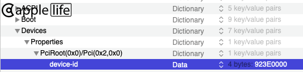  

For UHD620 ([Whiskey Lake](https://en.wikipedia.org/wiki/Whiskey_Lake_(microarchitecture))) fake `device-id` `A53E0000` for `IGPU`.  
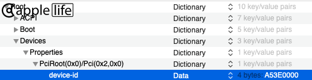
  
<details>
<summary>Spoiler: macOS 10.13 and CFL</summary>
Installing 10.13 on the Coffee Lake platform makes sense only if there is a reason, like having discrete NVIDIA Maxwell / Pascal graphics with absent 10.14 web drivers.  
  
There is a special build of macOS High Sierra 10.13.6 (17G2208), which has native support for Coffee Lake graphics: [link1](https://drive.google.com/file/d/1FyPvo81K8qEXhiEuwDX3mAHMg1ZMdiYS/view), [link2](https://mega.nz/#!GNgDTDob!N3jediG_xrzJPRFi9bQ0MtAFCKbOl33QvQp9tRUSwhQ). This version has no [empty framebuffers](https://www.applelife.ru/threads/zavod-intel-quick-sync-video.817923/) (0 connectors) and there is no dev.id 0x3E91.  
To have [empty framebuffer](https://www.applelife.ru/threads/zavod-intel-quick-sync-video.817923/) (0 connectors) this special build requires installing AppleIntelCFLGraphicsFramebuffer.kext from 10.14 or newer.  
For `IGPU` with dev.id 0x3E91 fake the id with 0x3E92 (`device-id` `923E0000`).  
The 3025 and newer updates with Coffee Lake support are as limited as the initial special build.  
  
And you can always enable UHD630 in macOS 10.13 using the fake `device-id` of a Kaby Lake HD630.  
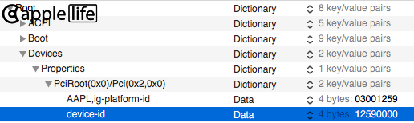  
Use the Kaby Lake HD630 framebuffer (specify the framebuffer explicitly!)  
</details>
  
## Intel Iris Plus Graphics ([Ice Lake](https://en.wikipedia.org/wiki/Ice_Lake_(microprocessor)) processors)

> Supported since macOS 10.15.4  
  
***ICL framebuffer list:***

| Framebuffer | Type   | Connectors | TOTAL STOLEN Memory |
| ----------- | ------ | ---------- | ------------------- |
| 0xFF050000  | mobile | 3          | 193 MB?             |
| 0x8A710000  | mobile | 6          | 193 MB?             |
| 0x8A700000  | mobile | 6          | 193 MB?             |
| 0x8A510000  | mobile | 6          | 193 MB?             |
| 0x8A5C0000  | mobile | 6          | 193 MB?             |
| 0x8A5D0000  | mobile | 6          | 193 MB?             |
| 0x8A520000  | mobile | 6          | 193 MB?             |
| 0x8A530000  | mobile | 6          | 193 MB?             |
| 0x8A5A0000  | mobile | 6          | 193 MB?             |
| 0x8A5B0000  | mobile | 6          | 193 MB?             |
| 0x8A710001  | mobile | 5          | 193 MB?             |
| 0x8A700001  | mobile | 5          | 193 MB?             |
| 0x8A510001  | mobile | 3          | 193 MB?             |
| 0x8A5C0001  | mobile | 3          | 193 MB?             |
| 0x8A5D0001  | mobile | 3          | 193 MB?             |
| 0x8A520001  | mobile | 5          | 193 MB?             |
| 0x8A530001  | mobile | 5          | 193 MB?             |
| 0x8A5A0001  | mobile | 5          | 193 MB?             |
| 0x8A5B0001  | mobile | 5          | 193 MB?             |
| 0x8A510002  | mobile | 3          | 193 MB?             |
| 0x8A5C0002  | mobile | 3          | 193 MB?             |
| 0x8A520002  | mobile | 5          | 193 MB?             |
| 0x8A530002  | mobile | 5          | 193 MB?             |

<details>
<summary>Spoiler: ICL connectors</summary>
  
`AppleIntelICLLPGraphicsFramebuffer.kext`  
  
ID: FF050000, STOLEN: 64 MB, FBMEM: 0 bytes, VRAM: 1536 MB, Flags: 0x00000300  
TOTAL STOLEN: 193 MB?, TOTAL CURSOR: 1 MB (1572864 bytes), MAX STOLEN: 193 MB, MAX OVERALL: 194 MB (203960320 bytes)  
Model name: Intel HD Graphics ICL SIM  
Camellia: CamelliaDisabled (0), Freq: 0 Hz, FreqMax: 0 Hz  
Mobile: 1, PipeCount: 3, PortCount: 3, FBMemoryCount: 3  
[0] busId: 0x00, pipe: 0, type: 0x00000002, flags: 0x00000018 - ConnectorLVDS  
[1] busId: 0x02, pipe: 1, type: 0x00000400, flags: 0x00000201 - ConnectorDP  
[2] busId: 0x09, pipe: 1, type: 0x00000400, flags: 0x00000201 - ConnectorDP  
00000000 00000000 00000000 00000000 02000000 18000000  
01000000 02000000 01000000 00000000 00040000 01020000  
02000000 09000000 01000000 01000000 00040000 01020000  

ID: 8A710000, STOLEN: 64 MB, FBMEM: 0 bytes, VRAM: 1536 MB, Flags: 0x00008301  
TOTAL STOLEN: 193 MB?, TOTAL CURSOR: 1 MB (1572864 bytes), MAX STOLEN: 193 MB, MAX OVERALL: 194 MB (203972608 bytes)  
Model name: Intel HD Graphics ICL RVP  
Camellia: CamelliaDisabled (0), Freq: 0 Hz, FreqMax: 0 Hz  
Mobile: 1, PipeCount: 3, PortCount: 6, FBMemoryCount: 3  
[0] busId: 0x00, pipe: 0, type: 0x00000002, flags: 0x00000018 - ConnectorLVDS  
[1] busId: 0x02, pipe: 1, type: 0x00000400, flags: 0x00000281 - ConnectorDP  
[2] busId: 0x09, pipe: 1, type: 0x00000400, flags: 0x00000281 - ConnectorDP  
[3] busId: 0x0A, pipe: 1, type: 0x00000400, flags: 0x00000281 - ConnectorDP  
[4] busId: 0x0B, pipe: 1, type: 0x00000400, flags: 0x00000281 - ConnectorDP  
[5] busId: 0x0C, pipe: 1, type: 0x00000400, flags: 0x00000281 - ConnectorDP  
00000000 00000000 00000000 00000000 02000000 18000000  
01000000 02000000 01000000 00000000 00040000 81020000  
02000000 09000000 01000000 01000000 00040000 81020000  
03000000 0A000000 01000000 01000000 00040000 81020000  
04000000 0B000000 01000000 01000000 00040000 81020000  
05000000 0C000000 01000000 01000000 00040000 81020000  
  
ID: 8A700000, STOLEN: 64 MB, FBMEM: 0 bytes, VRAM: 1536 MB, Flags: 0x00018301  
TOTAL STOLEN: 193 MB?, TOTAL CURSOR: 1 MB (1572864 bytes), MAX STOLEN: 193 MB, MAX OVERALL: 194 MB (203972608 bytes)  
Model name: Intel HD Graphics ICL RVP  
Camellia: CamelliaDisabled (0), Freq: 0 Hz, FreqMax: 0 Hz  
Mobile: 1, PipeCount: 3, PortCount: 6, FBMemoryCount: 3  
[0] busId: 0x00, pipe: 0, type: 0x00000002, flags: 0x00000018 - ConnectorLVDS  
[1] busId: 0x02, pipe: 1, type: 0x00000400, flags: 0x00000281 - ConnectorDP  
[2] busId: 0x09, pipe: 1, type: 0x00000400, flags: 0x00000281 - ConnectorDP  
[3] busId: 0x0A, pipe: 1, type: 0x00000400, flags: 0x00000281 - ConnectorDP  
[4] busId: 0x0B, pipe: 1, type: 0x00000400, flags: 0x00000281 - ConnectorDP  
[5] busId: 0x0C, pipe: 1, type: 0x00000400, flags: 0x00000281 - ConnectorDP  
00000000 00000000 00000000 00000000 02000000 18000000  
01000000 02000000 01000000 00000000 00040000 81020000  
02000000 09000000 01000000 01000000 00040000 81020000  
03000000 0A000000 01000000 01000000 00040000 81020000  
04000000 0B000000 01000000 01000000 00040000 81020000  
05000000 0C000000 01000000 01000000 00040000 81020000  
  
ID: 8A510000, STOLEN: 64 MB, FBMEM: 0 bytes, VRAM: 1536 MB, Flags: 0x00008305  
TOTAL STOLEN: 193 MB?, TOTAL CURSOR: 1 MB (1572864 bytes), MAX STOLEN: 193 MB, MAX OVERALL: 194 MB (203972608 bytes)  
Model name: Intel HD Graphics ICL RVP  
Camellia: CamelliaDisabled (0), Freq: 0 Hz, FreqMax: 0 Hz  
Mobile: 1, PipeCount: 3, PortCount: 6, FBMemoryCount: 3  
[0] busId: 0x00, pipe: 0, type: 0x00000002, flags: 0x00000018 - ConnectorLVDS  
[1] busId: 0x02, pipe: 1, type: 0x00000400, flags: 0x00000281 - ConnectorDP  
[2] busId: 0x09, pipe: 1, type: 0x00000400, flags: 0x00000281 - ConnectorDP  
[3] busId: 0x0A, pipe: 1, type: 0x00000400, flags: 0x00000281 - ConnectorDP  
[4] busId: 0x0B, pipe: 1, type: 0x00000400, flags: 0x00000281 - ConnectorDP  
[5] busId: 0x0C, pipe: 1, type: 0x00000400, flags: 0x00000281 - ConnectorDP  
00000000 00000000 00000000 00000000 02000000 18000000  
01000000 02000000 01000000 00000000 00040000 81020000  
02000000 09000000 01000000 01000000 00040000 81020000  
03000000 0A000000 01000000 01000000 00040000 81020000  
04000000 0B000000 01000000 01000000 00040000 81020000  
05000000 0C000000 01000000 01000000 00040000 81020000  
  
ID: 8A5C0000, STOLEN: 64 MB, FBMEM: 0 bytes, VRAM: 1536 MB, Flags: 0x00008305  
TOTAL STOLEN: 193 MB?, TOTAL CURSOR: 1 MB (1572864 bytes), MAX STOLEN: 193 MB, MAX OVERALL: 194 MB (203972608 bytes)  
Model name: Intel HD Graphics ICL RVP  
Camellia: CamelliaDisabled (0), Freq: 0 Hz, FreqMax: 0 Hz  
Mobile: 1, PipeCount: 3, PortCount: 6, FBMemoryCount: 3  
[0] busId: 0x00, pipe: 0, type: 0x00000002, flags: 0x00000018 - ConnectorLVDS  
[1] busId: 0x02, pipe: 1, type: 0x00000400, flags: 0x00000281 - ConnectorDP  
[2] busId: 0x09, pipe: 1, type: 0x00000400, flags: 0x00000281 - ConnectorDP  
[3] busId: 0x0A, pipe: 1, type: 0x00000400, flags: 0x00000281 - ConnectorDP  
[4] busId: 0x0B, pipe: 1, type: 0x00000400, flags: 0x00000281 - ConnectorDP  
[5] busId: 0x0C, pipe: 1, type: 0x00000400, flags: 0x00000281 - ConnectorDP  
00000000 00000000 00000000 00000000 02000000 18000000  
01000000 02000000 01000000 00000000 00040000 81020000  
02000000 09000000 01000000 01000000 00040000 81020000  
03000000 0A000000 01000000 01000000 00040000 81020000  
04000000 0B000000 01000000 01000000 00040000 81020000  
05000000 0C000000 01000000 01000000 00040000 81020000  
  
ID: 8A5D0000, STOLEN: 64 MB, FBMEM: 0 bytes, VRAM: 1536 MB, Flags: 0x00008301  
TOTAL STOLEN: 193 MB?, TOTAL CURSOR: 1 MB (1572864 bytes), MAX STOLEN: 193 MB, MAX OVERALL: 194 MB (203972608 bytes)  
Model name: Intel HD Graphics ICL RVP  
Camellia: CamelliaDisabled (0), Freq: 0 Hz, FreqMax: 0 Hz  
Mobile: 1, PipeCount: 3, PortCount: 6, FBMemoryCount: 3  
[0] busId: 0x00, pipe: 0, type: 0x00000002, flags: 0x00000018 - ConnectorLVDS  
[1] busId: 0x02, pipe: 1, type: 0x00000400, flags: 0x00000281 - ConnectorDP  
[2] busId: 0x09, pipe: 1, type: 0x00000400, flags: 0x00000281 - ConnectorDP  
[3] busId: 0x0A, pipe: 1, type: 0x00000400, flags: 0x00000281 - ConnectorDP  
[4] busId: 0x0B, pipe: 1, type: 0x00000400, flags: 0x00000281 - ConnectorDP  
[5] busId: 0x0C, pipe: 1, type: 0x00000400, flags: 0x00000281 - ConnectorDP  
00000000 00000000 00000000 00000000 02000000 18000000  
01000000 02000000 01000000 00000000 00040000 81020000  
02000000 09000000 01000000 01000000 00040000 81020000  
03000000 0A000000 01000000 01000000 00040000 81020000  
04000000 0B000000 01000000 01000000 00040000 81020000  
05000000 0C000000 01000000 01000000 00040000 81020000  
  
ID: 8A520000, STOLEN: 64 MB, FBMEM: 0 bytes, VRAM: 1536 MB, Flags: 0x00008305  
TOTAL STOLEN: 193 MB?, TOTAL CURSOR: 1 MB (1572864 bytes), MAX STOLEN: 193 MB, MAX OVERALL: 194 MB (203972608 bytes)  
Model name: Intel HD Graphics ICL RVP  
Camellia: CamelliaDisabled (0), Freq: 0 Hz, FreqMax: 0 Hz  
Mobile: 1, PipeCount: 3, PortCount: 6, FBMemoryCount: 3  
[0] busId: 0x00, pipe: 0, type: 0x00000002, flags: 0x00000018 - ConnectorLVDS  
[1] busId: 0x02, pipe: 1, type: 0x00000400, flags: 0x00000281 - ConnectorDP  
[2] busId: 0x09, pipe: 1, type: 0x00000400, flags: 0x00000281 - ConnectorDP  
[3] busId: 0x0A, pipe: 1, type: 0x00000400, flags: 0x00000281 - ConnectorDP  
[4] busId: 0x0B, pipe: 1, type: 0x00000400, flags: 0x00000281 - ConnectorDP  
[5] busId: 0x0C, pipe: 1, type: 0x00000400, flags: 0x00000281 - ConnectorDP  
00000000 00000000 00000000 00000000 02000000 18000000  
01000000 02000000 01000000 00000000 00040000 81020000  
02000000 09000000 01000000 01000000 00040000 81020000  
03000000 0A000000 01000000 01000000 00040000 81020000  
04000000 0B000000 01000000 01000000 00040000 81020000  
05000000 0C000000 01000000 01000000 00040000 81020000  
  
ID: 8A530000, STOLEN: 64 MB, FBMEM: 0 bytes, VRAM: 1536 MB, Flags: 0x00008305  
TOTAL STOLEN: 193 MB?, TOTAL CURSOR: 1 MB (1572864 bytes), MAX STOLEN: 193 MB, MAX OVERALL: 194 MB (203972608 bytes)  
Model name: Intel HD Graphics ICL RVP  
Camellia: CamelliaDisabled (0), Freq: 0 Hz, FreqMax: 0 Hz  
Mobile: 1, PipeCount: 3, PortCount: 6, FBMemoryCount: 3  
[0] busId: 0x00, pipe: 0, type: 0x00000002, flags: 0x00000018 - ConnectorLVDS  
[1] busId: 0x02, pipe: 1, type: 0x00000400, flags: 0x00000281 - ConnectorDP  
[2] busId: 0x09, pipe: 1, type: 0x00000400, flags: 0x00000281 - ConnectorDP  
[3] busId: 0x0A, pipe: 1, type: 0x00000400, flags: 0x00000281 - ConnectorDP  
[4] busId: 0x0B, pipe: 1, type: 0x00000400, flags: 0x00000281 - ConnectorDP  
[5] busId: 0x0C, pipe: 1, type: 0x00000400, flags: 0x00000281 - ConnectorDP  
00000000 00000000 00000000 00000000 02000000 18000000  
01000000 02000000 01000000 00000000 00040000 81020000  
02000000 09000000 01000000 01000000 00040000 81020000  
03000000 0A000000 01000000 01000000 00040000 81020000  
04000000 0B000000 01000000 01000000 00040000 81020000  
05000000 0C000000 01000000 01000000 00040000 81020000  
  
ID: 8A5A0000, STOLEN: 64 MB, FBMEM: 0 bytes, VRAM: 1536 MB, Flags: 0x00008305  
TOTAL STOLEN: 193 MB?, TOTAL CURSOR: 1 MB (1572864 bytes), MAX STOLEN: 193 MB, MAX OVERALL: 194 MB (203972608 bytes)  
Model name: Intel HD Graphics ICL RVP  
Camellia: CamelliaDisabled (0), Freq: 0 Hz, FreqMax: 0 Hz  
Mobile: 1, PipeCount: 3, PortCount: 6, FBMemoryCount: 3  
[0] busId: 0x00, pipe: 0, type: 0x00000002, flags: 0x00000018 - ConnectorLVDS  
[1] busId: 0x02, pipe: 1, type: 0x00000400, flags: 0x00000281 - ConnectorDP  
[2] busId: 0x09, pipe: 1, type: 0x00000400, flags: 0x00000281 - ConnectorDP  
[3] busId: 0x0A, pipe: 1, type: 0x00000400, flags: 0x00000281 - ConnectorDP  
[4] busId: 0x0B, pipe: 1, type: 0x00000400, flags: 0x00000281 - ConnectorDP  
[5] busId: 0x0C, pipe: 1, type: 0x00000400, flags: 0x00000281 - ConnectorDP  
00000000 00000000 00000000 00000000 02000000 18000000  
01000000 02000000 01000000 00000000 00040000 81020000  
02000000 09000000 01000000 01000000 00040000 81020000  
03000000 0A000000 01000000 01000000 00040000 81020000  
04000000 0B000000 01000000 01000000 00040000 81020000  
05000000 0C000000 01000000 01000000 00040000 81020000  
  
ID: 8A5B0000, STOLEN: 64 MB, FBMEM: 0 bytes, VRAM: 1536 MB, Flags: 0x00008301  
TOTAL STOLEN: 193 MB?, TOTAL CURSOR: 1 MB (1572864 bytes), MAX STOLEN: 193 MB, MAX OVERALL: 194 MB (203972608 bytes)  
Model name: Intel HD Graphics ICL RVP  
Camellia: CamelliaDisabled (0), Freq: 0 Hz, FreqMax: 0 Hz  
Mobile: 1, PipeCount: 3, PortCount: 6, FBMemoryCount: 3  
[0] busId: 0x00, pipe: 0, type: 0x00000002, flags: 0x00000018 - ConnectorLVDS  
[1] busId: 0x02, pipe: 1, type: 0x00000400, flags: 0x00000281 - ConnectorDP  
[2] busId: 0x09, pipe: 1, type: 0x00000400, flags: 0x00000281 - ConnectorDP  
[3] busId: 0x0A, pipe: 1, type: 0x00000400, flags: 0x00000281 - ConnectorDP  
[4] busId: 0x0B, pipe: 1, type: 0x00000400, flags: 0x00000281 - ConnectorDP  
[5] busId: 0x0C, pipe: 1, type: 0x00000400, flags: 0x00000281 - ConnectorDP  
00000000 00000000 00000000 00000000 02000000 18000000  
01000000 02000000 01000000 00000000 00040000 81020000  
02000000 09000000 01000000 01000000 00040000 81020000  
03000000 0A000000 01000000 01000000 00040000 81020000  
04000000 0B000000 01000000 01000000 00040000 81020000  
05000000 0C000000 01000000 01000000 00040000 81020000  
  
ID: 8A710001, STOLEN: 64 MB, FBMEM: 0 bytes, VRAM: 1536 MB, Flags: 0x0000A300  
TOTAL STOLEN: 193 MB?, TOTAL CURSOR: 1 MB (1572864 bytes), MAX STOLEN: 193 MB, MAX OVERALL: 194 MB (203968512 bytes)  
Model name: Intel HD Graphics ICL RVP BigSur  
Camellia: CamelliaV3 (3), Freq: 0 Hz, FreqMax: 0 Hz  
Mobile: 1, PipeCount: 3, PortCount: 5, FBMemoryCount: 3  
[0] busId: 0x00, pipe: 0, type: 0x00000002, flags: 0x00000018 - ConnectorLVDS  
[2] busId: 0x09, pipe: 1, type: 0x00000400, flags: 0x000002C1 - ConnectorDP  
[3] busId: 0x0A, pipe: 1, type: 0x00000400, flags: 0x000002C1 - ConnectorDP  
[4] busId: 0x0B, pipe: 1, type: 0x00000400, flags: 0x000002C1 - ConnectorDP  
[5] busId: 0x0C, pipe: 1, type: 0x00000400, flags: 0x000002C1 - ConnectorDP  
00000000 00000000 00000000 00000000 02000000 18000000  
02000000 09000000 01000000 01000000 00040000 C1020000  
03000000 0A000000 01000000 01000000 00040000 C1020000  
04000000 0B000000 01000000 01000000 00040000 C1020000  
05000000 0C000000 01000000 01000000 00040000 C1020000  
  
ID: 8A700001, STOLEN: 64 MB, FBMEM: 0 bytes, VRAM: 1536 MB, Flags: 0x0001A304  
TOTAL STOLEN: 193 MB?, TOTAL CURSOR: 1 MB (1572864 bytes), MAX STOLEN: 193 MB, MAX OVERALL: 194 MB (203968512 bytes)  
Model name: Intel HD Graphics ICL RVP BigSur  
Camellia: CamelliaV3 (3), Freq: 0 Hz, FreqMax: 0 Hz  
Mobile: 1, PipeCount: 3, PortCount: 5, FBMemoryCount: 3  
[0] busId: 0x00, pipe: 0, type: 0x00000002, flags: 0x00000018 - ConnectorLVDS  
[2] busId: 0x09, pipe: 1, type: 0x00000400, flags: 0x000002C1 - ConnectorDP  
[3] busId: 0x0A, pipe: 1, type: 0x00000400, flags: 0x000002C1 - ConnectorDP  
[4] busId: 0x0B, pipe: 1, type: 0x00000400, flags: 0x000002C1 - ConnectorDP  
[5] busId: 0x0C, pipe: 1, type: 0x00000400, flags: 0x000002C1 - ConnectorDP  
00000000 00000000 00000000 00000000 02000000 18000000  
02000000 09000000 01000000 01000000 00040000 C1020000  
03000000 0A000000 01000000 01000000 00040000 C1020000  
04000000 0B000000 01000000 01000000 00040000 C1020000  
05000000 0C000000 01000000 01000000 00040000 C1020000  
  
ID: 8A510001, STOLEN: 64 MB, FBMEM: 0 bytes, VRAM: 1536 MB, Flags: 0x0000E304  
TOTAL STOLEN: 193 MB?, TOTAL CURSOR: 1 MB (1572864 bytes), MAX STOLEN: 193 MB, MAX OVERALL: 194 MB (203960320 bytes)  
Model name: Intel HD Graphics ICL RVP BigSur  
Camellia: CamelliaV3 (3), Freq: 0 Hz, FreqMax: 0 Hz  
Mobile: 1, PipeCount: 3, PortCount: 3, FBMemoryCount: 3  
[0] busId: 0x00, pipe: 0, type: 0x00000002, flags: 0x00000018 - ConnectorLVDS  
[2] busId: 0x09, pipe: 1, type: 0x00000400, flags: 0x000002C1 - ConnectorDP  
[3] busId: 0x0A, pipe: 1, type: 0x00000400, flags: 0x000002C1 - ConnectorDP  
00000000 00000000 00000000 00000000 02000000 18000000  
02000000 09000000 01000000 01000000 00040000 C1020000  
03000000 0A000000 01000000 01000000 00040000 C1020000  
  
ID: 8A5C0001, STOLEN: 64 MB, FBMEM: 0 bytes, VRAM: 1536 MB, Flags: 0x0000A304  
TOTAL STOLEN: 193 MB?, TOTAL CURSOR: 1 MB (1572864 bytes), MAX STOLEN: 193 MB, MAX OVERALL: 194 MB (203960320 bytes)  
Model name: Intel HD Graphics ICL RVP BigSur  
Camellia: CamelliaV3 (3), Freq: 0 Hz, FreqMax: 0 Hz  
Mobile: 1, PipeCount: 3, PortCount: 3, FBMemoryCount: 3  
[0] busId: 0x00, pipe: 0, type: 0x00000002, flags: 0x00000018 - ConnectorLVDS  
[2] busId: 0x09, pipe: 1, type: 0x00000400, flags: 0x000002C1 - ConnectorDP  
[3] busId: 0x0A, pipe: 1, type: 0x00000400, flags: 0x000002C1 - ConnectorDP  
00000000 00000000 00000000 00000000 02000000 18000000  
02000000 09000000 01000000 01000000 00040000 C1020000  
03000000 0A000000 01000000 01000000 00040000 C1020000  
  
ID: 8A5D0001, STOLEN: 64 MB, FBMEM: 0 bytes, VRAM: 1536 MB, Flags: 0x0000A300  
TOTAL STOLEN: 193 MB?, TOTAL CURSOR: 1 MB (1572864 bytes), MAX STOLEN: 193 MB, MAX OVERALL: 194 MB (203960320 bytes)  
Model name: Intel HD Graphics ICL RVP BigSur  
Camellia: CamelliaV3 (3), Freq: 0 Hz, FreqMax: 0 Hz  
Mobile: 1, PipeCount: 3, PortCount: 3, FBMemoryCount: 3  
[0] busId: 0x00, pipe: 0, type: 0x00000002, flags: 0x00000018 - ConnectorLVDS  
[2] busId: 0x09, pipe: 1, type: 0x00000400, flags: 0x000002C1 - ConnectorDP  
[3] busId: 0x0A, pipe: 1, type: 0x00000400, flags: 0x000002C1 - ConnectorDP  
00000000 00000000 00000000 00000000 02000000 18000000  
02000000 09000000 01000000 01000000 00040000 C1020000  
03000000 0A000000 01000000 01000000 00040000 C1020000  
  
ID: 8A520001, STOLEN: 64 MB, FBMEM: 0 bytes, VRAM: 1536 MB, Flags: 0x0000E304  
TOTAL STOLEN: 193 MB?, TOTAL CURSOR: 1 MB (1572864 bytes), MAX STOLEN: 193 MB, MAX OVERALL: 194 MB (203968512 bytes)  
Model name: Intel HD Graphics ICL RVP BigSur  
Camellia: CamelliaV3 (3), Freq: 0 Hz, FreqMax: 0 Hz  
Mobile: 1, PipeCount: 3, PortCount: 5, FBMemoryCount: 3  
[0] busId: 0x00, pipe: 0, type: 0x00000002, flags: 0x00000118 - ConnectorLVDS  
[2] busId: 0x09, pipe: 1, type: 0x00000400, flags: 0x000002C1 - ConnectorDP  
[3] busId: 0x0A, pipe: 1, type: 0x00000400, flags: 0x000002C1 - ConnectorDP  
[4] busId: 0x0B, pipe: 1, type: 0x00000400, flags: 0x000002C1 - ConnectorDP  
[5] busId: 0x0C, pipe: 1, type: 0x00000400, flags: 0x000002C1 - ConnectorDP  
00000000 00000000 00000000 00000000 02000000 18010000  
02000000 09000000 01000000 01000000 00040000 C1020000  
03000000 0A000000 01000000 01000000 00040000 C1020000  
04000000 0B000000 01000000 01000000 00040000 C1020000  
05000000 0C000000 01000000 01000000 00040000 C1020000  
  
ID: 8A530001, STOLEN: 64 MB, FBMEM: 0 bytes, VRAM: 1536 MB, Flags: 0x0000E304  
TOTAL STOLEN: 193 MB?, TOTAL CURSOR: 1 MB (1572864 bytes), MAX STOLEN: 193 MB, MAX OVERALL: 194 MB (203968512 bytes)  
Model name: Intel HD Graphics ICL RVP BigSur  
Camellia: CamelliaV3 (3), Freq: 0 Hz, FreqMax: 0 Hz  
Mobile: 1, PipeCount: 3, PortCount: 5, FBMemoryCount: 3  
[0] busId: 0x00, pipe: 0, type: 0x00000002, flags: 0x00000118 - ConnectorLVDS  
[2] busId: 0x09, pipe: 1, type: 0x00000400, flags: 0x000002C1 - ConnectorDP  
[3] busId: 0x0A, pipe: 1, type: 0x00000400, flags: 0x000002C1 - ConnectorDP  
[4] busId: 0x0B, pipe: 1, type: 0x00000400, flags: 0x000002C1 - ConnectorDP  
[5] busId: 0x0C, pipe: 1, type: 0x00000400, flags: 0x000002C1 - ConnectorDP  
00000000 00000000 00000000 00000000 02000000 18010000  
02000000 09000000 01000000 01000000 00040000 C1020000  
03000000 0A000000 01000000 01000000 00040000 C1020000  
04000000 0B000000 01000000 01000000 00040000 C1020000  
05000000 0C000000 01000000 01000000 00040000 C1020000  
  
ID: 8A5A0001, STOLEN: 64 MB, FBMEM: 0 bytes, VRAM: 1536 MB, Flags: 0x0000A304  
TOTAL STOLEN: 193 MB?, TOTAL CURSOR: 1 MB (1572864 bytes), MAX STOLEN: 193 MB, MAX OVERALL: 194 MB (203968512 bytes)  
Model name: Intel HD Graphics ICL RVP BigSur  
Camellia: CamelliaV3 (3), Freq: 0 Hz, FreqMax: 0 Hz  
Mobile: 1, PipeCount: 3, PortCount: 5, FBMemoryCount: 3  
[0] busId: 0x00, pipe: 0, type: 0x00000002, flags: 0x00000118 - ConnectorLVDS  
[2] busId: 0x09, pipe: 1, type: 0x00000400, flags: 0x000002C1 - ConnectorDP  
[3] busId: 0x0A, pipe: 1, type: 0x00000400, flags: 0x000002C1 - ConnectorDP  
[4] busId: 0x0B, pipe: 1, type: 0x00000400, flags: 0x000002C1 - ConnectorDP  
[5] busId: 0x0C, pipe: 1, type: 0x00000400, flags: 0x000002C1 - ConnectorDP  
00000000 00000000 00000000 00000000 02000000 18010000  
02000000 09000000 01000000 01000000 00040000 C1020000  
03000000 0A000000 01000000 01000000 00040000 C1020000  
04000000 0B000000 01000000 01000000 00040000 C1020000  
05000000 0C000000 01000000 01000000 00040000 C1020000  
  
ID: 8A5B0001, STOLEN: 64 MB, FBMEM: 0 bytes, VRAM: 1536 MB, Flags: 0x0000A300  
TOTAL STOLEN: 193 MB?, TOTAL CURSOR: 1 MB (1572864 bytes), MAX STOLEN: 193 MB, MAX OVERALL: 194 MB (203968512 bytes)  
Model name: Intel HD Graphics ICL RVP BigSur  
Camellia: CamelliaV3 (3), Freq: 0 Hz, FreqMax: 0 Hz  
Mobile: 1, PipeCount: 3, PortCount: 5, FBMemoryCount: 3  
[0] busId: 0x00, pipe: 0, type: 0x00000002, flags: 0x00000118 - ConnectorLVDS  
[2] busId: 0x09, pipe: 1, type: 0x00000400, flags: 0x000002C1 - ConnectorDP  
[3] busId: 0x0A, pipe: 1, type: 0x00000400, flags: 0x000002C1 - ConnectorDP  
[4] busId: 0x0B, pipe: 1, type: 0x00000400, flags: 0x000002C1 - ConnectorDP  
[5] busId: 0x0C, pipe: 1, type: 0x00000400, flags: 0x000002C1 - ConnectorDP  
00000000 00000000 00000000 00000000 02000000 18010000  
02000000 09000000 01000000 01000000 00040000 C1020000  
03000000 0A000000 01000000 01000000 00040000 C1020000  
04000000 0B000000 01000000 01000000 00040000 C1020000  
05000000 0C000000 01000000 01000000 00040000 C1020000  
  
ID: 8A510002, STOLEN: 64 MB, FBMEM: 0 bytes, VRAM: 1536 MB, Flags: 0x0000E304  
TOTAL STOLEN: 193 MB?, TOTAL CURSOR: 1 MB (1572864 bytes), MAX STOLEN: 193 MB, MAX OVERALL: 194 MB (203960320 bytes)  
Model name: Intel Iris Plus Graphics  
Camellia: CamelliaV3 (3), Freq: 0 Hz, FreqMax: 0 Hz  
Mobile: 1, PipeCount: 3, PortCount: 3, FBMemoryCount: 3  
[0] busId: 0x00, pipe: 0, type: 0x00000002, flags: 0x00000018 - ConnectorLVDS  
[2] busId: 0x09, pipe: 1, type: 0x00000400, flags: 0x000002C1 - ConnectorDP  
[3] busId: 0x0A, pipe: 1, type: 0x00000400, flags: 0x000002C1 - ConnectorDP  
00000000 00000000 00000000 00000000 02000000 18000000  
02000000 09000000 01000000 01000000 00040000 C1020000  
03000000 0A000000 01000000 01000000 00040000 C1020000  
  
ID: 8A5C0002, STOLEN: 64 MB, FBMEM: 0 bytes, VRAM: 1536 MB, Flags: 0x0000E304  
TOTAL STOLEN: 193 MB?, TOTAL CURSOR: 1 MB (1572864 bytes), MAX STOLEN: 193 MB, MAX OVERALL: 194 MB (203960320 bytes)  
Model name: Intel Iris Plus Graphics  
Camellia: CamelliaV3 (3), Freq: 0 Hz, FreqMax: 0 Hz  
Mobile: 1, PipeCount: 3, PortCount: 3, FBMemoryCount: 3  
[0] busId: 0x00, pipe: 0, type: 0x00000002, flags: 0x00000018 - ConnectorLVDS  
[2] busId: 0x09, pipe: 1, type: 0x00000400, flags: 0x000002C1 - ConnectorDP  
[3] busId: 0x0A, pipe: 1, type: 0x00000400, flags: 0x000002C1 - ConnectorDP  
00000000 00000000 00000000 00000000 02000000 18000000  
02000000 09000000 01000000 01000000 00040000 C1020000  
03000000 0A000000 01000000 01000000 00040000 C1020000  
  
ID: 8A520002, STOLEN: 64 MB, FBMEM: 0 bytes, VRAM: 1536 MB, Flags: 0x0000E304  
TOTAL STOLEN: 193 MB?, TOTAL CURSOR: 1 MB (1572864 bytes), MAX STOLEN: 193 MB, MAX OVERALL: 194 MB (203968512 bytes)  
Model name: Intel Iris Plus Graphics  
Camellia: CamelliaV3 (3), Freq: 0 Hz, FreqMax: 0 Hz  
Mobile: 1, PipeCount: 3, PortCount: 5, FBMemoryCount: 3  
[0] busId: 0x00, pipe: 0, type: 0x00000002, flags: 0x00000118 - ConnectorLVDS  
[2] busId: 0x09, pipe: 1, type: 0x00000400, flags: 0x000002C1 - ConnectorDP  
[3] busId: 0x0A, pipe: 1, type: 0x00000400, flags: 0x000002C1 - ConnectorDP  
[4] busId: 0x0B, pipe: 1, type: 0x00000400, flags: 0x000002C1 - ConnectorDP  
[5] busId: 0x0C, pipe: 1, type: 0x00000400, flags: 0x000002C1 - ConnectorDP  
00000000 00000000 00000000 00000000 02000000 18010000  
02000000 09000000 01000000 01000000 00040000 C1020000  
03000000 0A000000 01000000 01000000 00040000 C1020000  
04000000 0B000000 01000000 01000000 00040000 C1020000  
05000000 0C000000 01000000 01000000 00040000 C1020000  
  
ID: 8A530002, STOLEN: 64 MB, FBMEM: 0 bytes, VRAM: 1536 MB, Flags: 0x0000E304  
TOTAL STOLEN: 193 MB?, TOTAL CURSOR: 1 MB (1572864 bytes), MAX STOLEN: 193 MB, MAX OVERALL: 194 MB (203968512 bytes)  
Model name: Intel Iris Plus Graphics  
Camellia: CamelliaV3 (3), Freq: 0 Hz, FreqMax: 0 Hz  
Mobile: 1, PipeCount: 3, PortCount: 5, FBMemoryCount: 3  
[0] busId: 0x00, pipe: 0, type: 0x00000002, flags: 0x00000118 - ConnectorLVDS  
[2] busId: 0x09, pipe: 1, type: 0x00000400, flags: 0x000002C1 - ConnectorDP  
[3] busId: 0x0A, pipe: 1, type: 0x00000400, flags: 0x000002C1 - ConnectorDP  
[4] busId: 0x0B, pipe: 1, type: 0x00000400, flags: 0x000002C1 - ConnectorDP  
[5] busId: 0x0C, pipe: 1, type: 0x00000400, flags: 0x000002C1 - ConnectorDP  
00000000 00000000 00000000 00000000 02000000 18010000  
02000000 09000000 01000000 01000000 00040000 C1020000  
03000000 0A000000 01000000 01000000 00040000 C1020000  
04000000 0B000000 01000000 01000000 00040000 C1020000  
05000000 0C000000 01000000 01000000 00040000 C1020000  
  
Note, that without AAPL,ig-platform-id the following REAL ID is assumed: 8A520000  
Note, that without AAPL,ig-platform-id the following SIMULATOR ID is assumed: FF050000  
</details>
<br>

***Native supported DevIDs:***

- `0xff05`
- `0x8A70`
- `0x8A71`
- `0x8A51`
- `0x8A5C`
- `0x8A5D`
- `0x8A52`
- `0x8A53`
- `0x8A5A`
- `0x8A5B`  

***Recommended framebuffers:***

- Laptop:
  - `0x8A520000` (default)

## Adjusting the brightness on a laptop

Use this ACPI table [SSDT-PNLF](https://github.com/acidanthera/OpenCorePkg/blob/master/Docs/AcpiSamples/Source/SSDT-PNLF.dsl)  
Table SSDT-PNLFCFL is deprecated, use updated table [SSDT-PNLF](https://github.com/acidanthera/OpenCorePkg/blob/master/Docs/AcpiSamples/Source/SSDT-PNLF.dsl) from OpenCore 0.7.3+ for any Intel HD Graphics.  
For laptop brightness keys use [BrightnessKeys.kext](https://github.com/acidanthera/BrightnessKeys).  
  
## Digital Audio (HDMI / DVI / DP)

To enable digital audio it is necessary to set the `hda-gfx` properties and patches the connectors.  
To enable audio in general and HDMI in particular use *WEG* along with [AppleALC.kext](https://github.com/acidanthera/AppleALC). AppleALC automatically injects missing `hda-gfx` properties.  
On 10.10.5 and above, *WEG* automatically changes the `connector-type` of DP (00040000) to HDMI (00080000), only if not used **Custom patching**. Physical connection may be of any type (HDMI, DVI, DP), but for the digital audio `connector-type` must explicitly be HDMI.

## Custom Patching

In most cases, no patches are required!  
In 10.14 for SKL and newer it is impossible to obtain information about the framebuffers and connectors directly from the kext binary - it is necessary to dump the binary from memory, so binary framebuffer patches in bootloader are impossible. It is, however, possible to make semantic (prefered) and binary patches by using *WEG*. On older OS'es and older IGPU - this works too. By default, the current framebuffer is patched.  
Patches are placed in the `Properties` section of IGPU.  

Example of a binary patch using WEG.  
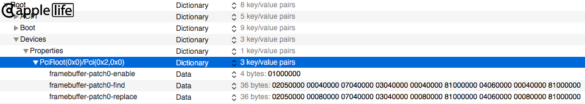  
  
Example of a semantic patch: HDMI type connector (connector-type=00080000 for connectors with index 1, 2 and 3).  
  
  
Example of a semantic patch for bios with DVMT Pre-Alloc 32MB when higher is required. (stolenmem=19MB, fbmem=9MB)  
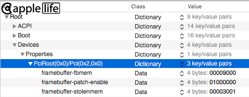  
  
[This series of patches](./AzulPatcher4600_equivalent.plist) are the full equivalent of AzulPatcher4600.kext, for those who have previously used it. (on [some](https://github.com/coderobe/AzulPatcher4600#tested-on) Haswell laptops with framebuffer `0x0A260006` helps to get rid of the artifacts).  
  
**All possible WEG custom patches :**  

***Semantic:***  
*framebuffer-patch-enable (enabling the semantic patches in principle)  
framebuffer-framebufferid (the framebuffer that we're patching, the current by default)*  

*framebuffer-mobile  
framebuffer-pipecount  
framebuffer-portcount  
framebuffer-memorycount  
framebuffer-stolenmem  
framebuffer-fbmem  
framebuffer-unifiedmem (VRAM, it is not recommended to use this patch)  
framebuffer-cursormem (Haswell specific)  
framebuffer-flags  
framebuffer-camellia (integrated display controller, this field is relevant only for real macs)*  
  
*framebuffer-conX-enable (enabling patches for connector X)  
framebuffer-conX-index  
framebuffer-conX-busid  
framebuffer-conX-pipe  
framebuffer-conX-type  
framebuffer-conX-flags  
framebuffer-conX-alldata (completely replace the connector)  
framebuffer-conX-YYYYYYYY-alldata (completely replace the connector, if the current framebuffer matches YYYYYYYY)  
Where X is the connector index.  
Alldata patches can patch multiple connectors in sequence by putting them in a single string and specifying the index of a connector to start with. The string length should be a multiple of 12 bytes (the length of a single connector), 24 bytes for ICL.*  
  
***Binary:***  
*framebuffer-patchN-enable (enabling patch number N)  
framebuffer-patchN-framebufferid (the framebuffer that we're patching, the current by default)  
framebuffer-patchN-find  
framebuffer-patchN-replace  
framebuffer-patchN-count (the amount of pattern iterations to search for, the default is 1)  
N stands for the number of the patch: 0, 1, 2, ... 9*  
  
Detailed information about framebuffers and connectors can be extracted with [010 Editor](http://www.sweetscape.com/010editor/) and the [IntelFramebuffer.bt](./IntelFramebuffer.bt) script.  
This information is useful for those who make custom patches.  
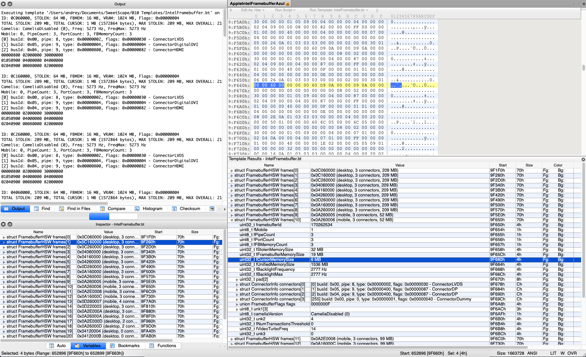  
In 10.14 for SKL and newer to get a dump suitable for the script you can use the debug version of *WEG* with the  
`-igfxdump` boot-argument. The dump will be saved to /var/log/  
The original and patched dumps can be obtained with IOReg when using a debug version of *WEG* and booting with the  
`-igfxfbdump` boot-argument from `IOService:/IOResources/WhateverGreen` (dumps from IOReg is simplified, don't use for bt script).

## VGA Support

In most cases with Intel Skylake and newer it works by default.  
For Ivy Bridge and possibly other generations there are the options to patch your connectors with the following:  
06020000 02000000 30000000 // Option 1  
06020000 01000000 30000000 // Option 2  
On OS X 10.8.2 and newer it is impossible to have VGA on Ivy Bridge systems.  
Hot-plugging VGA usually does not work.  
In case this doesn't help - there are no other known solutions at this time.

## EDID

EDID is usually correctly identified, so no actions are required. In rare cases, EDID needs to be injected manually.  
An EDID dump can be obtained, for example, [with Linux](https://unix.stackexchange.com/questions/114359/how-to-get-edid-for-a-single-monitor). The correct EDID must be put into *AAPL0**0**,override-no-connect* property for `IGPU`, where the second ***0*** stands for the display number.  
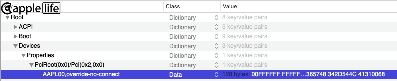  
In some cases the EDID dump may be incompatible with macOS and leads to distortions. For some EDID in such cases you can use this [script](./edid-gen.sh), which corrects a provided EDID and saves it to your desktop.  

## HDMI in UHD resolution with 60FPS

Add the `enable-max-pixel-clock-override` property to `IGPU` or use the `-igfxmpc` boot-arg instead to raise the max pixel clock limit.
This is needed for 4K@60Hz on laptops like ThinkPad P71 or XPS 15, otherwise you will get a black screen. It can also be used for 4K@60Hz over HDMI 2.0.

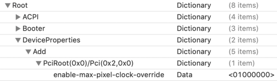

The `CheckTimingWithRange` function in CoreDisplay.framework (userspace) is responsible for validating display timings.
It reads the IOFBTimingRange property, which contains the IODisplayTimingRange structure with various limits, including the max pixel clock limit.
At least on KBL, the framebuffer driver sets the max pixel clock frequency in the IODisplayTimingRange structure to 450 MHz, which is insufficient for 4K@60Hz.
`-igfxmpc` modifies the IODisplayTimingRange structure and raises the max pixel clock limit to 675 MHz. This will allow `CheckTimingWithRange` to succeed with 4K@60Hz displays.
The default 675 MHz limit can be changed with the `max-pixel-clock-frequency` property in `IGPU`, which overrides the new max pixel clock limit (in hertz).

Another approach is to patch `CheckTimingWithRange` in CoreDisplay.framework to skip validation of the pixel clock.
To use this patch, add the `enable-hdmi20` property to `IGPU` or use the `-cdfon` boot-arg.

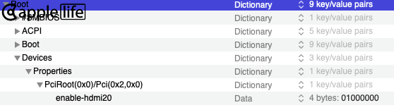

`-igfxmpc` is the preferred approach to bypass the 450 MHz pixel clock limit, as `-cdfon` depends on the userspace patcher.

## Disabling a discrete graphics card

Add the `disable-external-gpu` property to `IGPU`.  
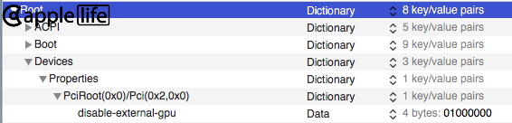  
Or instead of this property, use the boot-arg `-wegnoegpu`
  
## Fix the invalid maximum link rate issue on some laptops (Dell XPS 15 9570, etc.)

Add the `enable-dpcd-max-link-rate-fix` property to `IGPU`, otherwise a kernel panic would happen due to a division-by-zero. Or instead of this property, use the boot-arg `-igfxmlr`.  
Starting from v1.3.7, it also fixes the invalid max link rate value read from the extended DPCD buffer. This fixes the kernel panic on new laptops, such as Dell Inspiron 7590 with Sharp display.  
Starting from v1.4.4, it probes the maximum link rate value automatically if the property `dpcd-max-link-rate` is not specified, and it now supports Ice Lake platforms.  
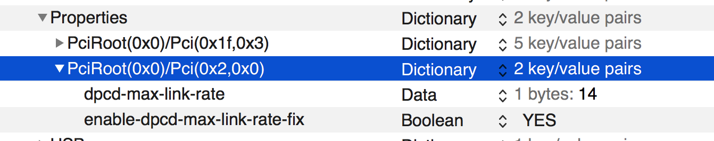  
You could also manually specify a maximum link rate value via the `dpcd-max-link-rate` for the builtin display. Typically use `0x14` for 4K display and `0x0A` for 1080p display. All possible values are `0x06` (RBR), `0x0A` (HBR), `0x14` (HBR2) and `0x1E` (HBR3).   
If an invalid value is specified or property `dpcd-max-link-rate` is not specified, the driver will probe the maximum link rate from DPCD instead.  
If the probed value is not supported by the driver (which should rarely happen), you need to manually specify a valid one, otherwise the graphics driver will trigger a kernel panic due to a division-by-zero later.

<details>
<summary>Spoiler: Debugging</summary>
When the driver probes the maximum link rate from DPCD, you should be able to see something similar to the following lines in your kernel log.  
The maximum link rate reported by the 4K panel on Dell XPS 15 9570 is 5.4 Gbps, and thus the fix writes `0x14` to the DPCD buffer.

```
igfx: @ (DBG) MLR: Found CFL- platforms. Will setup the fix for the CFL- graphics driver.
igfx: @ (DBG) MLR: [CFL-] Functions have been routed successfully.
igfx: @ (DBG) MLR: [CFL-] wrapReadAUX() Called with controller at 0xffffff802ca6e000 and framebuffer at 0xffffff81aa5a3000.
igfx: @ (DBG) MLR: [COMM] orgReadAUX() Routed to CFL IMP with Address = 0x0; Length = 16.
igfx: @ (DBG) MLR: [COMM] GetFBIndex() Port at 0x0; Framebuffer at 0xffffff81aa5a3000.
igfx: @ (DBG) MLR: [COMM] wrapReadAUX() Will probe the maximum link rate from the table.
igfx: @ (DBG) MLR: [COMM] orgReadAUX() Routed to CFL IMP with Address = 0x700; Length = 1.
igfx: @ (DBG) MLR: [COMM] ProbeMaxLinkRate() Found eDP version 1.4+ (Value = 0x4).
igfx: @ (DBG) MLR: [COMM] orgReadAUX() Routed to CFL IMP with Address = 0x10; Length = 16.
igfx: @ (DBG) MLR: [COMM] ProbeMaxLinkRate() Table[0] =  8100; Link Rate = 1620000000; Decimal Value = 0x06.
igfx: @ (DBG) MLR: [COMM] ProbeMaxLinkRate() Table[1] = 10800; Link Rate = 2160000000; Decimal Value = 0x08.
igfx: @ (DBG) MLR: [COMM] ProbeMaxLinkRate() Table[2] = 12150; Link Rate = 2430000000; Decimal Value = 0x09.
igfx: @ (DBG) MLR: [COMM] ProbeMaxLinkRate() Table[3] = 13500; Link Rate = 2700000000; Decimal Value = 0x0a.
igfx: @ (DBG) MLR: [COMM] ProbeMaxLinkRate() Table[4] = 16200; Link Rate = 3240000000; Decimal Value = 0x0c.
igfx: @ (DBG) MLR: [COMM] ProbeMaxLinkRate() Table[5] = 21600; Link Rate = 4320000000; Decimal Value = 0x10.
igfx: @ (DBG) MLR: [COMM] ProbeMaxLinkRate() Table[6] = 27000; Link Rate = 5400000000; Decimal Value = 0x14.
igfx: @ (DBG) MLR: [COMM] ProbeMaxLinkRate() End of table.
igfx: @ (DBG) MLR: [COMM] wrapReadAUX() Maximum link rate 0x14 has been set in the DPCD buffer.
igfx: @ (DBG) MLR: [CFL-] wrapReadAUX() Called with controller at 0xffffff802ca6e000 and framebuffer at 0xffffff81aa5a3000.
igfx: @ (DBG) MLR: [COMM] orgReadAUX() Routed to CFL IMP with Address = 0x2200; Length = 16.
igfx: @ (DBG) MLR: [COMM] GetFBIndex() Port at 0x0; Framebuffer at 0xffffff81aa5a3000.
igfx: @ (DBG) MLR: [COMM] wrapReadAUX() Will use the maximum link rate specified by user or cached by the previous probe call.
igfx: @ (DBG) MLR: [COMM] wrapReadAUX() Maximum link rate 0x14 has been set in the DPCD buffer.
```
</details>

## Fix the infinite loop on establishing Intel HDMI connections with a higher pixel clock rate on Skylake, Kaby Lake and Coffee Lake platforms
Add the `enable-hdmi-dividers-fix` property to `IGPU` or use the `-igfxhdmidivs` boot argument instead to fix the infinite loop when the graphics driver tries to establish a HDMI connection with a higher pixel clock rate, for example connecting to a 2K/4K display with HDMI 1.4, otherwise the system just hangs (and your builtin laptop display remains black) when you plug in the HDMI cable.  

**Notes**

- For those who want to have "limited" 2K/4K experience (i.e. 2K@59Hz or 4K@30Hz) with their HDMI 1.4 port, you might find this fix helpful.  
- For those who have a laptop or PC with HDMI 2.0 routed to IGPU and have HDMI output issues, please note that this fix is now succeeded by the LSPCON driver solution, and it is still recommended to enable the LSPCON driver support to have full HDMI 2.0 experience. *You might still need this fix temporarily to figure out the connector index of your HDMI port, see the LSPCON section below.*  

## LSPCON driver support to enable DisplayPort to HDMI 2.0 output on IGPU

Recent laptops (KBL/CFL) are typically equipped with a HDMI 2.0 port. This port could be either routed to IGPU or DGPU, and you can have a confirmation on Windows 10. Intel (U)HD Graphics, however, does not provide native HDMI 2.0 output, so in order to solve this issue OEMs add an additional hardware named LSPCON on the motherboard to convert DisplayPort into HDMI 2.0.  
  
LSPCON works in either Level Shifter (LS) or Protocol Converter (PCON) mode. When the adapter works in LS mode, it is capable of producing HDMI 1.4 signals from DisplayPort, while in PCON mode, it could provide HDMI 2.0 output. Some onboard LSPCON adapters (e.g. the one on Dell XPS 15 9570) have been configured in the firmware to work in LS mode by default, resulting a black screen on handling HDMI 2.0 connections.  
  
Starting from version 1.3.0, *WEG* now provides driver support for the onboard LSPCON by automatically configuring the adapter to run in PCON mode on new HDMI connections, and hence solves the black screen issue on some platforms.  
  
- LSPCON driver is only applicable for laptops and PCs with HDMI 2.0 routed to IGPU.
- LSPCON driver is necessary for all newer platforms unless the new IGPU starts to provide native HDMI 2.0 output.
- Supported Intel Platform: SKL, KBL, CFL and later. SKL: Intel NUC Skull Canyon; Iris Pro 580 + HDMI 2.0 with Parade PS175 LSPCON. CFL: Some laptops, e.g. Dell XPS 15 9570, are equipped with HDMI 2.0 and Parade PS175 LSPCON.
- If you have confirmed that your HDMI 2.0 is routed to IGPU and is working properly right now, you don't need to enable this driver, because your onboard LSPCON might already be configured in the firmware to work in PCON mode.

**Instructions**

- Add the `enable-lspcon-support` property to `IGPU` to enable the driver, or use the boot-arg `-igfxlspcon` instead.  
- Next, you need to know the corresponding connector index (one of 0,1,2,3) of your HDMI port. You could find it under IGPU in IORegistryExplorer (i.e. AppleIntelFramebuffer@0/1/2/3). *If you only have a 2K/4K HDMI monitor, you might need temporarily to enable the **infinite loop fix** before connecting a HDMI monitor to your build, otherwise the system just hangs, so you won't be able to run the IORegistryExplorer and find the connector index.*  
- Add the `framebuffer-conX-has-lspcon` property to `IGPU` to inform the driver which connector has an onboard LSPCON adapter. Replace `X` with the index you have found in the previous step. The value must be of type `Data` and should be one of `01000000` (True) and `00000000` (False).  
- (*Optional*) Add the `framebuffer-conX-preferred-lspcon-mode` property to `IGPU` to specify a mode for your onboard LSPCON adapter. The value must be of type `Data` and should be one of `01000000` (PCON, DP to HDMI 2.0) and `00000000` (LS, DP to HDMI 1.4). Any other invalid values are treated as PCON mode. If this property is not specified, the driver assumes that PCON mode is preferred.  
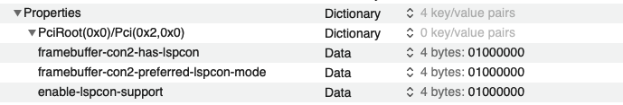
  
<details>
<summary>Spoiler: Debugging</summary>
Once you have completed the steps above, rebuild the kext cache and reboot your computer.
After plugging into your HDMI 2.0 cable (and the HDMI 2.0 monitor), you should be able to see the output on your monitor.  

Dump your kernel log and you should also be able to see something simillar to lines below.

```
// When you insert the HDMI 2.0 cable
igfx @ (DBG) SC:     GetDPCDInfo() DInfo: [FB0] called with controller at 0xffffff81a8680000 and framebuffer at 0xffffff81a868c000.
igfx @ (DBG) SC:     GetDPCDInfo() DInfo: [FB0] No LSPCON chip associated with this framebuffer.
igfx @ (DBG) SC:     GetDPCDInfo() DInfo: [FB0] Will call the original method.
igfx @ (DBG) SC:     GetDPCDInfo() DInfo: [FB0] Returns 0x0.
igfx @ (DBG) SC:     GetDPCDInfo() DInfo: [FB2] called with controller at 0xffffff81a8680000 and framebuffer at 0xffffff81a869a000.
igfx @ (DBG) SC:   LSPCON::probe() DInfo: [FB2] Found the LSPCON adapter: Parade PS1750.
igfx @ (DBG) SC:   LSPCON::probe() DInfo: [FB2] The current adapter mode is Level Shifter (DP++ to HDMI 1.4).
igfx @ (DBG) SC:     GetDPCDInfo() DInfo: [FB2] LSPCON driver has detected the onboard chip successfully.
igfx @ (DBG) SC:     GetDPCDInfo() DInfo: [FB2] LSPCON driver has been initialized successfully.
igfx @ (DBG) SC: LSPCON::getMode() DInfo: [FB2] The current mode value is 0x00.
igfx @ (DBG) SC: LSPCON::getMode() DInfo: [FB2] The current mode value is 0x00.
igfx @ (DBG) SC: LSPCON::getMode() DInfo: [FB2] The current mode value is 0x00.
igfx @ (DBG) SC: LSPCON::getMode() DInfo: [FB2] The current mode value is 0x01.
igfx @ (DBG) SC: LSPCON::setMode() DInfo: [FB2] The new mode is now effective.
igfx @ (DBG) SC:     GetDPCDInfo() DInfo: [FB2] The adapter is running in preferred mode [Protocol Converter (DP++ to HDMI 2.0)].
igfx @ (DBG) SC:     GetDPCDInfo() DInfo: [FB2] Will call the original method.
igfx @ (DBG) SC:     GetDPCDInfo() DInfo: [FB2] Returns 0x0.

// When you remove the HDMI 2.0 cable
igfx @ (DBG) SC:     GetDPCDInfo() DInfo: [FB0] called with controller at 0xffffff81a8680000 and framebuffer at 0xffffff81a868c000.
igfx @ (DBG) SC:     GetDPCDInfo() DInfo: [FB0] No LSPCON chip associated with this framebuffer.
igfx @ (DBG) SC:     GetDPCDInfo() DInfo: [FB0] Will call the original method.
igfx @ (DBG) SC:     GetDPCDInfo() DInfo: [FB0] Returns 0x0.
igfx @ (DBG) SC:     GetDPCDInfo() DInfo: [FB2] called with controller at 0xffffff81a8680000 and framebuffer at 0xffffff81a869a000.
igfx @ (DBG) SC:     GetDPCDInfo() DInfo: [FB2] LSPCON driver (at 0xffffff802ba3afe0) has already been initialized for this framebuffer.
igfx @ (DBG) SC: LSPCON::setModeIfNecessary() DInfo: [FB2] The adapter is already running in Protocol Converter (DP++ to HDMI 2.0) mode. No need to update.
igfx @ (DBG) SC: LSPCON::wakeUpNativeAUX() DInfo: [FB2] The native AUX channel is up. DPCD Rev = 0x12.
igfx @ (DBG) SC:     GetDPCDInfo() DInfo: [FB2] Will call the original method.
igfx @ (DBG) SC:     GetDPCDInfo() DInfo: [FB2] Returns 0x0.
```

Additionally, you can find these properties injected by the driver under the corresponding connector with index (Only available in DEBUG version).  

`fw-framebuffer-has-lspcon` indicates whether the onboard LSPCON adapter exists or not.  
`fw-framebuffer-preferred-lspcon-mode` indicates the preferred adapter mode. 1 is PCON, and 0 is LS.  
  
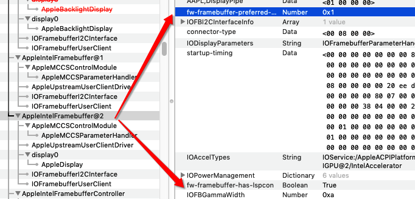
</details>

## Support all possible Core Display Clock (CDCLK) frequencies on ICL platforms

Add the `enable-cdclk-frequency-fix` property to `IGPU` or use the `-igfxcdc` boot argument instead to support all valid Core Display Clock (CDCLK) frequencies on ICL platforms, otherwise a kernel panic would happen due to an unsupported CD clock decimal frequency.   

Core Display Clock (CDCLK) is one of the primary clocks used by the display engine to do its work. Apple's graphics driver expects that the firmware has already set the clock frequency to either 652.8 MHz or 648 MHz (the actual value depends on hardware), but quite a few laptops set it to a much lower value, such as 172.8 MHz, and hence you will see a kernel panic message like "Unsupported CD clock decimal frequency 0x158". This patch reprograms the clock to set its frequency to one of supported value, so that this precondition can be satisifed.   

<details>
<summary>Spoiler: Debugging</summary>
Once you have enabled the patch, dump your kernel log and you should also be able to see something simillar to lines below.

```
igfx: @ (DBG) CDC: Functions have been routed successfully.
igfx: @ (DBG) CDC: ProbeCDClockFrequency() DInfo: Called with controller at 0xffffff8035933000.
igfx: @ (DBG) CDC: ProbeCDClockFrequency() DInfo: The currrent core display clock frequency is 172.8 MHz.
igfx: @ (DBG) CDC: ProbeCDClockFrequency() DInfo: The currrent core display clock frequency is not supported.
igfx: @ (DBG) CDC: sanitizeCDClockFrequency() DInfo: Reference frequency is 38.4 MHz.
igfx: @ (DBG) CDC: sanitizeCDClockFrequency() DInfo: Core Display Clock frequency will be set to 652.8 MHz.
igfx: @ (DBG) CDC: sanitizeCDClockFrequency() DInfo: Core Display Clock PLL frequency will be set to 1305600000 Hz.
igfx: @ (DBG) CDC: sanitizeCDClockFrequency() DInfo: Core Display Clock PLL has been disabled.
igfx: @ (DBG) CDC: sanitizeCDClockFrequency() DInfo: Core Display Clock has been reprogrammed and PLL has been re-enabled.
igfx: @ (DBG) CDC: sanitizeCDClockFrequency() DInfo: Core Display Clock frequency is 652.8 MHz now.
igfx: @ (DBG) CDC: ProbeCDClockFrequency() DInfo: The core display clock has been switched to a supported frequency.
igfx: @ (DBG) CDC: ProbeCDClockFrequency() DInfo: Will invoke the original function.
igfx: @ (DBG) CDC: ProbeCDClockFrequency() DInfo: The original function returns 0x4dd1e000.
```
</details>

## Fix the kernel panic caused by an incorrectly calculated amount of DVMT pre-allocated memory on Intel ICL platforms

Add the `enable-dvmt-calc-fix` property to `IGPU` or use the `-igfxdvmt` boot argument instead to fix the calculation of the amount of DVMT pre-allocated memory on ICL platforms, otherwise a kernel panic saying `Unsupported ICL SKU` would happen.

Apple’s graphics driver reads the DVMT value set in the BIOS or the firmware and uses a “magic” formula to calculate the amount of memory in bytes. Unfortunately, the formula only works for a pre-allocated memory size that is a multiple of 32MB. Problem arises as laptops now have DVMT set to 60MB on ICL+ platforms by default, and the framebuffer controller ends up with initializing the stolen memory manager with an incorrect amount of pre-allocated memory. Even though one might be able to modify DVMT settings via `EFI shell` or `RU.EFI`, these methods are not applicable to some laptops, such as Surface Pro 7, that use custom firmware. As such, this patch calculates the correct number of bytes beforehand and patches the driver so that it will initialize the memory manager with proper values and aforementioned kernel panics can be avoided.

Apple has removed the kernel panic if the stolen memory is not enough, but you are encouraged to patch the framebuffer so that it fits into your available amount of stolen memory. Once the patch is enabled, you could find your actual amount of DVMT pre-allocated memory in the property `fw-dvmt-preallocated-memory` under the graphics device. (Only available in DEBUG version) The unit is megabyte, and the size in the example below is 60 MB. (0x3C = 60)

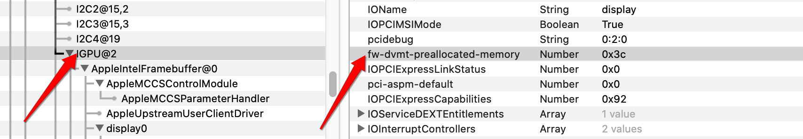

<details>
<summary>Spoiler: Debugging</summary>
Additionally, you should be able to find something similar to lines below in your kernel log.

```
igfx: @ (DBG) DVMT: Found the shll instruction. Length = 3; DSTReg = 0.
igfx: @ (DBG) DVMT: Found the andl instruction. Length = 5; DSTReg = 0.
igfx: @ (DBG) DVMT: Calculation patch has been applied successfully.
```
</details>

## Customize the behavior of the backlight smoother to improve your experience

Add the `enable-backlight-smoother` property to `IGPU` or use the `-igfxbls` boot argument instead to make brightness transitions smoother on Intel IVB+ platforms.  

The graphics driver adjusts the panel brightness by writing values to related registers. 
Brightness Smoother (BLS) intercepts these write operations and gradually changes the register value. 
You may think of the graphics driver changing the brightness like climbing the stairs while BLS works like taking the escalator.

BLS uses a simple algorithm: it reads the register value `SRC` that represents the current brightness level and calculates the distance `D` to the register value `DST` requested by the graphics driver. 
It then moves toward the target value in `N` steps, each of which takes `T` milliseconds. 
By default, `N` is 35 and `T` is 7, but you may change their values by adding the properties `backlight-smoother-steps` and `backlight-smoother-interval`. 
It is recommended to keep `T` less than 10 milliseconds and the total amount of time `N * T` less than 350 milliseconds. 

Besides, you may use the property  `backlight-smoother-threshold` to ask BLS to skip the smoother process if the distance `D` falls below the threshold. 
In other words, BLS will write `DST` to the register directly. The default threshold value is 0.

If you want to prevent the built-in display from going black at the lowest brightness level, 
you may use the property `backlight-smoother-lowerbound` to specify the minimum register value that corresponds to the new, lowest brightness level.
Similarly, `backlight-smoother-upperbound` can be used to specify the maximum value instead. See the example below.
If these two properties are not present, BLS uses the default range [0, 2^32-1].

<details>
<summary>Example: Configure the smoother for a Haswell-based laptop with Intel HD Graphics 4600</summary>

The following kernel logs are dumped from a Haswell laptop when a user changes the brightness from the lowest level to the highest one.  
Since the distance to the next level is relatively short, we use `N = 25` and `T = 8` instead,  
making the graphics driver transition to the next brightness level in approximately 200 milliseconds.

|     Device Property Name     | Type |   Value  |            Notes           |
|:----------------------------:|:----:|:--------:|:--------------------------:|
|   enable-backlight-smoother  | Data | 01000000 |     Enable the smoother    |
|   backlight-smoother-steps   | Data | 19000000 | 25 (0x19) in little endian |
|  backlight-smoother-interval | Data | 08000000 | 08 (0x08) in little endian |
| backlight-smoother-threshold | Data | 00000000 | 00 (0x00) in little endian |

```
igfx: @ (DBG) BLS: [COMM] Processing the request: Current = 0x00000000; Target = 0x00000036; Distance = 0054; Steps = 25; Stride = 3.
igfx: @ (DBG) BLS: [COMM] Processing the request: Current = 0x00000036; Target = 0x00000036; Distance = 0000; Steps = 25; Stride = 0.
igfx: @ (DBG) BLS: [COMM] Processing the request: Current = 0x00000036; Target = 0x00000054; Distance = 0030; Steps = 25; Stride = 2.
igfx: @ (DBG) BLS: [COMM] Processing the request: Current = 0x00000054; Target = 0x0000007d; Distance = 0041; Steps = 25; Stride = 2.
igfx: @ (DBG) BLS: [COMM] Processing the request: Current = 0x0000007d; Target = 0x000000b2; Distance = 0053; Steps = 25; Stride = 3.
igfx: @ (DBG) BLS: [COMM] Processing the request: Current = 0x000000b2; Target = 0x000000e7; Distance = 0053; Steps = 25; Stride = 3.
igfx: @ (DBG) BLS: [COMM] Processing the request: Current = 0x000000e7; Target = 0x000000f5; Distance = 0014; Steps = 25; Stride = 1.
igfx: @ (DBG) BLS: [COMM] Processing the request: Current = 0x000000f5; Target = 0x00000137; Distance = 0066; Steps = 25; Stride = 3.
igfx: @ (DBG) BLS: [COMM] Processing the request: Current = 0x00000137; Target = 0x00000149; Distance = 0018; Steps = 25; Stride = 1.
igfx: @ (DBG) BLS: [COMM] Processing the request: Current = 0x00000149; Target = 0x000001b1; Distance = 0104; Steps = 25; Stride = 5.
igfx: @ (DBG) BLS: [COMM] Processing the request: Current = 0x000001b1; Target = 0x0000022b; Distance = 0122; Steps = 25; Stride = 5.
igfx: @ (DBG) BLS: [COMM] Processing the request: Current = 0x0000022b; Target = 0x00000271; Distance = 0070; Steps = 25; Stride = 3.
igfx: @ (DBG) BLS: [COMM] Processing the request: Current = 0x00000271; Target = 0x000002b8; Distance = 0071; Steps = 25; Stride = 3.
igfx: @ (DBG) BLS: [COMM] Processing the request: Current = 0x000002b8; Target = 0x00000359; Distance = 0161; Steps = 25; Stride = 7.
igfx: @ (DBG) BLS: [COMM] Processing the request: Current = 0x00000359; Target = 0x000003a4; Distance = 0075; Steps = 25; Stride = 3.
igfx: @ (DBG) BLS: [COMM] Processing the request: Current = 0x000003a4; Target = 0x00000401; Distance = 0093; Steps = 25; Stride = 4.
igfx: @ (DBG) BLS: [COMM] Processing the request: Current = 0x00000401; Target = 0x00000413; Distance = 0018; Steps = 25; Stride = 1.
igfx: @ (DBG) BLS: [COMM] Processing the request: Current = 0x00000413; Target = 0x0000046b; Distance = 0088; Steps = 25; Stride = 4.
igfx: @ (DBG) BLS: [COMM] Processing the request: Current = 0x0000046b; Target = 0x000004ec; Distance = 0129; Steps = 25; Stride = 6.
igfx: @ (DBG) BLS: [COMM] Processing the request: Current = 0x000004ec; Target = 0x00000588; Distance = 0156; Steps = 25; Stride = 7.
igfx: @ (DBG) BLS: [COMM] Processing the request: Current = 0x00000588; Target = 0x000005f3; Distance = 0107; Steps = 25; Stride = 5.
igfx: @ (DBG) BLS: [COMM] Processing the request: Current = 0x000005f3; Target = 0x000006b1; Distance = 0190; Steps = 25; Stride = 8.
igfx: @ (DBG) BLS: [COMM] Processing the request: Current = 0x000006b1; Target = 0x00000734; Distance = 0131; Steps = 25; Stride = 6.
igfx: @ (DBG) BLS: [COMM] Processing the request: Current = 0x00000734; Target = 0x00000815; Distance = 0225; Steps = 25; Stride = 9.
igfx: @ (DBG) BLS: [COMM] Processing the request: Current = 0x00000815; Target = 0x000008af; Distance = 0154; Steps = 25; Stride = 7.
igfx: @ (DBG) BLS: [COMM] Processing the request: Current = 0x000008af; Target = 0x000009f7; Distance = 0328; Steps = 25; Stride = 14.
igfx: @ (DBG) BLS: [COMM] Processing the request: Current = 0x000009f7; Target = 0x00000ad9; Distance = 0226; Steps = 25; Stride = 10.
```

As you can observe from the above log, the register value is `0x00` when the display is at the lowest brightness level.
When the user presses a key to increase the brightness, the register value becomes `0x36`, 
so in this case you may use a lowerbound, for example `0x18`, to prevent the display turning black.
You may want to analyze the kernel log produced by the DEBUG version to find a lowerbound that best works for your laptop.

</details>

<details>
<summary>Example: Configure the smoother for a Coffee Lake-based laptop with Intel UHD Graphics 630</summary>

The following kernel logs are dumped from a Coffee Lake laptop when a user changes the brightness from the lowest level to the highest one.  
Since the distance to the next level is long, we use `N = 35` and `T = 7`,  
making the graphics driver transition to the next brightness level in approximately 250 milliseconds.

|     Device Property Name     | Type |   Value  |              Notes             |
|:----------------------------:|:----:|:--------:|:------------------------------:|
|   enable-backlight-smoother  | Data | 01000000 |       Enable the smoother      |
|   backlight-smoother-steps   | Data | 23000000 |   35 (0x23) in little endian   |
|  backlight-smoother-interval | Data | 07000000 |   07 (0x07) in little endian   |
| backlight-smoother-threshold | Data | 2C010000 | 300 (0x012C) in little endian  |

```
igfx: @ (DBG) BLS: [COMM] Processing the request: Current = 0x00000000; Target = 0x000004ae; Distance = 1198; Steps = 35; Stride = 35.
igfx: @ (DBG) BLS: [COMM] Processing the request: Current = 0x000004ae; Target = 0x00000613; Distance = 0357; Steps = 35; Stride = 11.
igfx: @ (DBG) BLS: [COMM] Processing the request: Current = 0x00000613; Target = 0x000007f3; Distance = 0480; Steps = 35; Stride = 14.
igfx: @ (DBG) BLS: [COMM] Processing the request: Current = 0x000007f3; Target = 0x00000a4b; Distance = 0600; Steps = 35; Stride = 18.
igfx: @ (DBG) BLS: [COMM] Processing the request: Current = 0x00000a4b; Target = 0x00000e0c; Distance = 0961; Steps = 35; Stride = 28.
igfx: @ (DBG) BLS: [COMM] Processing the request: Current = 0x00000e0c; Target = 0x000012bb; Distance = 1199; Steps = 35; Stride = 35.
igfx: @ (DBG) BLS: [COMM] Processing the request: Current = 0x000012bb; Target = 0x000019c6; Distance = 1803; Steps = 35; Stride = 52.
igfx: @ (DBG) BLS: [COMM] Processing the request: Current = 0x000019c6; Target = 0x0000239b; Distance = 2517; Steps = 35; Stride = 72.
igfx: @ (DBG) BLS: [COMM] Processing the request: Current = 0x0000239b; Target = 0x00003043; Distance = 3240; Steps = 35; Stride = 93.
igfx: @ (DBG) BLS: [COMM] Processing the request: Current = 0x00003043; Target = 0x00004216; Distance = 4563; Steps = 35; Stride = 131.
igfx: @ (DBG) BLS: [COMM] Processing the request: Current = 0x00004216; Target = 0x000050d5; Distance = 3775; Steps = 35; Stride = 108.
igfx: @ (DBG) BLS: [COMM] Processing the request: Current = 0x000050d5; Target = 0x00005aea; Distance = 2581; Steps = 35; Stride = 74.
igfx: @ (DBG) BLS: [COMM] Processing the request: Current = 0x00005aea; Target = 0x00007d21; Distance = 8759; Steps = 35; Stride = 251.
igfx: @ (DBG) BLS: [COMM] Processing the request: Current = 0x00007d21; Target = 0x0000acf3; Distance = 12242; Steps = 35; Stride = 350.
igfx: @ (DBG) BLS: [COMM] Processing the request: Current = 0x0000acf3; Target = 0x0000effc; Distance = 17161; Steps = 35; Stride = 491.
igfx: @ (DBG) BLS: [COMM] Processing the request: Current = 0x0000effc; Target = 0x0001328e; Distance = 17042; Steps = 35; Stride = 487.
igfx: @ (DBG) BLS: [COMM] Processing the request: Current = 0x0001328e; Target = 0x00014ead; Distance = 7199; Steps = 35; Stride = 206.
igfx: @ (DBG) BLS: [COMM] Processing the request: Current = 0x00014ead; Target = 0x0001d3cc; Distance = 34079; Steps = 35; Stride = 974.
```

</details>

## Fix the issue that the builtin display remains garbled after the system boots on ICL platforms

Add the `enable-dbuf-early-optimizer` property to `IGPU` or use the `-igfxdbeo` boot argument instead to fix the Display Data Buffer (DBUF) allocation issue on ICL platforms, 
otherwise your builtin display remains garbled for 7 to 15 seconds after the system boots.
You need this fix if you observe a bunch of errors mentioning "DBUF" and "pipe underrun" in the kernel log.

This fix works by calling the function that optimizes the display data buffer allocations early.
You may specify the delay in seconds (value of type `Data`) via the `dbuf-optimizer-delay` property.
If the property is not specified, the default value will be used (see below).

The community reports that a delay of 1 to 3 seconds is adequate for avoiding the underrun issue on the builtin display without having negative impacts on external displays,
and that the default delay of 0 second used in *WEG* v1.5.4 may lead to both internal and external displays flickering on some laptops.
Starting from v1.5.5, the default delay is changed to 1 second, so in most cases users do not have to specify the delay manually.

<details>
<summary>Sample kernel log that contains DBUF-related errors</summary>

```
[IGFB][ERROR][DISPLAY   ] Display Pipe Underrun occurred on pipe(s) A
[IGFB][ERROR][DISPLAY   ] Internal cached DBuf values are not set. Failed to distribute DBufs
```

</details>

## Fix backlight registers on KBL, CFL and ICL platforms

Certain mobile Kaby Lake, Coffee Lake and Ice Lake devices need fixing of the backlight registers. 
Without the fix certain devices will end in a black screen when booting macOS, like seen on the Dell inspiron 3593. 
The WateverGreen backlight registers fix can be enabled using 'enable-backlight-registers-fix' properly to 'IGPU' or using the '-igfxblr' boot argument.

## Known Issues

**Compatibility**

- Limited cards: HD2000, HD2500 can only be used for [IQSV](https://www.applelife.ru/threads/zavod-intel-quick-sync-video.817923/) (they are used in real Macs only for this), there are no solutions.  
- Intel Pentium / Celeron Graphics can't be enabled, there are no solutions. In certain cases сan only be used for [IQSV](https://www.applelife.ru/threads/zavod-intel-quick-sync-video.817923/).  
- HDMI black screen on Haswell platforms. Resolved by using *WEG* or macOS 10.13.4 and later.  
- Support for 2 or more displays on Intel Skylake and newer desktops is missing or buggy. In macOS 10.14.x there is an improvement tendency.  
- Displays do not wake up on Intel Skylake desktops and later, connecting via DisplayPort or upgrading to macOS 10.14.x may help.  
  
**Glitches and settings**

- HD3000 can sometimes have interface glitches. Since the amount of video memory in Sandy depends on the overall system memory - 8 GB is the minimum to have, but there are no guaranteed solutions. It is also recommended to install [Max TOLUD to Dynamic](https://applelife.ru/posts/595326/) in the BIOS. Perhaps you can benefit from these [patches](https://www.applelife.ru/posts/730496).  
- "8 apples" and the disappearance of the background image with File Vault 2 during the transition from UEFI GOP drivers to macOS drivers (due to incompatible EDID). Partially solved in *WEG*.  
- PAVP freezes (freezes during video playback, broken QuickLook, etc.) are solved with *WEG* at the cost of disabling HDCP.  
- Haswell glitches for some framebuffers are resolved with a semantic `framebuffer-cursormem` patch.  
- In macOS 10.14 оn some laptops with KBL graphics one may face visual artifacts on the gradients. For a temporary solution try to fake IGPU to use SKL drivers.  
- The several minutes black screen upon OS boot with mobile CFL is fixed by *WEG*.  
- The absence in BIOS of an option to change the amount of memory for the frame buffer is resolved with either semantic `framebuffer-stolenmem` and `framebuffer-fbmem` patches, by modifying the BIOS or by manually inputting the values in UEFI Shell. **Otherwise you get a panic.** [Explanation](https://www.applelife.ru/posts/750369)  
- Some systems with IGPUs (e.g. KBL and CFL) may cause system instability in lower power states. Sometimes it can be noticed by NVMe kernel panics. The generally available workaround is passing `forceRenderStandby=0` to kernel boot arguments to disable RC6 Render Standby. See [this issue](https://github.com/acidanthera/bugtracker/issues/1193) for more details.
  
**Performance and media content**

- Compatibility with discrete cards in unsupported configurations (NVIDIA + SNB/SKL/KBL; AMD + IVY), for some applications is fixed by *WEG*. Starting with macOS 10.13.4 the problem is gone.  
- Viewing protected iTunes content is fixed by *WEG*. Starting with macOS 10.12 on Ivy Bridge and newer viewing HD movies on iTunes is not possible without a discrete card.  
- Apple GuC firmware doesn't work at old 22 nanometer chipsets - Z370 and older.  
  
A [VDADecoderChecker](https://i.applelife.ru/2019/05/451893_10.12_VDADecoderChecker.zip) output for solo integrated graphics using non-empty framebuffer must look like this:  
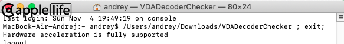  
  
A [VDADecoderChecker](https://i.applelife.ru/2019/05/451893_10.12_VDADecoderChecker.zip) output for discrete graphics with IGPU offline mode (empty framebuffer) must look like this:  
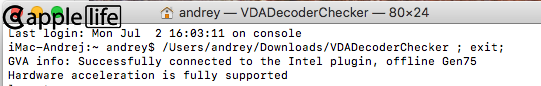  
[Note for 10.15+](https://www.applelife.ru/posts/765336)  
  
In case of special IGPU, IMEI and HDEF device locations, [gfxutil](https://github.com/acidanthera/gfxutil) may be used: `gfxutil -f IGPU`, `gfxutil -f IMEI`, `gfxutil -f HDEF`. IGPU and IMEI device locations - usually standardly.  
  
## Discussion

[Russian](https://www.applelife.ru/threads/intel-hd-graphics-3000-4000-4400-4600-5000-5500-5600-520-530-630.1289648/), [English](https://www.insanelymac.com/forum/topic/334899-intel-framebuffer-patching-using-whatevergreen/)  
  
The WWHC team is looking for talented Steve's reincarnations, so if you feel like you might be one - please report to the local looney bin.  
